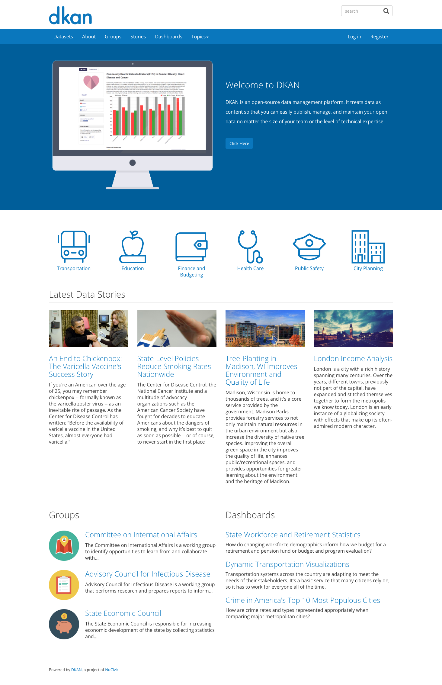

# DKAN Open Data Portal

[](https://circleci.com/gh/NuCivic/dkan)

[](https://gitter.im/NuCivic/dkan?utm_source=badge&utm_medium=badge&utm_campaign=pr-badge&utm_content=badge)

DKAN is a Drupal-based open data tool with a full suite of cataloging, publishing and visualization features that allows governments, nonprofits and universities to easily publish data to the public. It is inspired by the [CKAN project](https://github.com/ckan/ckan) and maintained by [Granicus Data](http://getdkan.com/contact).

[](http://getdkan.com)

*  [ Live demo » ](http://demo.getdkan.com/)
*  [ Full Documetation » ](http://docs.getdkan.com/)
*  [ Open data portals using DKAN » ](https://github.com/NuCivic/dkan-sites)

## Features

### For data publishers

*   Publish data through a guided process or import via API/harvesting from other catalogs
*   Customize your own metadata fields, themes and branding
*   Store data within DKAN or on external (e.g. departmental) sites
*   Manage access control, version history with rollback, RDF support, user analytics
*   Supported enterprise-quality commercial support and FISMA-certified cloud hosting options available

### For data users

*   Explore, search, add, describe, tag, group datasets via web front-end or API
*   Collaborate with user profiles, groups, dashboard, social network integration, comments
*   Use metadata and data APIs, data previews and visualizations
*   Manage access control, version history with rollback, INSPIRE/RDF support, user analytics
*   Extend and leverage the full universe of more than 18,000 freely available Drupal modules

## Hosting and support

Granicus [Data](http://getdkan.com/) platform offers 24/7, secure, cloud-based DKAN hosting and support services.

## Installation

Please see the ["Installation" section of the DKAN Documentation](http://docs.getdkan.com/en/latest/introduction/installation.html).

### Upgrading DKAN

Please see the ["Updating and Maintaining DKAN" section of the DKAN Documentation](http://docs.getdkan.com/en/latest/introduction/maintaining.html) for general upgrade information.

## Releases

Check the [releases page](https://github.com/NuCivic/dkan/releases) for latest DKAN Version. 7.x-1.x is the development branch.

Contact us if you want to get involved!

DKAN development is a sponsored by NuCivic. For more information about hosting and professional support options for DKAN, see http://getdkan.com/contact

### Releases and Release Candidates

DKAN follows a modified semantic versioning convention, and has _major_, _point_ (also known as _minor_), and _patch_ releases.

The only _major_ release of DKAN has been 7.x-1.0. It is unlikely there will be a 7.x-2.x version of DKAN but in the case of a major architecture change, this is possible. More likely is a 8.x-2.x release if and when DKAN is ported to Drupal 8. At the moment there is no work being done on a Drupal 8 version.

_Point_ releases occur approximately every 1-2 months and include new functionality and architectural changes. For instance, DKAN 7.x-1.1 was the first point release, and 7.x-1.2 was the second. While we try to make updating as seamless as possible, _point release_ updates often involve some work, especially if the website uses a custom theme or modules outside of what is included in the distro.

_Patch_ releases, introduced after the release of DKAN 7.x-1.12, occur much more frequently, and include bug fixes, core and contrib module updates, and minor enhancements. The first patch release was version 7.x-1.12.1, the second was 7.x-1.12.2, and so on. Updating to a new _patch_ release should be very straightforward and cause little to no distruption to a website.

### Tags and branches

After a _point_ release comes out, we create a _release branch_, on which we do any work intended for future _patch_ releases on that version of DKAN. The _release branch_ for version 7.x-1.12 development, for instance, is `release-1-12`. New features and other work destined for the next _point release_ continues on the main development branch, `7.x-1.x`.

We keep the DKAN profile (this project), [DKAN Dataset](https://github.com/NuCivic/dkan_dataset), [DKAN Datastore](https://github.com/NuCivic/dkan_datastore), [DKAN Workflow](https://github.com/NuCivic/dkan_workflow) and [Recline](https://github.com/NuCivic/recline) versioning in sync. Other depdendencies that we maintain, incuding [Open Data Schema Map](https://github.com/NuCivic/open_data_schema_map) and [Visualization Entity](https://github.com/NuCivic/visualization_entity) follow their own, separate release cycle.

## Getting Help with DKAN

Have a question, found a bug, or need help with DKAN? Check our [documentation](http://docs.getdkan.com) first. In addition:

### General questions as a developer or site builder

Please post a question on our [Developer list](https://groups.google.com/forum/?hl=en#!forum/dkan-dev).

### Bugs and issues

Please post it to our [Github issue queue](https://github.com/nucivic/dkan/issues).

### I would like to purchase Granicus support or hosting

[Please contact us for a consultation](https://granicus.com/contact-us/).

## Community

While the GovDelivery Open Data team leads the DKAN project, there is a worldwide community behind it contributing ideas and code. You are welcome to join the discussion:

* [The DKAN Developers mailing list](https://groups.google.com/forum/?hl=en#!forum/dkan-dev)
* [Our Gitter channel](https://gitter.im/NuCivic/dkan)

## Contributing

Please file all tickets for DKAN [in this issue queue](https://github.com/NuCivic/dkan/issues). We have several labels in place for you to tag the issue with and identify it with the proper component.

Please follow the [Ticket Template](https://github.com/NuCivic/dkan/blob/7.x-1.x/CONTRIBUTING.md#new-feature-template) when creating new tickets.

Also, please remember to reference the issue across repositories in order for maintainers to pick up commits and pull requests looking at the issue. You can do that for commits like this:

```bash
git commit -m "Issue NuCivic/dkan#<issue_number>: ..."
```

Just replace **<issue_number>** with the actual issue number. You can reference pull requests exactly like that if you add the same text **"NuCivic/dkan#<issue_number>"** in a comment.


This really help us detecting changes and pulling them in in faster.
