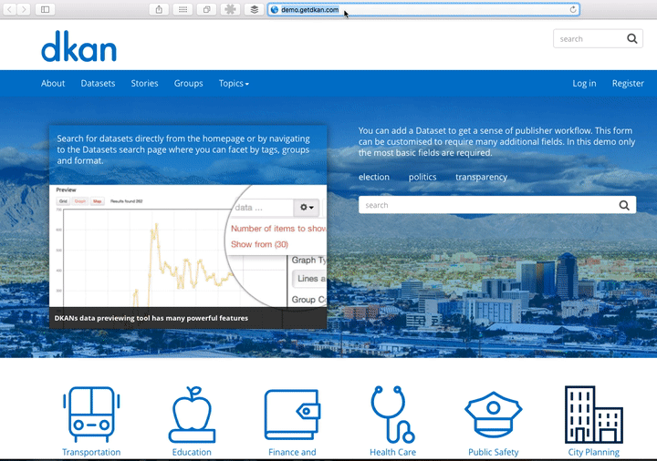
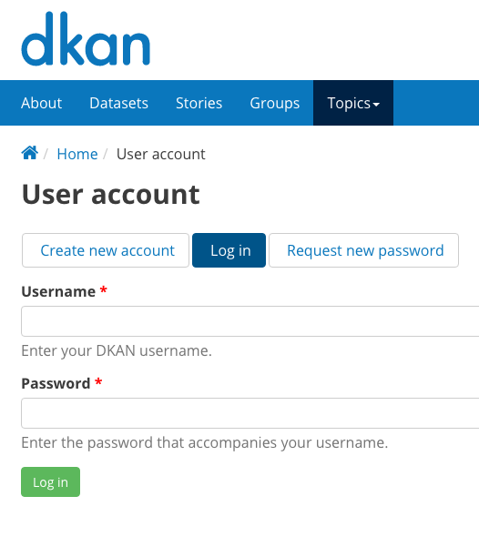
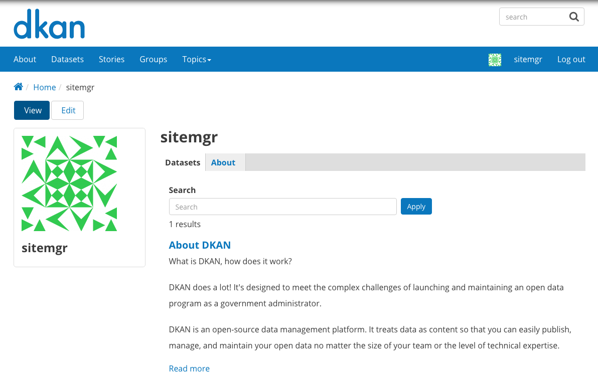
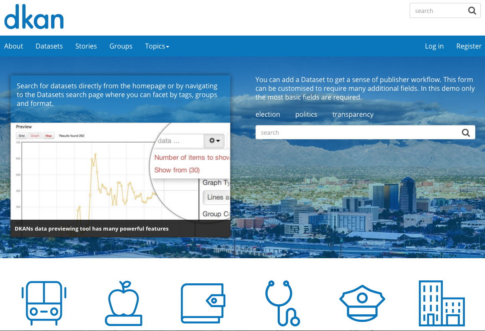
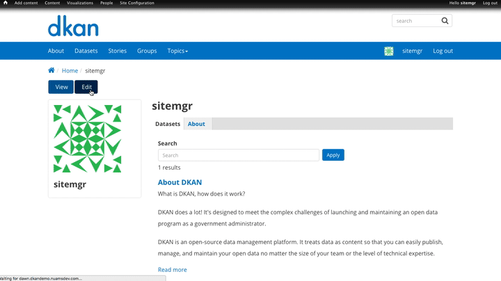

========================
Account Access and Setup
========================

Getting to the site
-------------------

Your DKAN Open Data site will have a login page located at the site's URL with the ending /user. Once you've accessed the login page, you can log in with your account information. We suggest bookmarking the page for quick access.

Getting your login information
------------------------------

For your account details, you may receive an automated email with a link and further instructions for login or simply be contacted directly by the person managing your site. Once you receive your account information, you can access the site, log in, and begin setting up your profile.

Access the site and log in/log out

Get to your DKAN site and log in by either:

- Finding your DKAN site and typing /user in the web address bar after the site name.
- Following the link sent to you with your login information.
 
If you don't remember or can't find your password you can get a new password by clicking the Request new password button.

Use the login information provided to access the site and your profile. You'll see your most recent content, your profile details, and your profile image.

When you're done adding and editing content on the site, you'll want to make sure you log out to avoid security risks. You can log out from anywhere on the site by using either of the buttons shown in the picture below. The blue navigation bar is not on every page of the site, but the black administration bar (the Admin Menu) always appears.

.. image:: ../images/site_manager_playbook/account_access_and_setup/account_access_and_setup_image_06.png
   :alt: An image displaying the two upper right-hand side locations of the "Log out" buttons on DKAN.

Once you log out, you'll be taken back to the Home page of your DKAN site as if you were a general site visitor.

Setting up your profile
-----------------------

Once logged in, you'll see your profile page. By clicking the Edit button above your profile image, you can change the details of your account including:

- Your Username.
- The email address linked to your account and how you will be contacted.
- Your password (you can also request a new password if you've lost or forgotten it).
- Additional information about you in the About section and your timezone.
- Your profile image.
- You can also see which Groups you belong to and delete your account by clicking the Cancel account button.
