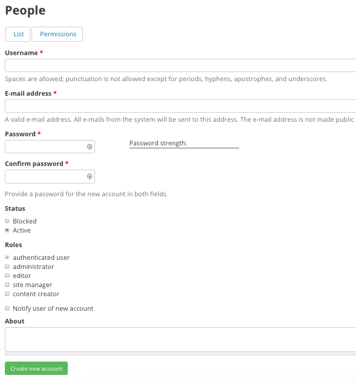

================
Adding New Users
================

Adding a user
-------------

As a Site Manager, a core piece of your role involves adding users to the site. On your DKAN site you may have generic roles like Authenticated User register for an account that simply needs approval from the Site Manager. But trusted roles with access to content like Content Creators and Editors must be created by a Site Manager. The user can change most of the information on their profile once they access the site, but you’ll need to initially provide basic information like a username and password.

.. figure:: ../images/site_manager_playbook/adding_a_user/adding_a_user_01.png
   :alt: Image displaying the location of the People button at the top of the screen.

You can add new users by clicking on the **People** link and choosing the Create user menu item for quick access or the main People page.

Key information when adding a new user
--------------------------------------

- **Username:** Create a unique username to create a new user account. The user can change their username once they’re logged in as long as it’s still unique, but you’ll have to choose a name to begin with for the user to first access the site.
- **Email address:** This is how the user will be contacted with notifications about their account and how they can recover a lost password. Choose an email that they are likely to check on a regular basis.
- **Password:** The user should change whatever you originally enter for the password, but you’ll need to choose the initial password so that the user can login to their account and change the profile information.
- **Roles:**  As you’re adding a new user you’ll choose which role that person should have from the list of user types detailed in another section. Choosing a role might be obvious in some cases, but in other cases it may be less clear. The role you assign will depend on how much a person needs to do with the site. Higher-level access roles automatically have all the permissions of lower-access roles, but in general we recommend erring on the side of lower-access.

Once you click the **Create new account** button at the bottom the page, the account is created and can now be managed with other existing user accounts.
