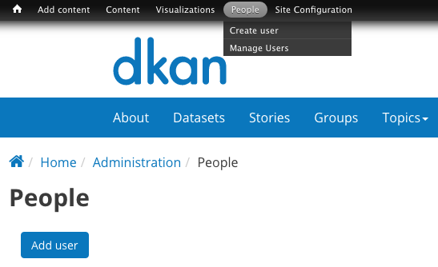
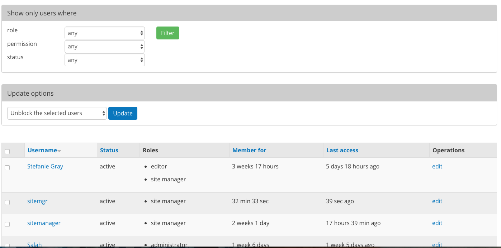
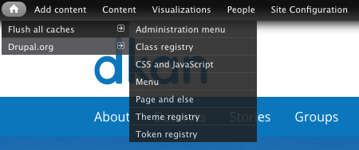
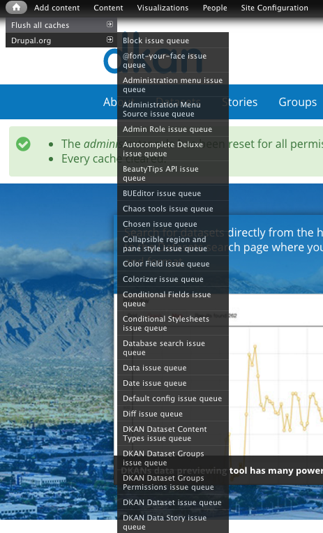

================
Admin Menu
================

The Admin Menu on your site is the main tool for navigating data and content management. Get familiar with the Admin Menu as a first step to mastering your DKAN site.

.. figure:: ../images/site_manager_playbook/admin_menu/admin_menu_01.png
   :alt: Image displaying the admin menu, located at the top of the screen.

When you're logged onto the site, you'll see a black navigation bar at the top of the page. This is the Admin Menu. As a Site Manager, this menu looks different for you than other roles on the site. Editors and Content Creators have fewer options because they have fewer permissions on the site.

Use the Admin Menu as your anchor on your DKAN site. Everything you can do on the site is accessed through the Admin Menu.

Admin Menu Items
----------------

.. figure:: ../images/site_manager_playbook/admin_menu/admin_menu_02.png
   :alt: Image displaying the admin menu, located at the top of the screen.

Add Content
-----------
Add Content is shortcuts menu item for creating new content. Click on Add Content to go to a page of available content types to create or simply choose from the drop-down menu. As a Site Manager, you have permissions to create all the content types possible.

.. figure:: ../images/site_manager_playbook/admin_menu/admin_menu_03.png
   :alt: The "Add Content" dropdown on the DKAN admin menu.

Content
-------
Click on the **Content** menu item to access all the content that exists on the site. As the Site Manager, you have access to create all the content types possible as well as edit, unpublish, and delete all existing content regardless of who the author is. You can create new content from this page as well as manage all the existing content and files on your DKAN site from here. Files include things like images, videos, font files for icons, other graphics, etc.

In smaller organizations, Site Managers may both be writing and editing their own content to then directly publish the content to the live site. Larger organizations may have people in other roles like Editors and Content Creators to help with handling a large mass of content on the site. Depending on the scale of your organization and volume of content, you may spend more or less time directly handling content.

.. figure:: ../images/site_manager_playbook/admin_menu/admin_menu_04.png
   :alt: A view of the "Content" page in DKAN.

In any scenario, as a Site Manager you can use this page to look at the content on the site to see who created a particular piece of content, when it was last updated, its status (published or unpublished) and take action on existing content. You can handle individual pieces of content, but you can also perform "bulk actions". This is a particularly useful function especially when dealing with a high volume of content. From this page you can take the same action on several different pieces of content by simply checking the boxes on the left, selecting an update option and clicking the Update button.

In the example below, the Site Manager is selecting a few pieces of content to perform a single action on. The Site Manager is able to unpublish 3 pieces of content at the same time by using bulk actions. While the example is simple, this function becomes helpful on site that contain thousands of pieces of content.

.. figure:: ../images/site_manager_playbook/admin_menu/admin_menu_05.gif
   :alt: An animated example of a Site Manager selecting content in order to perform a bulk action.

Visualizations
--------------

As a Site Manager, you have access to create visualizations on DKAN. This type of content is unique to Site Managers and Editors, and as a Site Manager you have access to manage all content regardless of the author. Typically, you'll use DKAN Charts.

.. figure:: ../images/site_manager_playbook/admin_menu/admin_menu_06.png
   :alt: The "Visualizations" dropdown on the DKAN admin menu.

Charts are a powerful tool for taking data and making it meaningful to the average site visitor who may have little to no experience with data and analysis. Click on the **Visualizations** menu item to access all the existing visualization content in your DKAN site, make edits, delete or create new visual content.

.. figure:: ../images/site_manager_playbook/admin_menu/admin_menu_07.png
   :alt: A sample listing of Charts from the DKAN Demo site.
   
   A sample listing of Charts from the DKAN Demo site.

People
------

From the **People** menu item, you can create new users, manage existing accounts, and get a comprehensive view of all the users on the site.

The People main page gives you all the information about the users on your DKAN site including the username and role as well as the length of the account and when the user last accessed their account. This high-level view is especially helpful for managing a large number of accounts and performing "bulk actions".

Sort the order of info columns by clicking the title link. In other words you can sort A-Z by clicking the Username title link You can use filters and combinations of filters to search for users with specific roles, permissions, and status.

Make bulk actions to users by selecting the checkboxes on the the far left of the page, choosing an action from the Update options menu and clicking the **Update** button.

Site Configuration
------------------

These options let you manage general settings of certain features on your DKAN site like how user accounts are set up, search options, which fonts are applied to the text on the site and more. These settings determine how lower-access users interact with the site and give you flexibility to change the default behavior.

Click the **Site Configuration** menu item to see all the configuration options.

DKAN
----

From the DKAN menu, Site Managers can access some of the more technical operations of DKAN. DKAN is the technical engine that powers DKAN, and the available options in this menu are customized to DKAN and open data publishing.

Use the **DKAN** menu item to add APIs, enable External Previews, access the Harvest dashboard, manage the Recline configuration, and more.

Recline configuration
---------------------

DKAN Internal Previews provide site visitors a visual snapshot of the contents of a Resource. Previews are powered by a tool called Recline that works in the background.

In cases where the file is relatively small (under 3MB) the Previews tool, Recline, will display the file contents without issue. To preview contents of a file larger than 3MB there are two options: import the file into the DKANDatastore or adjust the Recline configuration.

**Import file:** As a best practice, we recommend importing CSV files into the Datastore whenever possible. In the case of Internal Previews, if the file is imported to the Datastore there are no size limits on what a site visitor can preview.

**Adjust Recline Configuration:** For files that cannot be imported to the Datastore, the entire file is downloaded to be previewed. File size limits maintain a positive user experience by preventing errors or loading errors, however they can also keep a site visitor from seeing the contents of some file.

Site Managers can adjust the size limitations to be higher or lower with Recline Configuration:

   1. From the Admin Menu, mouse over the DKAN menu item.
   2. Select the Recline Configuration menu item.
   3. On the Recline Configuration page, enter file size limits using standard conventions (MB, GB, etc.)

Caches
------
From the Admin Menu you can access caches to flush directly from the drop-down menu items.

**More actions (home icon):** On the Admin Menu, you can click on the Home icon any time to return to the Home page of your DKAN site. Additionally, if you hover over the home icon, you'll see two options.

.. figure:: ../images/site_manager_playbook/admin_menu/admin_menu_11.png
   :alt: The "Flush All Caches" button available within the admin menu on DKAN.

**Flush all caches:** Flush all caches is a drop-down menu item that allows you to delete stored information on DKAN. Caches are helpful in storing information on the site that was recently used or likely to be used again in the near future. DKAN has a number of caches that are specialized to capture certain information in different places on the site.

- While caches are useful for keeping information easily accessible, they can significantly slow down computer speed as the caches accumulate more information. By flushing a cache, you delete the stored information and increase computer speed. Click on the main menu item to simply flush all the caches possible, or hover over the arrow to see all the individual options.

**Note:** By clicking any of the options to flush caches, you will not be taken to a landing page as with other menu items. Clicking on these menu items directly performs the task, and you'll get a confirmation message like in the image below.

.. figure:: ../images/site_manager_playbook/admin_menu/admin_menu_13.png
   :alt: An example of a successfully cleared cache in DKAN.

*Drupal.org issue queues:** For Drupal-savvy users, the home icon also has Drupal.org menu items. Clicking directly on Drupal.org will take you the main Drupal website that contains extensive documentation on Drupal features, modules, functions and more.
- You can also hover over the menu item to see a list of queues. These queues are a place to report and see already-reported issues that you may encounter on your DKAN site. Some of the queues are specific to DKAN and others are for general Drupal features. These queues are a good resource for troubleshooting issues and reporting problems so that they can be fixed if you're familiar with Drupal.

