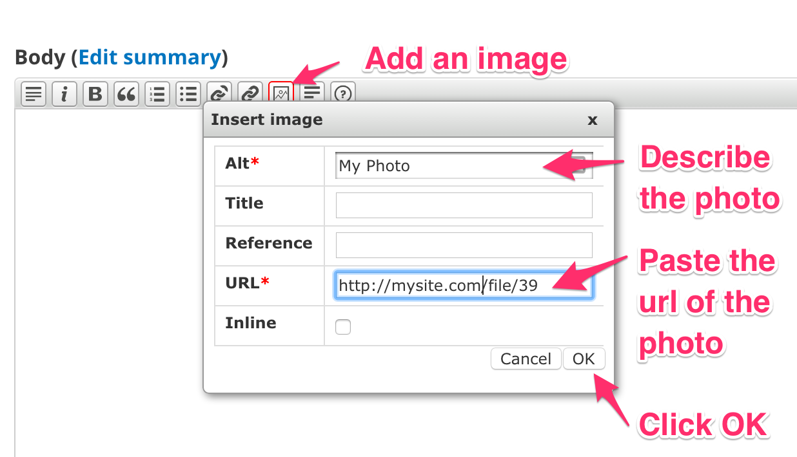
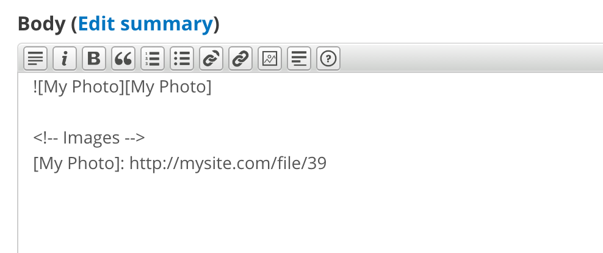

# Customizing DKAN's Appearance

DKAN takes advantage of Drupal’s well-developed and flexible theming system,
allowing administrators complete graphical control over the entire DKAN site.
Features such as responsive page templates, accessible design elements, and
built-in media management provide the latest in design and presentation
technologies.

## Default DKAN Theme

In Drupal and DKAN, the collection of page templates, fonts, colors, images,
and other “look and feel” elements are known as a “theme.” The DKAN
distribution of Drupal includes a default “DKAN Theme” called NuBoot Radix, that visually
highlights all of the DKAN-specific data elements in the software.

DKAN administrators have the choice of customizing the existing DKAN Theme through theme settings, implementing an entirely new theme, or creating a [subtheme of nuboot_radix](dkan-documentation/dkan-developers-guide/creating-sub-theme-dkan).

By default, the DKAN Theme is located in: `[SITEROOT]/themes/nuboot_radix`

The default DKAN Theme is a sub-theme of [Radix](https://www.drupal.org/project/radix),  and Radix uses components and plugins from [Bootstrap](https://github.com/twbs/bootstrap).

## Theme and Appearance Settings

The DKAN Theme does provide a few simple customizations that administrators can use to change the default appearance of the site from the theme settings screen. If logged in as an administrative user, navigate to Appearance >> Settings

### Site name and slogan
From the settings screen, you can toggle on/off the **site name** and **slogan**, simply check the box next to the elements you want to use.

### Logo
Uncheck the 'Use the default' checkbox, and upload a new logo file in the logo image settings section.
![Logo settings][(../images/Appearance_DKAN_2.png)

### Shortcut icon
If you would like to use a different favicon image, uncheck the 'Use the default' checkbox, and upload your own.

### Copyright info
To change the **copyright** information that displays at the bottom of every page, edit the text in the copyright field and save.

### Hero background image/color
The **Hero Unit** is the background image that displays on the front page. To use a different photo than the one supplied, click the 'Choose file' button to upload a new image. This image will expand to cover the full width of the browser so be sure to upload a horizontal/landscape image and not a vertical/portrait image.

### Color scheme
To use the **colorizer** option, you must use the default theme as the admin theme. Navigate to `[SITEROOT]/admin/appearance` and scroll to the bottom. Confirm that the Admin theme is set to 'Default Theme'.

Now navigate to `[SITEROOT]/admin/appearance/colorizer` by clicking on the 'Colorizer' tab. Here you will see the color scheme options. There are a few default options you can select from the drop down, or you can enter hex values to create a custom color scheme, be sure to click 'Save Configuration' when finished. Your new colors are saved to a css file in your files directory. If you do not see your changes you may need to clear the colorizer cache by clicking the 'Clear Colorizer Cache' button. These colors will override all other styles in the theme.

### Fonts
On the Appearance page, you will see a sub-menu item for **@font-your-face**. Navigate to `[SITEROOT]/admin/appearance/fontyourface`.

By default, the Google fonts api is enabled. If you click on the **Browse all fonts** tab, you will be able to select which google fonts to add to your site. Once you have made your selections, click on the **Enabled fonts** tab to view the font settings screen. Click on the **By CSS selector**, here you can select the css tag and what font should be applied to it using the table. To add fonts to specific css selectors, add them to the open text field at the bottom of the list, select a font from the dropdown next to it and click the **Save applied fonts** button
For more information on how to use @fontyourface visit the [project page](https://www.drupal.org/project/fontyourface).

## Adding Styles to text

DKAN allows you to style the text in the description fields of datasets and resources as well as in the body of data stories. Text can be styled as bold and italic. You can add headline styling and subheads, blockquotes, numbered lists, bulleted lists, hyperlinks and images.

Text styling is added using [markdown syntax](http://daringfireball.net/projects/markdown/syntax). To assist you in adding styling to your text, a markdown toolbar appears at the top of styled text areas with buttons that you can click to add styles:

Markdown syntax is intended to provide limited styling capabilities. It offers fewer styling options and is not as simple to use as the WYSIWYG editors used in modern word processors such as Microsoft Word. This limitation is intentional. DKAN is intended to serve as an open data sharing platform, and it has a powerful API that can be used to retrieve datasets and their content by other computer programs. Limiting DKAN to markdown styles helps ensure that dataset descriptions and other metadata can be shared consistently via the API without breaking.

## Adding Images 

First you will need to upload an image file to your website, then use the markdown image tool to insert that image into your content.

Users with the role of "administrator" can upload files to a DKAN website. This permission can be added to other DKAN user roles such as the "editor" and "content creator" roles, but these permissions are not enabled by default for security reasons. To upload an image, visit the files administration page at path /admin/content/file and click the "Add file" button:

This will bring up an "Add file" page that lets you choose the image file and upload it:

After you have uploaded and saved the image file, you can view it and copy its image address (URL) to be added to the text where you want it to appear. If you are using a Windows computer, visit the image file's page and right click on it to made a copy of the image address. On an OSX computer, control click rather than right click to do the same thing:

Now visit the text field where you want to insert the image, and position your edit cursor inside the textfield at the spot where you want the image to appear. Click the picture button in the markdown toolbar to insert the image:

A popup window will appear where you need to enter alt text describing the image as well as its URL. You should also select the "Inline" checkbox:

This will insert markdown text for the image that you want to insert, like the example below:

