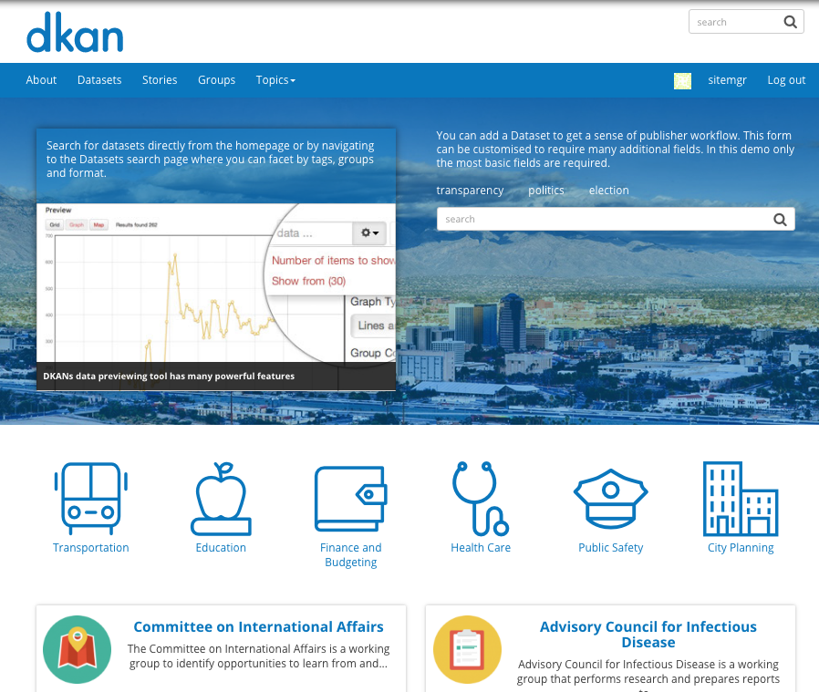
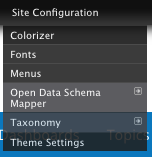
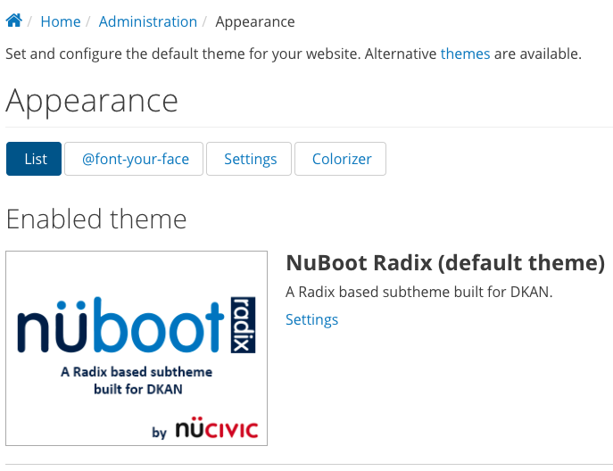
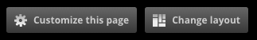
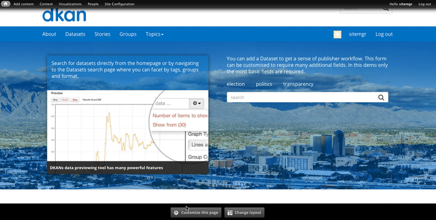
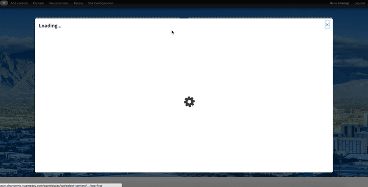
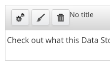
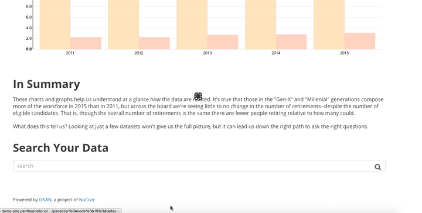
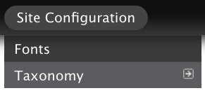
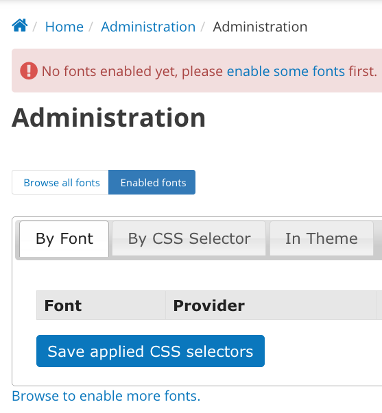

==========
Appearance
==========

You can make your DKAN site look and feel completely aligned with your organization to give site visitors the best possible experience while going through the site. Add your logo, change page layouts, customize the Home page, or pick out the right fonts to match your brand.

Colorizer
~~~~~~~~~
Colorizer is what powers the color scheme on a DKAN site. Color schemes are a large part of a consistent aesthetic, which is especially important when working with many collaborators.

The default color scheme gives your site a consistent look and feel and meets standard accessibility requirements. You can also customize the color scheme to align with your agency’s image using Colorizer.

With Colorizer, you can choose a different preset color scheme or create your own custom color scheme for full customization.

Colorizer can be accessed by navigating to the Site Configuration drop-down menu and selecting "Colorizer."

Using Colorizer
---------------

**Global settings:** The global settings are technical details pulled from the CSS template that powers the Colorizer tool. The global settings remain the same, unless you have your own CSS template.

**Color scheme settings:** The color scheme settings customize a color scheme that will be consistent throughout your site.

**Color scheme:** Click on the Color scheme drop-down menu to choose from a list of preset themes. Click on the custom theme to choose your own.

**Custom color scheme:** Create your custom color scheme in one of the following ways:

- **Using the color picker:** With the custom color scheme selected, use the color picker to choose the primary color for your color scheme. The secondary colors will automatically update to complement the primary color selected.

- **Manually:** Hex numbers can be changed individually by manually entering a new hex number. When changed manually, secondary colors do not automatically update.

**Save as default:** Once the color scheme is selected, whether custom or preset, save the changes by clicking the Save as default button at the bottom of the page.

**Clear Colorizer Cache:** With custom themes, you can reset to the default theme by clicking the Clear Colorizer Cache at the bottom of the page. Clear the cache to start the customization process over or to simply use the default theme.

.. figure:: ../images/site_manager_playbook/appearance/colorizer_in_action.png
   :alt: An example screencap of Colorizer when choosing from one of the default color schemes.

Theme Settings
~~~~~~~~~~~~~~

.. figure:: ../images/site_manager_playbook/appearance/theme_settings_link.png
   :alt: The "Site Configuration" dropdown menu, which contains a link to theme settings.

The theme settings are options that personalize your website. Page elements like logo, site name, the hero section, etc. can all be customized to reflect your agency’s brand.

**Using theme settings:**

**List:** Click the List button to see which site themes are enabled and disabled. From here, enable site themes and choose the default theme. Site themes affect how page elements are displayed on a site. By default, DKAN uses the NuBoot Radix theme. Use the List page to choose your theme.

**Global settings:** These options control the default display settings for your entire site, across all themes. Unless they have been overridden by a specific theme, these settings will be used.

.. figure:: ../images/site_manager_playbook/appearance/global_settings.png
   :alt: The "global settings" display in DKAN, showing a full list of appearance options.

- **Toggle display:** Turn the display of page elements on and off with the selected checkboxes. With these options, Site Managers can decide to show or not show the logo, site name, option to login, etc. Pay attention to elements like menus, since these affect how site visitors can navigate the site.

- **Logo image and Shortcut icon settings:** Uncheck the default logo box to add a custom logo. Small, but high-resolution photos work best for these elements. Using a custom logo and shortcut icon are additional ways to personalize your DKAN site.

**NuBoot Radix:** These options control the display settings for the NuBoot Radix theme. When your site is displayed using this theme, these settings will be used. Because NuBoot is the default theme, use these settings to make changes.

- **Footer text:** The footer appears on the bottom of every page on the site. In the Copyright section, edit the footer text for additional branding.

- **Hero Unit:** The front page display includes a large banner at the top of the page, called the Hero Unit. This image is the first contact a site visitor makes with your site, so it can make a strong visual impression. Add a high-resolution image or choose a solid color. In the example below, the solid blue color is the Hero Unit.

Featured Groups sort order
~~~~~~~~~~~~~~~~~~~~~~~~~~

Featured Groups is a type of pane that highlights a set number of Groups on a page. If a DKAN site has a Featured Groups pane, Site Managers can decide which Groups are highlighted by changing the sort order of the Groups list.

1. Choose the order of how Groups appear in a Featured Groups pane with the sort order:
2. From the Admin Menu hover the mouse over the **DKAN** menu item.
3. From the drop-down menu, select **Featured Groups Sort Order**.
4. View the list of Groups; all Groups are listed.
5. Click and drag the cross icon to change the order of the Groups.

The pane reflects the order on the Featured Groups Sort Order page. To remove a Group from this display, move it further below on the list. Depending on the site, the Featured Groups pane could have as few as 1 Group or as many as 12. The pane displays the Groups at the top of the list for as many Groups are included in the pane.

Changing front page content
~~~~~~~~~~~~~~~~~~~~~~~~~~~

The landing page of any website is critical. It's the first impression you give a site visitor, and it may be the deciding factor if that site visitor continues to explore the content on your site or if they move on to the next thing. The content on your front page should be eye-catching to get site visitors interested in exploring more. As a Site Manager, you can customize the content of the front page to be engaging and timely.

Customize branding elements
---------------------------

The logo, shortcut icon, and hero unit on a DKAN website can be customized to fit a specific look and feel on an ongoing basis as designs and logos change over time.

Change the logo
---------------

1. From the Admin Menu, hover over the **Site Configuration** menu link to display the drop-down menu.
2. From the drop-down menu, select **Theme Settings.**
3. On the Theme Settings page, scroll down the page to the section labeled Logo image settings.
4. Uncheck the box labeled, Use the default logo.
5. Paste the URL to a remotely hosted image or upload an image.
6. Click the Save configuration button at the bottom of the page to finalize the changes.

For the logo, use a high resolution image sized with small to medium dimensions.

Change the shortcut icon
------------------------
1. From the Admin Menu, hover over the **Site Configuration** menu link to display the drop-down menu.
2. From the drop-down menu, select **Theme Settings.**
3. On the Theme Settings page, scroll down the page to the section labeled Shortcut icon settings.
4. Uncheck the box labeled, Use the default shortcut icon.
5. Paste the URL to a remotely hosted image or upload an image.
6. Click the Save configuration button at the bottom of the page to finalize the changes.

For the favicon, use a high resolution image sized with small dimensions.

Change the hero unit
--------------------

The hero unit on a website is the large, banner-like image or color on the front page. This section of the website is the backdrop for the welcome to new and returning site visitors. As the first impression, the hero unit can play an important role in retaining site visitors.

1. From the Admin Menu, hover over the **Site Configuration** menu link to display the drop-down menu.
2. From the drop-down menu, select **Theme Settings.**
3. On the Theme Settings page, click the tab labeled NuBoot Radix for specific theme settings.
4. Scroll down the page to the section labeled, Hero Unit.
5. For a hero unit using an image, upload the file by clicking the Choose file button (max size is 2MB).
6. For a hero unit using a solid color (recommended), enter the hex value of the color. Hex values use a hashtag with numbers and letter format such as #000000 or #4c9d9b

Using the In-Place Editor
~~~~~~~~~~~~~~~~~~~~~~~~~

The In-place Editor is a tool on DKAN designed to make it easy to add, change, and move around content elements directly on the page. You can use the In-place Editor to add new content, drag-and-drop content that already exists, and see changes on the page in real-time.

From the front page, click the Customize page button at the bottom of the page to open the In-Place Editor and access the existing content. You may want to leave some elements, like the search bar, or you may want to start completely new.

Using the In-place Editor gives you flexibility in the way content is displayed and curated. Add simple content types like images, videos, links, and text or you can add more dynamic content like visualizations and slideshows.

Because this feature shows changes in real-time, it's well-suited for testing how content will look before clicking the Save button. Play with the placement of content on the page, the styling of the region, and keep tweaking until the page looks right.

Add new content (+):
--------------------

1. On the bottom of the Page, click the **Customize this page** button.
2. Choose the region to add new content to.
3. The add content button is represented on the In-place Editor by a + icon. Click on the + button to add a new piece of content to the region.
4. Choose what element to add to the page (exe visualization, text box, image, video, etc.)
5. Fill in the details of the form, specific to the type of content.
6. Click the **Finish** button.
7. Preview the changes on the Page. Make edits or rearrange with the In-place Editor.
8. Click the **Save** button at the bottom of the page to finalize the new content.

**Which content, where?:** Choosing the right content type will depend on the information and the overall arrangement of the different pieces of content. Visual content, like slideshows (a collection of rotating images), videos, maps, and visualizations grab attention and so they do well near the top of the page. Other content, like text, files, and tables add density to a page so less is more. They're best used for quick bites of information and as complements to visual content.

In the example below, the Site Manager is using the In-place Editor to move content from region to region and delete irrelevant content. the placement of the content is previewed in real-time so you can see how the page will look once the changes are saved and published to the public site.

.. figure:: ../images/site_manager_playbook/appearance/appearance_06.gif
   :alt: An animated screencap of how to add, edit and delete front page content.

Edit existing content:
----------------------

1. Click the **Customize this page** button at the bottom of the page with the content you want to edit.
2. On the pane of the content, click the the gear icon. Each pane can be edited individually by clicking the gear icon for the specific pane with the content to be edited.
3. A menu will appear with the administrative details included when the content was first created.
4. Use the Content settings section to make changes.
5. Click the **Finish** button at the bottom of the screen to save the changes.
6. Review changes on the Page and continue to make changes as needed with the In-place Editor.
7. Click the **Save** button at the bottom of the page to finalize the new content.

**Remove content:**
To remove the entire pane and all its contents click the trash can icon to remove the pane in one click. Once you choose to remove a pane it cannot be undone, so be careful when removing content.

**Style a whole region or a single pane:**
Styling gives you even more control over the experience a site visitor has going through the site. You can style an entire region to affect all the panes within the region to have the same styling.

Alternatively, you can choose a style for single panes within a region. The style button is represented by the paintbrush icon in the top-right corner of the region or pane.

Use this button to change the style of the region as a whole or an individual pane. Styling may affect the appearance (like adding rounded corners to the region) or the user experience (like making a region and its content collapsed or exposed by default).

In the image below, none of the panes have any styling applied.

.. figure:: ../images/site_manager_playbook/appearance/appearance_08.png
   :alt: This image displays DKAN panels without any styling applied.

In the image below each pane has a style different from the others in the same region (from left to right): rounded corners, collapsible (not by default), no style, collapsible (by default).

.. figure:: ../images/site_manager_playbook/appearance/appearance_09.png
   :alt: This image displays DKAN panels with styling applied.

In the example below the Site Manager is changing the style for the entire region on a page. The Site Manager chose rounded corners for the style. This style groups together a set of information to help guide the site visitor and create a clear differentiation from the other sets of information. When adding styling, you want to think about how it can improve the experience a site visitor has on your site rather than choosing a style based solely on the aesthetic.

Choose fonts
~~~~~~~~~~~~

As a Site Manager, you can control what fonts are used for the text across your DKAN site. By setting fonts, the text is formatted automatically rather than leaving it to individual users to decide.

This maintains a consistent style throughout your site which is important to the site visitor’s ease in navigating content. User experience can’t be emphasized enough. It can make the difference of a person going exploring through your content or leaving after clicking on just a couple pages.

While DKAN defaults to a certain font for text styles, the Site Manager has control over fonts to best match the overall look and feel of the organization. Mix and match which fonts are used for specific text areas. Choose one font for text in description and summary boxes, choose another for all headers or a specific size of header or add custom font specifications.

Enabling fonts
--------------

Before making font selections, you first have to enable fonts.

1. On the Admin Menu, find the **Site Configuration** menu link.
2. From the drop-down, select the **Fonts** menu item to access fonts and set defaults.
3. Displayed is the list of fonts that have been enabled as well as browse fonts to either enable or disable. By default, no fonts are enabled; texts appears in the default font set by the DKAN theme.
4. Click on the **Browse all fonts** link.
5. Select a number of fonts to enable and click on the Enable link for each font selected. Once enabled the font can be used in default settings.
6. Click the Enabled fonts link to view the fonts just enabled.

Enabled fonts are the options that may be used for default font settings. Browse from a list of over 3000 font options provided by Google fonts.

The tiles have the name of the font as well as a preview, and tiles in green mean that the font is currently enabled. Switch to a list view of fonts you’ve already enabled (if applicable) by selecting the **Enabled fonts** tab.

.. figure:: ../images/site_manager_playbook/appearance/appearance_13.png
   :alt: The "Browse Fonts" screen.

Once fonts are enabled, they will appear on the fonts main page and you can set defaults with these fonts. Quickly and easily disable fonts from either the **Enabled fonts** menu or while looking for new fonts in the **Browse all fonts** menu. Click the **Disable** link associated with the font.

.. figure:: ../images/site_manager_playbook/appearance/appearance_14.png
   :alt: This screen shows fonts that have been enabled.

Selecting default fonts
-----------------------

Once your fonts are enabled, Site Managers can make selections for how text appears on the site by default.

From the **Enabled fonts** menu, make selections based on the font or based on the CSS selector. CSS selector is a technical term that refers to headers, body text, and any other selectors.

.. figure:: ../images/site_manager_playbook/appearance/appearance_15.png
   :alt: This screen shows what you'll see when selecting which fonts should be assigned to which CSS selectors.

Find the font you want to apply and use the drop-down menu in the CSS Selector section to choose the right selector. This is good for quick changes to your font selections. Click the **Save applied CSS selectors** to finalize your choices.

Alternatively, you can apply fonts to CSS selectors by clicking the By CSS Selector tab.

Here, you can make several changes to the different selectors and apply font changes. This is a good option when you have many changes to make to your font selections. You can also add fonts to the Fallbacks column for your primary font selections.

By adding a font in this field under the Fallbacks menu section next to the primary selection the fallback font will appear if the primary font is unable to display.

You can select multiple fallback fonts by using commas; if none are selected then the default DKAN font will display.

Click the **Save applied fonts** button at the bottom of the page to save your selections.

.. figure:: ../images/site_manager_playbook/appearance/appearance_16.png
   :alt: This screen shows what you'll see when selecting which fonts should be assigned to which CSS selectors.
