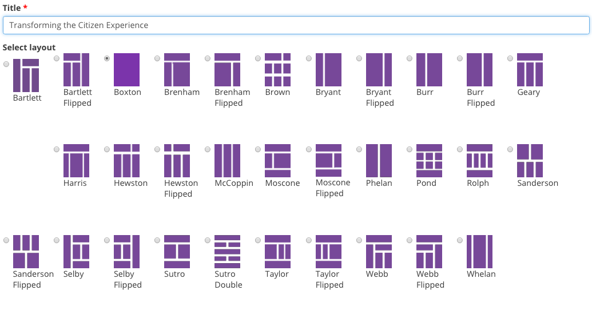

.. toctree::
   :maxdepth: 1
   
   account_access_and_setup
   appearance
   data_and_content
   people
   structure
   using_the_admin_menu

================
Data and Content
================

On Granicus Open Data the data you publish for site visitors is handled as content. Treating data like content makes it easier for general site visitors to consume information and accessible for people.  

Equally important is making your open data accessible for computers (ie machine-usable). Technologists leverage this access by developing applications to interact with your open data programmatically. This opens an entire realm of possibilities.  

Granicus Open Data is designed to make your published data accessible to the greatest number of people. At the same time, Granicus Open Data was also created with Site Managers in mind. The platform itself makes data management and open data compliance simpler to manage.     

While Granicus Open Data handles data as content along with many other types, not all content is the same. You can think of content in three different ways on Granicus Open Data: data, narrative, and curation content. Narrative and curation content support the data content published on your Granicus Open Data site. They help highlight the investment and value of open data that might not otherwise be apparent. 

Data content types
------------------

Data content is specifically for publishing and managing open data. That is, the actual files in which your open data is contained. These include Resources and Datasets. 

Resources
---------

Resources are the most basic content type on Granicus Open Data. They represent the actual file that can be viewed and downloaded by site visitors. Granicus Open Data supports a large range of file formats including csv, html, xls, json, xlsx, doc, docx, rdf, txt, jpg, png, gif, tiff, pdf, odf, ods, odt, tsv, geojson and xml. Resources may be uploaded alone, but in order to include metadata you must add the Resource to a Dataset. 

.. figure:: ../images/site_manager_playbook/data_and_content/resources_list_on_dataset_page.png
   :alt: resource list
   
   Example of a list of resources on a dataset page.

Add a Resource when you're trying to:

- Upload files of open data to your Granicus Open Data site. 
- Link to data from an online, external source. 
- Publish many different formats of the same data.

Datasets
--------

Datasets are often described as "containers" because they group related pieces of data (Resources). Grouping Resources together in Datasets gives the data a common summary description, licensing information, and a unique URL to easily share the dataset directly. The image above shows the Resources, which are the actual files that can be previewed and downloaded by site visitors.

In the image below everything surrounding the Resources is the "container", or Dataset. It includes a name for the Dataset, a description of the collection of Resources, tags, license information, the data author, and other metadata about the Resources. Resources may be uploaded alone, but metadata is associated with the dataset and cannot be individually attributed to a Resource.

.. figure:: ../images/site_manager_playbook/data_and_content/dataset_page.png
   :alt: dataset page
   
   Example of a dataset page.
   
Add a Dataset when you're trying to:

- Collect Resources with common metadata (such as author, open data license information, tags, etc.)  
- Create a unique URL to link site visitors directly to a Dataset. 

Narrative content types
-----------------------

Narrative content is designed to tell the story and reveal insights of data. Narrative content allows you to add context and bring the personal elements of data out to the front. These include Data Stories and Visualizations. 

Data Stories
~~~~~~~~~~~~

Data Stories show the people in data. It's not always obvious how rows and columns can make a difference in the world of citizens. Data Stories help show the impact data can make in our everyday lives by adding context and synthesis through a narrative form. This content type is easy to use and similar to writing a blog post. Use Data Stories to combine narrative, media, and data for a compelling way to connect to data.

.. figure:: ../images/site_manager_playbook/data_and_content/stories_page.png
   :alt: stories page
   
   Example of the Stories page.
   
Add a Data Story when you're trying to:

- Tell the story within the data on your Granicus Open Data site. 
- Show the impact of data on citizens' daily lives. 
- Demonstrate the value and return on investment of open data.  

Visualizations
~~~~~~~~~~~~~~

Visualizations on Granicus Open Data create a powerful access point for users. Visual representations of data are simpler to comprehend, regardless of technical expertise, and make large quantities of data consumable rather than overwhelming. Granicus Open Data Charts (pictured below) can also be interactive, letting site visitors toggle which data points are shown in the Chart. Use Visualizations to make your data more than just available.

.. figure:: ../images/site_manager_playbook/data_and_content/multiple_pie_charts.png
   :alt: pie charts
   
   Example of the pie chart visualizations added to a Data Story page.

Add a Visualization when you're trying to:

- Make large datasets understandable instead of overwhelming. 
- Make your data available and accessible to site visitors regardless of technical expertise.
- Use data-driven decision making for internal use.

Curation content types
----------------------

Curation content types bring both data and narrative content types into conversation to create context and bring out meaning. These include: Pages, Dashboards, and Groups. 

Pages
~~~~~

One of the most basic content types on Granicus Open Data is a Page. Though the content type is straightforward it has implications for the structure, appearance, and experience of your Granicus Open Data site. You can think about Pages as the anchors of your site.

With a Page, not only do you add content but you create additional space on your Granicus Open Data site. With other pieces of content, like Dashboards and Data Stories, the content is collected onto a single page. In contrast, Pages typically won't change themselves, though the content on them could change at any frequency.

Add a Page when you're trying to:

- Add a new space on your Granicus Open Data site for key information (like an About page).
- Add a space that itself won't change, though the contents within it might (like a Contact page). 

Data Dashboards
~~~~~~~~~~~~~~~

Dashboards provide the ultimate flexibility for you to give site visitors the best experience possible while also showcasing the data and content on your Granicus Open Data site. Using this curation content type, you can mix and match all kinds of content without ever touching code.

Mix videos, images slideshows, Granicus Open Data Visualizations, text, tables, and maps to most effectively deliver your content. With more than 20 responsive layouts to choose from and our easy to use drag and drop interface, any user can create compelling data-powered content within minutes.

   
   Different layouts that can be used to build Dashboards.
   
Add a Dashboard when you're trying to:

- Combine many different types of content in one place.
- Put data and narrative content in conversation to better connect open data to citizens.
- Use flexible layouts for easy content curation.

Groups
~~~~~~

Groups are both a way to collect common Datasets and enable an additional workflow on Granicus Open Data. On the outward-facing side, site visitors are able to browse Datasets published by a specific Group, which is the common publisher of a number of Datasets. 

Behind the scenes, Groups add an additional set of roles and permissions that ensure quality and security when publishing data. Group roles and permissions ensure that Content Creators can add new data but only to their assigned Group. This is especially important for large sites that may have several working groups publishing data to the site. Read more about `Group roles and permissions`_ **¡EDIT LATER WHEN DOCUMENT EXISTS!** .

.. _`Group roles and permissions`: ./people.rst

.. figure:: ../images/site_manager_playbook/data_and_content/groups_list.png
   :alt: groups list
   
   Example of a Groups list.

Add a Group when you're trying to:

- Collect and categorize Datasets by a common publisher. 
- Need a workflow for Content Creators to publish data to your Granicus Open Data site within a specific Group. 
