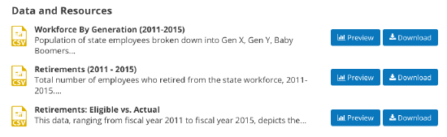

================
Data and Content
================

On Granicus Open Data the data you publish for site visitors is handled as content. Treating data like content makes it easier for general site visitors to consume information and accessible for people.  

Equally important is making your open data accessible for computers (ie machine-usable). Technologists leverage this access by developing applications to interact with your open data programmatically. This opens an entire realm of possibilities.  

Granicus Open Data is designed to make your published data accessible to the greatest number of people. At the same time, Granicus Open Data was also created with Site Managers in mind. The platform itself makes data management and open data compliance simpler to manage.     

While Granicus Open Data handles data as content along with many other types, not all content is the same. You can think of content in three different ways on Granicus Open Data: data, narrative, and curation content. Narrative and curation content support the data content published on your Granicus Open Data site. They help highlight the investment and value of open data that might not otherwise be apparent. 

Data content types
------------------

Data content is specifically for publishing and managing open data. That is, the actual files in which your open data is contained. These include Resources and Datasets. 

Resources
---------

Resources are the most basic content type on Granicus Open Data. They represent the actual file that can be viewed and downloaded by site visitors. Granicus Open Data supports a large range of file formats including csv, html, xls, json, xlsx, doc, docx, rdf, txt, jpg, png, gif, tiff, pdf, odf, ods, odt, tsv, geojson and xml. Resources may be uploaded alone, but in order to include metadata you must add the Resource to a Dataset. 

   
   Example of a list of resources on a dataset page.

Add a Resource when you're trying to:

- Upload files of open data to your Granicus Open Data site. 
- Link to data from an online, external source. 
- Publish many different formats of the same data.

Datasets
--------

Datasets are often described as "containers" because they group related pieces of data (Resources). Grouping Resources together in Datasets gives the data a common summary description, licensing information, and a unique URL to easily share the dataset directly. The image above shows the Resources, which are the actual files that can be previewed and downloaded by site visitors.

In the image below everything surrounding the Resources is the "container", or Dataset. It includes a name for the Dataset, a description of the collection of Resources, tags, license information, the data author, and other metadata about the Resources. Resources may be uploaded alone, but metadata is associated with the dataset and cannot be individually attributed to a Resource.

.. figure:: ../images/site_manager_playbook/data_and_content/dataset_page.png.png
   :alt: dataset page
   
   Example of a dataset page.
   
Add a Dataset when you're trying to:

- Collect Resources with common metadata (such as author, open data license information, tags, etc.)  
- Create a unique URL to link site visitors directly to a Dataset. 

Narrative content types
-----------------------

Narrative content is designed to tell the story and reveal insights of data. Narrative content allows you to add context and bring the personal elements of data out to the front. These include Data Stories and Visualizations. 

Data Stories
~~~~~~~~~~~~

Data Stories show the people in data. It's not always obvious how rows and columns can make a difference in the world of citizens. Data Stories help show the impact data can make in our everyday lives by adding context and synthesis through a narrative form. This content type is easy to use and similar to writing a blog post. Use Data Stories to combine narrative, media, and data for a compelling way to connect to data.
