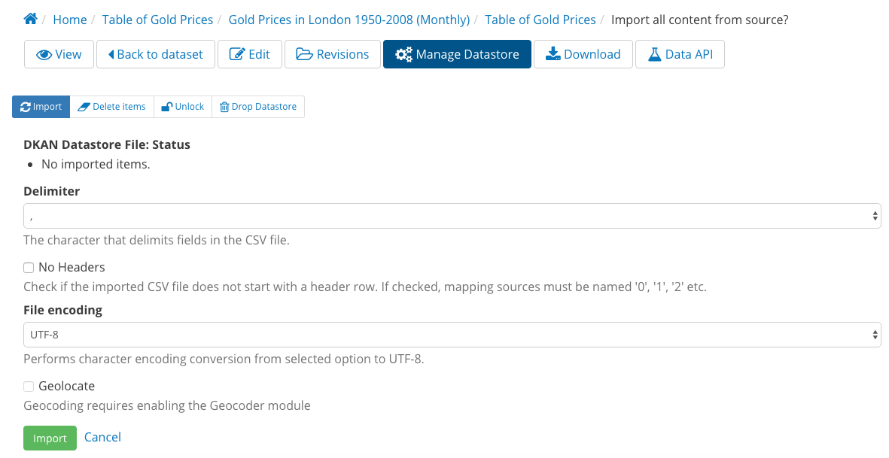
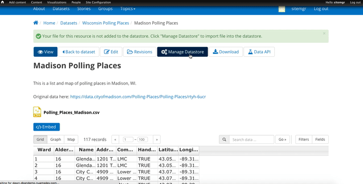
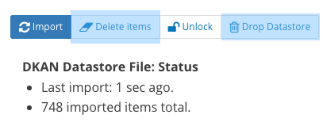
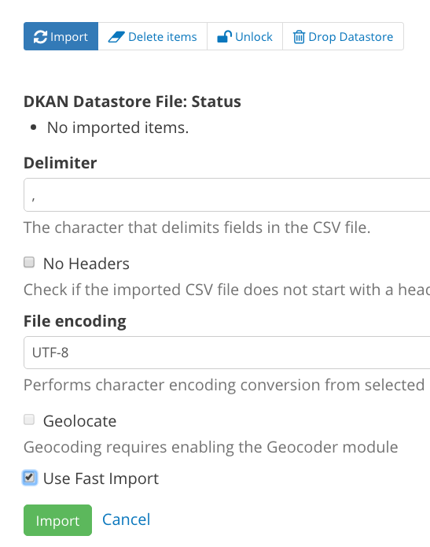

===============
Data Management
===============

Granicus Open Data supports broader data management strategies with tools that simplify and streamline data migration, storage, and usability. The tools are designed to be straightforward so that you don’t need to be a technical expert to use them. Migrate open data efficiently and effectively, store your data, and improve the overall usability of your data.  

Harvest
--------------

As you build up your Granicus Open Data site with content and data, you can add datasets by uploading or linking to resources and APIs. You can also “harvest” datasets from other data portals that have a public data.json or an XML endpoint. All the datasets published in the source are added to your Granicus Open Data site as the Dataset content type.  

Unlike linking to a file hosted on the web, harvested datasets are fully imported from an external source onto your Granicus Open Data site. That means that the datasets exist both on the external source and your site independently from one another with all the same information (including title, metadata, tags, etc.).  

By importing datasets from external sources, you can provide more open data on your site without manually managing the dataset content. Site visitors will see that a dataset was harvested and from which portal, promoting visibility across agencies and sectors. Harvest optimizes importing, publishing and updating imported datasets into a single streamlined process. 

How Harvest Works
~~~~~~~~~~~~~~~~~~~~~~~

The source is defined (fetching) 
  First, identify where the datasets should be imported from. Harvest is compatible with data.json and XML endpoints, and your source may be configured before import. By default, all the datasets and their metadata are imported from a source, but you can further configure exceptions to narrow what information is included (more on that in the Harvest Dashboard section). Site Managers define a source by creating a Harvest Source as a new piece of content.  

Data is stored locally (caching) as a copy  
  Once the source is identified, Harvest pulls datasets and stores them on the computer’s local hard drive. This is called caching. Site Managers have two options for how cached data is handled. Datasets may be cached and migrated (step 3) automatically or they may be only cached to be reviewed and later migrated manually. You may use a different operation depending on the context and can choose on a case-by-case basis.  

Harvest adds cached data to your site (migration and publishing)  
  After the dataset information is cached onto the computer’s local hard drive as a JSON file, Harvest reads the file and imports it to your Granicus Open Data site. Datasets can be migrated and published to your Granicus Open Data site automatically as part of the caching operation. Alternatively, datasets can be only migrated (without caching).  

Harvest is used to check for changes to migrated datasets
  Once the dataset information is imported to your Granicus Open Data site, its contents exist independently from the original source. That means changes made to a dataset on the original source won’t appear on your Granicus Open Data site unless the harvested dataset is updated. It also means that if you make changes to the dataset on your Granicus Open Data site, the changes will be overwritten when you run a harvest operation to update the file contents and metadata.  

With Harvest, you can make updates to your harvested datasets by repeating the process of fetching, caching and migrating. Harvest replaces the old information with the current datasets, updating the information to include any changes made to the original source. With defined sources, the process is a quick operation.  

Though most of Harvest works in the background, Site Managers can use the Harvest Dashboard to manage Harvest operations.

Harvest Dashboard
~~~~~~~~~~~~~~~~~

Harvest Sources have special handling. The Harvest Dashboard displays all the Sources on a site and a comprehensive list of harvested datasets.  

From here, Site Managers can view Harvest Sources, Source metadata such as date last updated and number of datasets in the Source, view harvested datasets individually, filter and search Harvest content, and perform bulk operations on Harvest content. 

The Harvest Dashboard is also used to perform Harvest operations, edit and configure a Source, check the status of a Source, and manage the datasets in a Source.  

Harvest operations
~~~~~~~~~~~~~~~~~~

Site Managers use special operations on the Harvest Dashboard to manage the harvesting process for existing Sources. From the Sources tab, Sources may be cached, migrated, harvested (cached and migrated) or deleted.  

Cache Source(s):
  This operation parses the Source endpoint (either data.json or XML) stores a subset of the Source data (reflecting parameters set by the Source configuration) on a computer. Caching data from the Source endpoint pulls the latest data, so the datasets on your Granicus Open Data site are current.  

Migrate Source(s):
  Migrating a Source imports cached data from local computer storage and uploads files as content to your site. For existing Sources, the new data will replace what was previously published or create a new dataset if it wasn’t previously published to your site.  

Harvest Source(s):
  The harvest operation combines the cache and migrate operations for a single, streamlined process. This option automates some of the work that would otherwise be done manually, but it also removes the ability to review datasets before migrating to your site.  

Delete Source(s):
  By deleting a Source, all the datasets associated with the defined endpoint are removed from your Granicus Open Data site. This is a permanent change.

Edit and configure a Source
~~~~~~~~~~~~~~~~~~~~~~~~~~~

The edit view of a Source opens the same options available when first adding a new Harvest Source.

Here, you can change the basic information about a Source, like the title and the URI. The basic information of a Source doesn’t typically change once it’s set.   

In this same view, Site Managers configure harvests with filters, excludes, overrides, and defaults. With these options, Site Managers can customize what information is pulled from a Source and how metadata values are handled during the harvesting process.  

Filters:
  Filters restrict which datasets imported by setting a pair of key values. For instance, if you are harvesting from a data.json endpoint and want to harvest only health-related datasets, you might add a filter with "keyword" in the first text box, and "health" in the second. With this configuration, only datasets that meet the stated criteria are imported.  

Excludes:
  Excludes are the inverse of filters. Values in this field determine which datasets are left out of an import, while all other datasets are included. For example, if there is one publisher included in a Source whose datasets you do not want to bring onto your site, you might add "publisher" in the first text box and "Office of Public Affairs" in the second.  

Overrides:
  Values included in the Overrides field will replace metadata values from the Source as it’s migrated in a harvest. For example, to change the name of the publisher, you might add "publisher" in the first text box to be replaced by the value in the second text box, like your own agency’s name. 

Defaults:
  In some cases, datasets from a Source may not have all metadata fields filled with a value. Use defaults to replace an empty field. For example, the first box might designate the License metadata value to be replaced if empty. The second box designates which value should replace it, like “Creative Commons”.  

Check the status of a Harvest Source
~~~~~~~~~~~~~~~~~~~~~~~~~~~~~~~~~~~~

As Sources go through the harvesting process, Harvest captures the details and displays the results. After a Harvest Source is created and the datasets harvested are published to your Granicus Open Data site, the original source may change. Datasets may be added, removed, edited, and otherwise modified. These changes are reflected in a Harvest Source when a harvest operation is performed as part of the status of that Harvest Source.  

There are two places to find specific details about a harvest operation on the Harvest Dashboard: the Events tab and the Errors tab.   

Events:
  Each Harvest Source has an event log under the Events tab. When a Source is harvested, the process is recorded as an event. Sources are updated by running the harvest operation, so there may be several events recorded and detailed in this log. The event log is helpful for checking harvest events and getting the status breakdown on the most recent harvest, the number of new datasets created, datasets updated, datasets that failed to upload, datasets that have become “orphaned” on your site, and unchanged datasets.  

Errors:
  Harvest Sources have an error log under the Errors tab to display the details of when a harvest encounters and error with the Source or a dataset in the Source. Error messages appear individually with the time and date it occurred as well as a message for the likely cause of an error. Details in the error log help identify the specifics of an error and find the best solution. 

Manage Harvest Source datasets
~~~~~~~~~~~~~~~~~~~~~~~~~~~~~~

Though harvested datasets appear alongside directly-published Datasets on your Granicus Open Data site, it’s best practice for Site Managers to manage harvested datasets with the Harvest Dashboard. The Harvest Dashboard provides more specific information like when a dataset was updated from a harvest, its “orphan” status, and its Harvest Source.  

Site Managers can either permanently delete or unpublish (recommended) harvested datasets. 

Managing orphan datasets
~~~~~~~~~~~~~~~~~~~~~~~~

After a Source is harvested, the datasets belonging to the source may change and may be deleted all together. When a dataset is deleted from the Source, but remains published to your Granicus Open Data site, the dataset is considered an orphan.  

Because the Source no longer contains the dataset, it isn’t updated as part of a harvest operation. But it isn’t deleted from your Granicus Open Data site automatically. Site Managers must make a judgment call on whether to delete the dataset and stay aligned with the Harvest Source, to unpublish the dataset and hide from public view, or to keep the dataset as a stand-alone dataset that won’t be updated through a harvest operation.  

Visit the Adding Content section to learn how to add a Harvest Source. 

Datastore
---------

Granicus Open Data comes standard with a Datastore to house tabular data imported from your CSV files on Granicus Open Data. That is, the Datastore can support files with contents that appear as a table (rows and columns). You can think of the Datastore like a basic database. Files that are imported to the Datastore have the contents of the file copied into a table in the Datastore, and the Datastore as a whole is composed of all the tables copied from imported files on Granicus Open Data.The Datastore processes data, stores the contents of Resources (if CSV), and makes them ready to be queried.   

As a Site Manager, you can manage the Datastore by adding and removing files from the Datastore. In most cases you want all CSV files included in the Datastore to support better data previewing, large files, and a more robust API.

Managing the Datastore 
~~~~~~~~~~~~~~~~~~~~~~

In broad strokes, managing the Granicus Open Data Datastore is deciding which Resources to include in the Datastore. There isn't any management further than that, and every user has the ability to import and remove Resources they've authored. As a Site Manager, you can import or remove any Resource regardless of the author. This allows you to manage what data is included in the Datastore API.

There may be some sensitive data that should not be included in the Datastore, but in general we recommend increasing your transparency and usability of your data by importing every Resource possible into your Datastore. 

Importing and removing files
~~~~~~~~~~~~~~~~~~~~~~~~~~~~

Uploading files to the Datastore has major benefits including enhancing the Datastore API and improved user experience of previewing data. The Datastore API makes the Resources more usable and accessible to technical users. Previews display resources as graphs, grids, or maps for geospatial data. In some cases files contain thousands (or millions) of rows. For data on such high order, users can only properly preview the data if the Resource has been imported into the Granicus Open Data Datastore.

.. figure:: ../images/site_manager_playbook/data_management/resource_page_with_datastore_message.png
   :alt: Your file for this resource is not added to the datastore.
   
   Above is what you should see on a resource page if your Resource file has not yet been added to the datastore.

   
   Above is what you should see when you select Manage Datastore.
   
**When to import:**

- The file is formatted as a CSV.
- The file is very large (and formatted as a CSV).
- To include the file in the Datastore API.

Importing
+++++++++

Once a Resource is added, you can import the file into the Datastore. Click the Manage Datastore button at the top of the screen to open the options included for importing a file into the Datastore. From the import screen, you can select the options that best reflect the contents of your data. By default, Granicus Open Data is set to match common data formatting practices. 

In the example below, the Site Manager is importing a Resource into the Datastore from the Manage Datastore page. From the Import tab, the Site Manager selects the delimeter and leaves the rest of the default settings for import. After clicking the Import button at the bottom of the page, the contents of the Resource are now included in the Granicus Open Data Datastore as well as the Datastore API.

Removing
++++++++

If you need to remove a Resource from the Datastore you’ll make this change directly from editing the Resource on the Manage Datastore screen. You have two options for removing the contents from the Datastore:

Delete items
  By deleting items, the values are removed from the Datastore. However, the table itself generated by the file import still exists. In this sense, you can think of the file as imported to the Datastore but empty. Again, the CSV file on your Granicus Open Data site is separate from the Datastore. By deleting the values in the Datastore, your file won’t be changed.

Drop Datastore
  This option removes both the values in the file as well as the table generated upon import. In this sense, the file is not imported. If you don’t want the contents of a file in the Datastore, we recommend this option.
  

  
Updating
++++++++

When you import a Resource to the Datastore, the contents of the associate file are copied and added to the Datastore. If the file is changed, the Datastore is not automatically updated with the contents of the new file. If you update a file associated with your Resource, you will also need to update the Datastore by importing the file again. All the old data will be overwritten with the contents of the new file.

Using Fast Import
~~~~~~~~~~~~~~~~~

For datasets with thousands (or millions) of rows, the size of the file increases quickly. By default, Granicus Open Data processes the contents of a file before importing to the Datastore. The processing checks that the contents match delimiter, file encoding, etc. for a smooth import. 

Large file sizes can delay the time it takes to import a file into the Datastore as more information needs to be processed before it can be imported.

With the Fast Import option, the time to upload a large file is dramatically reduced. The contents of a file are not processed and directly imported to the Datastore, so files that otherwise might take hours to import only take minutes. 

For smaller files, we recommend using the standard processor and import. When large files must be imported, check the Use Fast Import checkbox to skip the processing and directly import.  

Special note: This capability is not enabled by default. Talk with your Granicus implementation consultant for more details on set up.

.. image:: ../images/site_manager_playbook/data_management/datastore_fast_import_option.png
   :alt: datastore import options close up
