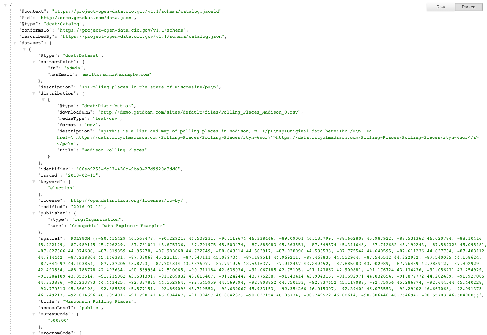

.. _`user-docs DKAN APIs`
=========
DKAN APIs
=========

In the same way that data on a Granicus Open Data site is made accessible to general users through sensory devices like visualizations, dashboards, and data stories, Granicus Open Data APIs are essential to developers. Granicus Open Data comes with three API’s, the Dataset API, the Datastore API, and the Dataset REST API. These can be queried to discover metadata associated with the catalog or a specific dataset. It can also be harvested by other portals by complying with the API standard data.json.

Datastore API
-------------

The Granicus Open Data Datastore houses any CSV files that have been uploaded and then imported into the Datastore. One reason for importing CSV files into the Datastore is to make the file part of the public Datastore API. Allowing data from uploaded files to be included in the Datastore API greatly increases ability to discover the information as well as the usability and accessibility of the data.

The Datastore API enables interactions with specific Resources in the Granicus Open Data Datastore down to specific rows. Without the Datastore API data could not be searched with such precision.  

With the Datastore API, technical users can write programs to interact with the information held within the API. This means that the data in the Granicus Open Data Datastore can be accurately and efficiently queried (searched) and the data then used in other contexts and applications. The Datastore API is another way to show how open data can be used to provide a tangible return for citizens.

.. figure:: ../images/site_manager_playbook/DKAN_APIs/datastore_tab_view.png
   :alt: datastore api view
   
   Datastore API view on a Resource page.

Using the API
~~~~~~~~~~~~~

For any Resource imported to the Datastore, click Manage the Datastore. Then click the Data API button to get information about the Resource.

You won't perform API queries from here, but you can get linked to a sample query and find :ref:`documentation for more instruction<datastore API>` on how to use the Datastore API. The image below is the information returned on a sample query of the Granicus Open Data Datastore using the Datastore API.  

The query below shows the results in a "raw" form. This is generally more difficult to read, but it is what appears with a standard query. 

.. figure:: ../images/site_manager_playbook/DKAN_APIs/datastore_api_output_unformatted.png
   :alt: unformatted datastore API query
   
   This query shows the results in a "raw" form. This is generally more difficult to read, but it is what appears with a standard query. 
   
.. figure:: ../images/site_manager_playbook/DKAN_APIs/datastore_api_output_formatted.png
   :alt: formatted datastore API query
   
   This image shows a formatted view of another API query using a web extension to make the results easier to read.

Dataset API
-----------

The Dataset API works by combining a number of public, supported APIs. Each API is different in what level of detail it pulls out from the information available on a Granicus Open Data site. Together, the suite of APIs makes it possible to pull out information with varying specificity. When data is uploaded to Granicus Open Data as a Resource or Dataset, it is automatically included in the Dataset API. With the Dataset API, a public data.json file is also automatically published to follow Project Open Data standards.

As a Site Manager, you don’t have to worry about managing the Dataset API because all the work happens in the background. At any point you can access the data.json file by simply typing /data.json in the URL after the homepage URL. You’ll get a page with all the information from the Datasets and Resources on your Granicus Open Data site.

.. figure:: ../images/site_manager_playbook/DKAN_APIs/dataset_api_output_unformatted.png
   :alt: formatted data.json
   
   This shows the results in a "raw" form. This is generally more difficult to read, but it is what appears with a standard query.
   

   
   This shows a formatted view using a web extension to make the results easier to read.  

Dataset REST API
----------------

REST continues to be one of the most popular API styles in web development, and it’s quickly becoming the standard for API design. In large part, that’s because REST is designed to be light-weight, fast, portable, and simple to implement.

With REST APIs, external web applications and services can supplement platforms without significant investment or complexity in programmatic communication. The Dataset REST API leverages the opportunities of REST to open greater possibilities on Granicus Open Data.

With the Dataset REST API, you can take action on your Granicus Open Data site programmatically. For example, adding a Dataset through the API. For one or two Datasets it might not seem like a drastic difference; but imagine automating the action of adding dozens, or even hundreds, of Datasets. Or imagine you have an application built in-house that you want to integrate with Granicus Open Data. The Dataset REST API makes these actions (and many more) possible.

We have :ref:`technical documentation on the Dataset REST API<dataset REST API>` that provides more information on how to use it.
