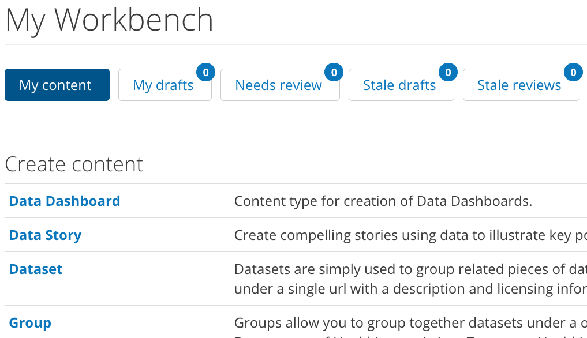

.. _`user-docs dkan workflow`:
=============
DKAN Workflow
=============

Granicus Open Data Workflow is an advanced feature that opens up additional functions to manage an editorial review process for the content on a Granicus Open Data site. It also adds a new set of user roles and permissions to distribute the work associated with a review process.

While there are usually only one or two Site Managers maintaining the entire site, content can be added by dozens of different users. In some cases the amount of content that needs review and management may be on an order that cannot be done by just one or two people. Granicus Open Data Workflow helps ensure quality content by introducing a review process, and it distributes the workload with unique Workflow roles and permissions.

Special note: This feature is not enabled by default. If you are interested in getting Granicus Open Data Workflow, talk with your Granicus implementation consultant. 

Workflow and the Editorial Process
----------------------------------

Data portals can house thousands of files in the form of Resources organized into Datasets, and these Datasets and Resources may originate from a variety of departments and organizations. While there may be one or two Site Managers maintaining the entire site, content may be added by dozens of different users. This empowers agencies to add their data as it becomes available and allows for updating the data portal to be a sustainable endeavor.

On the other hand, broad contributions add a complicating factor for Site Managers. Contributors from different Groups can add data to the site, but these users may be unfamiliar with open data standards and less knowledgeable about handling data in general.

Granicus Open Data Workflow introduces an editorial process to ensure quality control at any scale. Workflow creates a moderation queue so that content is published only after a designated supervisor has reviewed and approved it. Contributors can still add content to the data catalog, but it is up to a supervisor to act as the gatekeeper in making the content public on the live site.

Workflow Roles and Permissions
------------------------------

Each user on a Granicus Open Data site will have a role (or multiple roles) and have certain permissions for moving content through Workflow. These roles allow users to interact differently with My Workbench, but they do not negate the need for core user roles. This means that every user must be assigned a core role granting a certain level of access to the site, independent of the user's Workflow role. Read about `user management in the Site Manager Playbook<EDIT LATER>` for additional details. 

Core roles/permissions and Workflow roles/permissions serve different purposes but complement one another. Each set of roles has different permissions that enable the user to interact with certain functions on Granicus Open Data. As Workflow roles are assigned, the core role equivalent is automatically selected so that there are no gaps in a user’s permissions.

There are three roles with Workflow-specific permissions: Workflow Contributor, Workflow Moderator, Workflow Supervisor.

Workflow Contributor
~~~~~~~~~~~~~~~~~~~~

The Workflow Contributor role has the lowest level of permissions while still gaining access to My Workbench. These users add content to the data catalog, but their content needs approval before it is published and made live. Workflow Contributors can save content as a Draft or move it to Needs Review, but they do not have the power to publish content live.

Workflow Contributors will be assigned the core role of Content Creator.

Workflow Moderator
~~~~~~~~~~~~~~~~~~

The Workflow Moderator reviews the bulk of content that has been added by Workflow Contributors for a single Group and moves it through the publishing pipeline. This role reviews and publishes content--including what they have created themselves--for their Group, rather than the entire site. Read more about how Groups work in the `Group Roles and Permissions section<EDIT LATER>`. 

Moderators can also unpublish content, leaving it in a Needs Review or Draft state and removing it from public view, or delete content altogether. Workflow Moderators will be assigned the core role of Editor. 

Workflow Moderators ensure that data uploaded to the site does not have any sensitive or private information included within it. They also check whether the file format is listed correctly, that the Resource follows open data best practices, and that it is associated with the correct licenses. Lastly, the Workflow Moderator should look over the Dataset or Resource’s metadata to ensure accuracy and completeness. 

Workflow Supervisor
~~~~~~~~~~~~~~~~~~~

The Workflow Supervisor role has the highest-level permissions within Workflow because users with this role are not restricted to Group to which they belong.

Unlike a Moderator, Supervisors can access content from all Groups and moderate content as needed. However, the primary focus of the Supervisor is overseeing My Workbench for the entire site. In general, this is an administrative role rather than a practical one. Supervisors catch any issues that could otherwise fall through the cracks, especially in the case of content that isn’t associated with a specific Group.

Workflow Supervisors will be assigned the core role of Site Managers.

My Workbench
------------------

My Workbench provides additional content management via a system of “states”. A piece of content could be in either a “draft” state or a “needs review” state before ultimately being published. “Transitions” define in which order content can move from state to state, and who has permissions to do so. As content is drafted, it goes through an editorial workflow managed by trusted roles. 

Content exists in three states:

Draft
  A saved work in progress.
Needs Review
  The author feels the content is ready to go on public on the live site, and would like the supervisor to review it.
Published
  The content is public and visible on the live site.

My Workbench stores unpublished content in the Draft and Needs Review states, while Workflow roles give certain users the ability to moderate content through the editorial workflow. Users can view the state of the content as well as its age. 

Granicus Open Data Workflow organizes content into five different tabs: My Content, My Drafts, Needs Review, Stale Drafts, and Stale Reviews.

The Stale Drafts and Stale Reviews tabs contain content that has gone untouched for too long. The default time limit is 72 hours before drafts become stale.

For Workflow Moderators reviewing a steady stream of content it’s helpful to know how many pieces of content need to be moderated. In the picture above, note that each tab has a bubble with a number located in the top right corner. This number reflects the total pieces of content within that tab. 

For example, a Workflow Moderator may have two drafts and 10 pieces of content in the Needs Review tab. Two of those drafts may have gone stale and would also appear in the Stale Drafts tab. Three of the reviews may also be stale and would appear both in the Needs Review tab as well as the Stale Reviews tab. The quantities of content within each category will appear as a count at the top of each tab.

Workflow Roles and Permissions At-a-Glance
------------------------------------------

Users assigned a DKAN Workflow role are automatically assigned the corresponding level of core DKAN role. The following is the relationship between the roles.

.. list-table:: 
   :stub-columns: 1
   
   * - Core Role
     - Content Creator
     - Editor
     - Site Manager
   * - Workflow Role
     - Workflow Contributor
     - Workflow Moderator
     - Site Manager

============= -------------------- ------------------ -------------------      
Core Role     Content Creator      Editor             Site Manager
------------- -------------------- ------------------ -------------------
Workflow Role Workflow Contributor Workflow Moderator Workflow Supervisor
============= -------------------- ------------------ -------------------
