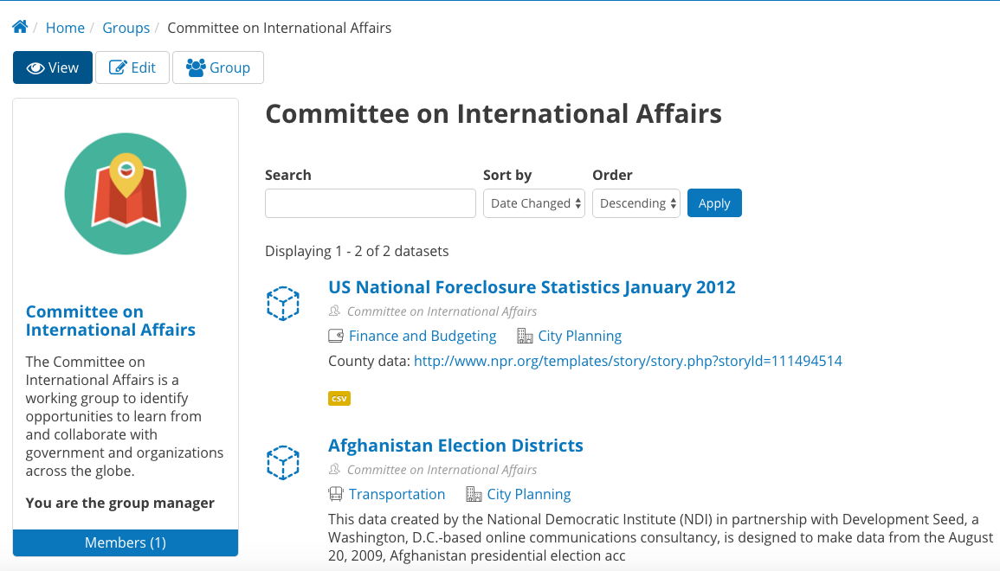
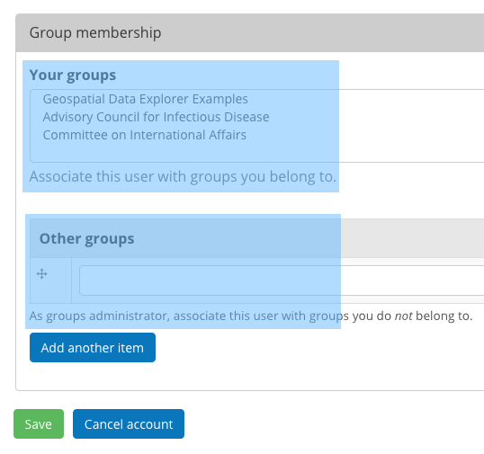
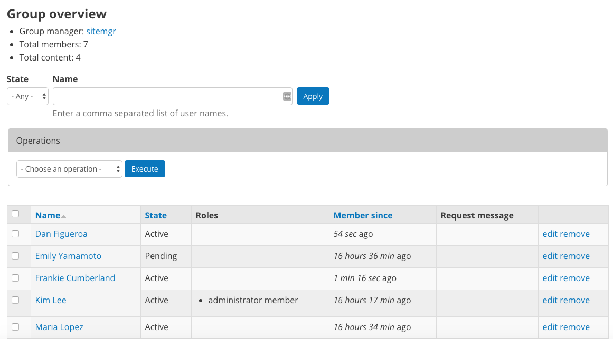
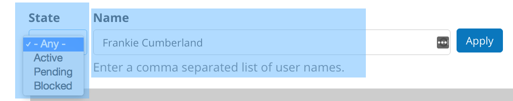
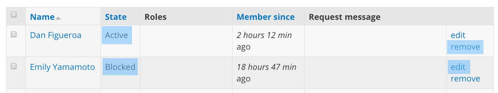
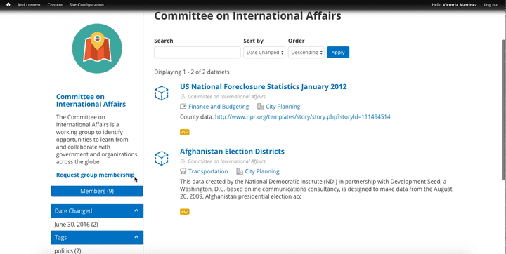
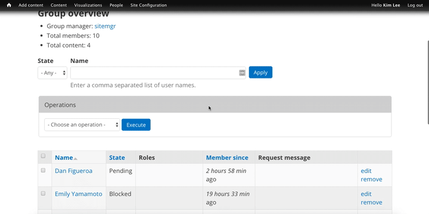
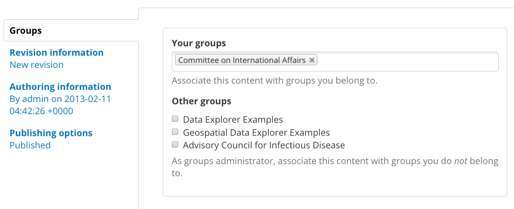

===========================
Group Roles and Permissions
===========================

Group roles and permissions
Granicus Open Data standard roles and permissions apply across the entire site, but there are also special permissions that apply to only some parts of the site. That includes Group roles and permissions. You can learn more about Groups and how they work in the Data and Content section.

With large sites there is often a need to have special permissions for a group of users to handle a specific set of content. Think of a large agency or department with sub-departments or programs that produce content. On the one hand these users shouldn’t have the ability to manage or edit content for the entire site or other Groups. On the other hand it would be impractical for Editors or Site Managers to handle content for a large number of users.

To keep content organized and in the hands of its owners without introducing the risk of inadvertent (and sometimes irreversible) actions, Group-level permissions give users the ability to do things they couldn’t necessarily do on the site outside of the Group.

About Group roles and permissions
After adding a new Group, Site Managers can assign Datasets (and their Resources) to that Group. You can also manage the members of a Group, adding new members and giving certain members different roles.

Members of a Group are bound by the permissions of their role and restricted to the content in their Group. As a Site Manager you have access to all Groups and are not limited by the permissions of the Group.

Within Groups there are different levels of access a user can have, which determines another level of permissions. Any user who belongs to a group falls into one of two types: Member or Administrator. Users not in the group are considered Nonmembers.

Nonmember. A Nonmember is any user on the site who does not belong to the Group. This role can request membership in the Group and view Group members and content.

Member. A Member is a basic user within the Group who is mostly adding and editing their own content for the Group. As Datasets are added they can be assigned to a Group. Members of a Group can add Datasets to their Group and edit those Datasets from the Group page. Content within a Group can only be edited by members of that Group, so it’s important to only associate Datasets with Groups that the user belongs to.

Administrator. An Administrator of a Group plays a similar role to that of an Editor but for their particular Group rather than for the entire site. Conversely, Editors outside of a Group are not able to manage content published within a Group. Administrators of Groups are able to add and remove Group members and manage (create/edit/delete) all content within the Group. It’s good practice to have only 1 or 2 users in this role for any given Group.

Group roles and permissions at-a-glance
~~~~~~~~~~~~~~~~~~~~~~~~~~~~~~~~~~~~~~~

+---------------+---------------------------------------------------------------------------------------------------------+---------------------------------------------------------------------------------+
| Role          | Description                                                                                             | Permissions                                                                     |
+===============+=========================================================================================================+=================================================================================+
| Nonmember	    | A user on the site who does not belong to the Group.                                                    | Request membership in the Group. View Group members and content.                |
+---------------+---------------------------------------------------------------------------------------------------------+---------------------------------------------------------------------------------+
| Member	       | A basic user within the Group who is mostly adding and editing content and associating it with a Group. | Create and edit content they have created and associated to their Group.        |
+---------------+---------------------------------------------------------------------------------------------------------+---------------------------------------------------------------------------------+
| Administrator | One or two people managing content associated with the Group.                                           | Add and remove Group members.                                                   |
|               |                                                                                                         |                                                                                 |
|               | This higher level of permissions is restricted to the user’s Group.                                     | Manage permissions of Group members.                                            |
|               |                                                                                                         |                                                                                 |
|               | Groups can be administered independently, without affecting content on the rest of the site.            | Create and edit all content associated with the Group regardless of the author. |
+---------------+---------------------------------------------------------------------------------------------------------+---------------------------------------------------------------------------------+

Add Group Members
~~~~~~~~~~~~~~~~~

For basic members of a Group, there are two ways that you can add a user to a Group: from the user profile and from the Group page.

**Add a user by editing their user profile:** This way of adding users to a Group is preferred if you are the Site Manager but not the Group Administrator. The Group Administrator should be aware and approve of incoming members. You can submit a request for a user to a Group by selecting the Groups on the user's profile page.

By adding a user to a Group from the user's profile page, a request is sent to the Group Administrator on their behalf for the Administrator to approve. Edit the user's profile who you want to add to the Group and scroll to the bottom of the page. In the section Group membership section there are two fields, Your groups and Other groups.

- **Your groups:** These are Groups that you are a member of. Users are not automatically added to Groups, so Groups won't appear in this field unless you add yourself to a Group.

- **Other groups:** These are simply Groups that you are not a member of. As a Site Manager, you can add any user to a Group regardless if you are a member yourself. But the Group names will not automatically appear like in the Your groups field, so you will have to know the name of the Group to enter it in the Other groups field.

Once the right Groups have been selected, click the **Save** button at the bottom to submit the requests.

**Add a user from the Group page:** This option is best if you are the Site Manager and the Group Administrator. You can add a user members directly from the main Group page by clicking the **Group** button and clicking the **Add people** link. On the next page, you can add users by pulling up an existing user and optionally choose if a member should be an Administrator member.

Begin typing an existing a user and a list of autocomplete options will appear to select from. A user must already have an account to be added to a Group, so if a person needs to be added you should first create a site account for them with the appropriate role.

By default a user will only have a Member role in the Group. To give the user an Administrator role and permissions, check the **administrator member** box. To finally create the user, click the **Add users** button at the bottom of the page.

In the example below, the Site Manager goes to the Group, "Committee on International Affairs". From the Group page the Site Manager adds a new user by typing the user name and choosing the autocomplete selection. In this example, Kim Lee should be an Administrator of the Group so the Site Manager checks the administrator member box.

.. figure:: ../images/site_manager_playbook/group_roles_and_permissions/group_roles_perms_03.gif
   :alt: An animated screencap showing the process of adding a new user to a Group.

Manage Group members
~~~~~~~~~~~~~~~~~~~~

You can manage Group members directly from the main Group page by clicking the **Group** button. From this page you can manage existing members by clicking the **People** link. The Group overview page lists all the members of a Group including pending members. From this page you can see how many members are in the group overall, the number of Datasets associated with the Group, access and edit individual member profiles, perform bulk actions and manage membership requests.

**Find members:** All the members of a Group, including pending members, appear on the members list. There are two ways to find members: by State and by Name.

- **State:** State refers to the status of a member. Active members are users who regularly add Datasets to the Group. Blocked members are unable to add Datasets to the Group and are not able to request membership. Pending members have requested to join the Group and are waiting for approval from the Group administrator. Use the **State** drop-down menu to find users who fit a common state. This is helpful when you want to perform bulk actions on multiple users at the same time.

- **Name:** Finding a member by name is a much more specific type of search. You can search for multiple members at the same time by entering the user names in the Name search field separated by commas. This type of search is helpful if you know which specific member you're looking for or if there is a specific group of members that don't have a common state but you want to perform a bulk action on that group of members.

**Change a user's role:** As a Site Manager you can change the role of a Group member to either be a regular member or an Administrator. In general there are only one or two Administrators managing the Group, so you won't need to change member roles often. When you do, you can change a member's role directly from their profile.

From the Group's home page, click the **Group** button and then the **People** link to manage the Group. Find the member whose role you want to change, either to an Administrator or remove their Administrator status to make them a regular member.

.. figure:: ../images/site_manager_playbook/group_roles_and_permissions/group_roles_perms_06.gif
   :alt: This animated screencap shows what it looks like when a Site Manager edits a user's membership within a Group.

**Remove or block a member:** You can keep users from adding Datasets to the Group in two ways: blocking a member or removing them from a Group.

- **Remove a member:** Removing a member keeps them from adding Datasets to the Group, but these users can later request membership. To remove a member, access the Group overview page where Group members are managed. Find the member you want to remove and click the remove link in the furthest column to the right in the member's row of information.

- **Block a member:** Blocking a member keeps a member from adding Datasets to the Group, and these users cannot request membership to the Group. To block a member, you'll need to change the status of the member by editing their profile. Find the member you want to block and click the edit link in the furthest column to the right in the member's row of information. From the drop-down Status menu, change the member's status from Active to Blocked.

.. figure:: ../images/site_manager_playbook/group_roles_and_permissions/group_roles_perms_08.png
   :alt: This screencap shows what you'll see when editing a user's Group membership.

**Membership requests:** Users may also request Administrator approval to become a member in a Group. When users submit a membership request, they appear in the list of members with a pending status. If you or the Group Administrator directly add a user to the Group, then you don’t need to add any text in the request message box. If the user requested membership, then their request message will appear here as part of the member profile (only visible to the Site Manager and Administrator).

In the example below, a non-member visits the Group's home page and submits a request for membership with a request message. The member and her message will now appear on the list of members on the Group overview page in a pending state.

The Administrator or Site Manager can approve the request by changing the user's status from pending to active. To change a member's status, click the edit link in the furthest column to the right in the member's row of information. From the drop-down Status menu, change the member's status from pending to active.

Membership requests don't send alerts to the Group Administrator, so the Administrator needs to check for members with a pending state. You can find members by state and select pending to show only pending members who need approval.

**Bulk actions:** Bulk actions help save time because you can select multiple members and perform the same action rather than taking the same action over and over on single members.

From the Group's home page, click the **Group** button and then the **People** link to manage the Group.

Find the members you want perform the action on and check the boxes to the left of the member's name for each member. There are three types of bulk actions: Modify OG user roles, Remove from group, and Modify membership status.

- **Modify OG user roles:** OG user roles refer specifically to Group roles and permissions, which are Member and Administrator. You can change the role of multiple members at the same time with this action. Check all the members whose roles you want to change–for this action, all the members must have the same role to be changed to a new role. Find the drop-down Operations menu, select Modify OG user roles, and click the Execute button. On the next screen you can choose to either add the Administrator role to the selected users or remove the Administrator role to make the users general members. Choose to add or remove the Administrator role and then click the Next button at the bottom of the page and confirm on the next screen.

.. figure:: ../images/site_manager_playbook/group_roles_and_permissions/group_roles_perms_11.png
   :alt: This screencap shows the process of editing OG user roles.

- **Remove from group:** Remove several members at once with this bulk action. Check all the members who you want to remove from the Group, find the Remove from group option on the drop-down Operations menu, and click the Execute button. You'll be asked to confirm on the next page and then the members will be removed from the Group.

- **Modify membership status:** Members in a Group may be in one of three statuses: active, pending, and blocked.

  - The active status means that the member is able to add Datasets to a Group and edit Datasets that they have created.
  - Pending members are waiting for approval from the Group Administrator.
  - Blocked members exist but are not active and do not have permission to add Datasets to the Group or submit another request for membership.
  - Check all the members who you want to change the status of. For this action, all the members must have the same status to be changed to a new status. Find the drop-down Operations menu, select Modify membership status, and click the Execute button. On the next screen, choose the new status and then confirm the changes.

In the example below, the Group Administrator (Kim Lee) first finds only members with a pending status using the **State** drop-down menu. Then she selects all of the members and chooses the bulk action **Modify membership status** from the drop-down **Operations** menu. On the next screen, she changes the members status to active. This is an example of an easy way to find and approve membership requests quickly using search functions and bulk actions.

.. figure:: ../images/site_manager_playbook/group_roles_and_permissions/group_roles_perms_12.gif
   :alt: This animated screencap shows the process of modifying OG user roles.

**Add and remove Datasets from your Group:** In general, your Group members will publish Datasets associated with the Group, so adding will be more common. On occasion, a Dataset may be added to a Group that does not belong and should be removed (though not deleted).

**Add a Dataset:** Datasets should be added a Group as part of the initial content creation process of the Dataset. As Group members add new content to the site they should associate the Dataset with the Group before finally publishing. Users who created the content can later edit the Dataset to add to a Group, and as a Site Manager you can add any Dataset regardless of the author. Once the Dataset is published and associated with the Group, it will appear on the Group's home page. Read the section on adding a Dataset to find more detail on how to add a Dataset to a Group.

**Remove a Dataset:** Though Datasets appear on the Group's home page once a Dataset is published and associated with the Group, they are not managed within the Group. To remove a Dataset, the content author, Group Administrator, or Site Manager needs to edit the Dataset directly and remove the Group associated with the Dataset. Once the Group is removed from the Dataset it will no longer appear on the Group's home page.
