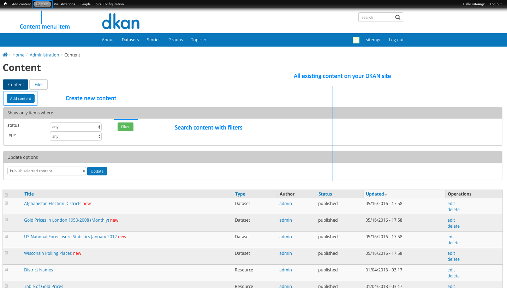
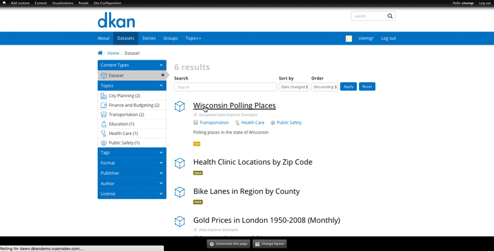
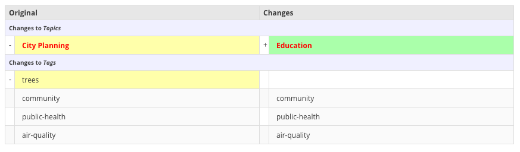
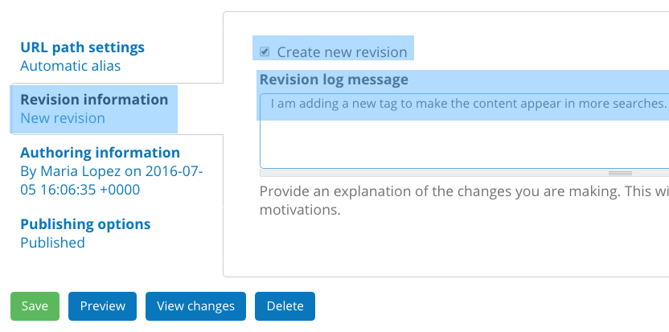
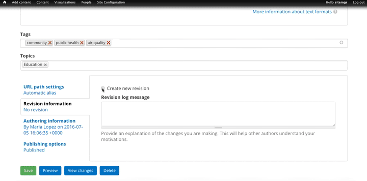

.. _`user-docs managing existing content`:
=========================
Managing Existing Content
=========================

In smaller organizations, Site Managers may both be writing and editing their own content to then directly publish the content to the live site. Larger organizations may have people in other roles like Editors and Content Creators to help with handling a large mass of content on the site. Depending on the scale of your organization and volume of content, you may spend more or less time directly handling content. Learn more about user roles in the :ref:`People<user-docs people` section of this guide. 

Where do I edit existing content?
---------------------------------

Site Managers can edit any content on the site, either from the main Content page or directly on the piece of content itself.  

Edit from the Content menu 
-----------------------------

The main Content page is the most comprehensive place to find and access content to edit an individual piece. Though the menu is comprehensive, editing the details of a piece of content can only happen one at a time. From the Admin Menu, click on the **Content** link to access all the content that exists on the site.

As the Site Manager, you have access to create all content types possible as well as edit, unpublish, and delete all existing content regardless of who the author is. You can create new content from this page as well as manage all the existing content and files on your Granicus Open Data site from here. Files include things like images, videos, font files for icons, other graphics, etc.  

In any scenario, as a Site Manager you can use this page to look at the content on the site to see who created a particular piece of content, when it was last updated, its status (published or unpublished) and take action on existing content. 

.. image:: ../images/site_manager_playbook/managing_existing_content/content_admin_menu.png
   :alt: highlighted content option in admin menu
   
Which content, when?
--------------------

Oversight over the details of content typically falls to the Editor role, but depending on the size of your team the Site Manager may play multiple roles and handle more content review and revision. Ultimately the quality of the content on your Granicus Open Data site falls to you as the Site Manager. 

When any user creates a new piece of content it defaults to a published state. That means the content automatically appears on the live site, visible to the general public. Because there isn't a technical review process on Granicus Open Data, you'll need a system for reviewing content before it is published as well as system for checking content that is published. 

Though you might not edit every piece of content, you'll generally review all the content that is visible to the public (in a published state) and make edits whenever necessary. Only Site Managers have the ability to edit or delete any piece of content regardless of the author, so use your best judgment when reviewing and editing content. If you're ever unsure, you can unpublish the content and go back to the author before making changes or removing the content.

   
Find content
---------------

Your Granicus Open Data site may have hundreds, or even thousands, of pieces of content from Resources to Data Stories; and as a Site Manager you'll have access to every piece of content. You can sift through the content and use filters on the Content main page to find content effectively. Filters help narrow your search by a set of criteria. On the Content main page, there are two types of filters to narrow the results: status and type. 

Status
  Choose from the status drop-down menu to show content that fits a specific status, like published or unpublished. The other options on this list, like promoted and sticky, are not typically used.
Type
  The type of content includes all the content types that may be added to your Granicus Open Data site. Choose from the type drop-down menu to select the content type to show only content that fits the specific type, like Resource or Data Story.

.. image:: ../images/site_manager_playbook/managing_existing_content/content_status_dropdown.png
   :alt: content search by status dropdown options
.. image:: ../images/site_manager_playbook/managing_existing_content/content_type_dropdown.png
   :alt: content search by type dropdown options

Edit from the page
------------------

As you navigate through your Granicus Open Data site, you have more options available to you as a Site Manager than other users. You'll see these options on every page including an option to edit while on the page of a piece of content. You can edit directly from the page by clicking the **Edit** button. The options for editing content are the same as when adding new content, and the form appears the same. 

In general, it's okay to make small changes to content while it's published. Small changes include adding Tags and Topics, adding or removing the content from a Group, spelling and grammar corrections, styling, and other minor updates.

For major changes to any piece of content, it's best to first unpublish the content and continue to make changes behind the scenes. You can change the status of the content by unchecking the **Published** box in the administrative submenu at the bottom of the form. Major changes include changing the title, changing the layout, adding new information that needs review, adding or changing images, and any other changes that aren't ready to be published immediately. 

   
   In this example, a Site Manager visits a Dataset page and decides to edit the content. The Site Manager clicks on the **Edit** button to open the form and make changes to the Dataset.

View changes
------------

When editing content, a user is making changes to something that is published and visible to the general public. Before saving the changes, you can see exactly what changes have been made in a summary form to check that all the changes are correct. Use the View changes button at the bottom of the page of any piece of content to get the breakdown. 

The changes are organized into two columns and sectioned off further by the different parts of the content for a side-by-side comparison of what has changed in the piece of content. On the right side, there is the column with the original version (called Original). On the left side, new additions are added to the Changes column.

.. image:: ../images/site_manager_playbook/managing_existing_content/dataset_changes_view.png
   :alt: example of viewing dataset changes

Original
  The column titled Original shows what information was in the original version before any changes were made. It contains information that has been removed or, alternatively, what remains when new information is added. The column is further organized into the different fields that make up the content form. These fields include the body text, Topics, Tags, metadata, Groups, etc. so you can see exactly where changes were made. When information is removed, the changes are highlighted in yellow and have a minus sign to the right-hand side. If information remains when new information is added, then the information appears in the Original column, but it's not highlighted and there is no minus sign. In that case, there should be new information in the Changes column. 
Changes
  The column titled Changes shows what information will appear in the new version once changes are saved. It contains information that has been added or, alternatively, what remains if information is removed.

   
   In this example, a Topic has been removed and a new Topic added. In the Changes to Tags section, you can see that the "trees" Tag was removed. The Changes column shows the information that will be included in the new version (everything that wasn't removed).

Revisions
---------

Revisions is a powerful capability, especially when working on content that undergoes several changes. Revisions help track and record changes to create a backup of a piece of content, but they're not automatically generated every time a change is made. Create a new revision any time that a significant change is made to create versions of a piece of content. This will create a safety net in case anything major needs to be reversed. It will also document institutional knowledge as there are personnel changes at your organization. 

Keep in mind that once you delete a piece of content, you also delete its revision history. We suggest unpublishing content, rather than deleting it, so that it's not visible to the general public but still exists on your site behind the scenes.    

Create a new revision
~~~~~~~~~~~~~~~~~~~~~

Once a piece of content has been published, you can go back and make changes to the content as needed. When you make a change, you have the option to create a new revision of the content. This creates a new version with the changes incorporated, but also keeps the old version. In general, you don't need to worry about creating a new revision for minor changes unless the information being added is critical. For bigger changes, it's helpful to have a backup especially if you're editing content for someone else.

Click the **Edit** button to open the content form and go to the bottom of the page. In the Revision information tab, click the option labeled **Create new revision**. This is all you need to create a new version for the piece of content.

Notice there's another field below the new revision option labeled Revision log message. This is a space to explain the changes you're making and why. This is particularly useful for content that goes between multiple authors. Giving an explanation for changes can help clarify reasons that might not be obvious which helps reduces confusion and mistakes that can be easily avoided. 

   
   In this example, the Site Manager is creating a new revision and includes an overview for what was changed in the Revision log message field. The Site Manager saves the changes, and then finds the new revision on the Revisions page.

Where to find revisions
~~~~~~~~~~~~~~~~~~~~~~~

You can access all the revisions of a piece of content by going directly to the page of the published content in View mode. Click the Revisions button to get to the Revisions page to see all the existing revisions and the revision options. The Revisions page gives an overview of all the existing revisions including when the revision was created, by which user, and the revision log message. Here, you can also compare revisions and go back to an old revision (reverting).

.. image:: ../images/site_manager_playbook/managing_existing_content/content_revisions_tab.png
   :alt: highlighted button for viewing revisions

Revision options
~~~~~~~~~~~~~~~~

From the Revisions page, there are additional options for what you can do with the different revisions for the piece of content. The most important options are Compare and Revert.

.. image:: ../images/site_manager_playbook/managing_existing_content/content_revisions_tab.png
   :alt: content revisions view

Compare
   Some content may have several revisions that are difficult to visually scan what the differences are. To get a clear sense of the distinction between two revisions, you can select revisions to compare on after the other. Click on the selection circle and then click the Compare button at the top of the columns. You'll see more details of each revision in comparison with one another. 
Revert
   As changes are made, you may not create a new revision each time. Revisions typically reflect significant changes to your published content, so lots of small changes can be made in between the previous and current version. You can go back to an older version of a piece content by clicking the Revert link under the Operations column in the row of the revision. Before reverting, it's best to create a new revision of the content with the most recent changes. The most recent revision will still exist in the list of revisions, but you can revert to an older revision, which is what will appear on your Granicus Open Data site.
   
Managing content on Granicus Open Data
--------------------------------------

After you add a piece of content you may want to make changes or updates or you may want to replace a piece of content all together. As a Site Manager, you can make changes to any piece of content regardless of the author, type of content, or state of the content. Creating and editing content on Granicus Open Data are critical functions of management, and there are even more ways to manage your content.

Content visibility
------------------

In general, most content is published at the same time it's added. Once content is published it appears on your live Granicus Open Data site meaning that it can be searched and discovered by the general public. But if you want to work with content without making it public or if you just want to keep a piece of content rather than delete it but don't want it visible on your Granicus Open Data site, you can change the visibility. 

There are two states that content can be in that determines its visibility to the public, published and unpublished. 

Published content
   Published content is live on your Granicus Open Data site and visible to the public. In some cases, you may want to access and change content that was not created recently. You can visit published content on your Granicus Open Data site and edit directly from the page for quick changes (spelling, typos, titles). For bigger changes, it's best to not edit live content. First unpublish the Granicus Open Data, make changes, and then publish again.   
Unpublished content
   If content is unpublished that means that it doesn't appear on your live Granicus Open Data site, but it still exists behind the scenes. Users can leave content unpublished if they have significant changes or if they want to come back to a piece of content later to finish editing.
   As a Site Manager, you can access all the existing content on your Granicus Open Data site through through the Content menu item on the Admin Menu bar. Once you unpublish a piece of content, that content is no longer visible to users with lower permissions (even if they are the author). 
 

When content is added, by any user, the content defaults to a published state. Users with fewer permissions can edit the content or delete it, but they can't unpublish content or view unpublished content, even if they authored the content. That means that the content is left visible on your Granicus Open Data site until the author makes changes.

In some cases the changes may be minor revisions, but other scenarios could require heavy editing before the content is ready to be made public. Some content is simply time-sensitive; the information is authored ahead of time but shouldn't be made public until a certain date. Publishing states let you manage the visibility of your content to give Site Managers greater control over the content that appears on your Granicus Open Data site. 
