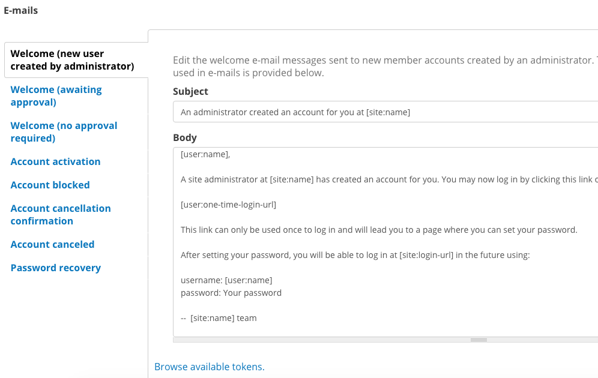

.. _`user-docs people`:
======
People
======

Data and content management can't be done alone. Site Managers handle all the users on the site and decide who has access to what. They can also create Groups for organizations, which have even more possibilities for roles and permissions. Build your team to build your site.

On DKAN, what you can do on the site depends on the permissions given to the role assigned to you. These roles can range from general site visitors to trusted Editors working behind the scenes. User roles and permissions maintain the security of your site, distribute workload without compromising quality, and lead to overall better content on your DKAN site.

About roles and permissions
---------------------------

There are 6 standard roles with set permissions:

- **Anonymous:** This is any site visitor accessing the site who is not logged in. Anyone who is not authenticated is an anonymous user. What’s important is that they can find the site and view its content.

- **Authenticated user:** This user has the lowest level of permissions; all users with login credentials have this role. This user type is utilized for a general site visitor who has created an account. They can create a profile, and if enabled, add or edit comments, but they cannot upload or edit site content.

- **Content Creator:** Content Creators are able to work with the actual content of your DKAN site. They can add Datasets, Resources, Dashboards, and Data Stories, and edit their own content. However, they cannot edit content created by other users or view unpublished content. This role is good for a user to add their data to your DKAN site, but who doesn’t need to access more sensitive capabilities.

- **Editor:** An Editor is responsible for managing content from a strategic perspective. This role is fit for a user who will create, edit, revise and delete content on a frequent basis, and should be given to a colleague with expertise on the subject matter at hand. Editors can add, edit and delete most content types, but they cannot create, modify, or delete Groups or modify the roles of other users. This role is able to make changes to content and where it appears, but it doesn’t go further into admin functions.

- **Site Manager:** This role is the highest level possible for non-technical users. A Site Manager performs administrative functions, and is a role best suited for a supervisor, manager, or other trusted upper-level employee. The Site Manager is provided with a sweeping overview of the site as well as its content and users. However, they do not deal with the technical back-end. A user with this role can create, edit, and delete all content types created by any user. Site Managers handle the infrastructure of the site that other users operate within.

- **Administrator:** Admins hold the highest level of all roles and permissions. This role is for a web professional with high technical competency. Administrators are the middle piece between the users using the site daily and the core functions built within the technical back-end. Based on an organization’s requirements, the administrator can adapt the site to meet daily needs of users. The administrator can also modify themes and layouts, and enable or disable modules.

Roles that are higher level automatically have all the permissions of a lower-level role. 

+----------------------------------------------------------------------------------------------------------+--------------------------------------------------------------------------------------------------------------------------------------------------------------------------------------+-------------------------------------------------------------------------------------+
| Role                                                                                                     | Description                                                                                                                                                                          | Permissions                                                                         |
+==========================================================================================================+======================================================================================================================================================================================+=====================================================================================+
|**Anonymous User:**                                                                                                                                                                                                                                                                                                                                                                    |
+----------------------------------------------------------------------------------------------------------+--------------------------------------------------------------------------------------------------------------------------------------------------------------------------------------+-------------------------------------------------------------------------------------+
| General site visitors that are not logged in.                                                            | This user type has no profile information.                                                                                                                                           | View and search content on public website.                                          |
+----------------------------------------------------------------------------------------------------------+--------------------------------------------------------------------------------------------------------------------------------------------------------------------------------------+-------------------------------------------------------------------------------------+
| **Authenticated User:**                                                                                                                                                                                                                                                                                                                                                               |
+----------------------------------------------------------------------------------------------------------+--------------------------------------------------------------------------------------------------------------------------------------------------------------------------------------+-------------------------------------------------------------------------------------+
| These users are logged on and have profile information that can be verified (and authenticated).         | This type has the lowest level of permissions; all users with login credentials have this role.                                                                                      | Have a profile and add/edit that profile.                                           |
|                                                                                                          |                                                                                                                                                                                      |                                                                                     |
|                                                                                                          | This user type is a general site visitor but he or she has created an account.                                                                                                       | Can leave comments on the data catalog (if commenting is enabled).                  |
+----------------------------------------------------------------------------------------------------------+--------------------------------------------------------------------------------------------------------------------------------------------------------------------------------------+-------------------------------------------------------------------------------------+
| **Content Creator:**                                                                                                                                                                                                                                                                                                                                                                  |
+----------------------------------------------------------------------------------------------------------+--------------------------------------------------------------------------------------------------------------------------------------------------------------------------------------+-------------------------------------------------------------------------------------+
| Content Creators are focused on adding Resources and Datasets to the site.                               | At this level, the role must be assigned by a higher role; this role has access to the production side of the site.                                                                  | Create most content types and edit own content.                                     |
|                                                                                                          |                                                                                                                                                                                      |                                                                                     |
|                                                                                                          |                                                                                                                                                                                      | View own unpublished content and revision history of all published content.         |
|                                                                                                          |                                                                                                                                                                                      |                                                                                     |
|                                                                                                          |                                                                                                                                                                                      | Add Resources to the Datastore and enable Internal Previews.                        |
+----------------------------------------------------------------------------------------------------------+--------------------------------------------------------------------------------------------------------------------------------------------------------------------------------------+-------------------------------------------------------------------------------------+
| **Editor:**                                                                                                                                                                                                                                                                                                                                                                           |
+----------------------------------------------------------------------------------------------------------+--------------------------------------------------------------------------------------------------------------------------------------------------------------------------------------+-------------------------------------------------------------------------------------+
| Typically a person handling content frequently.                                                          | An Editor role is similar to a Content Creator role because the focus is content, however an Editor will deal with multiple content authors and have the ability to manage and edit. | View, edit, delete most content types and manage versions of content.               |
|                                                                                                          |                                                                                                                                                                                      |                                                                                     |
| Someone in your organization with expertise on the subject-matter that is expansive as well as in-depth. | An Editor is responsible for managing content from a strategic perspective.                                                                                                          | Add Tags and Topics.                                                                |
|                                                                                                          |                                                                                                                                                                                      |                                                                                     |
|                                                                                                          |                                                                                                                                                                                      | Add Pages and Charts.                                                               |
+----------------------------------------------------------------------------------------------------------+--------------------------------------------------------------------------------------------------------------------------------------------------------------------------------------+-------------------------------------------------------------------------------------+
| **Site Manager:**                                                                                                                                                                                                                                                                                                                                                                     |
+----------------------------------------------------------------------------------------------------------+--------------------------------------------------------------------------------------------------------------------------------------------------------------------------------------+-------------------------------------------------------------------------------------+
| The highest-level for non-technical users. A Site Manager is concerned with admin functions of the site. | The Site Manager takes a high-level view of the site, its content, and the users on the site.                                                                                        | Create, edit, delete all content types created by any user.                         |
|                                                                                                          |                                                                                                                                                                                      |                                                                                     |
| Typically this will fall to someone in a supervisory role.                                               | This person maintains the site and assigns roles and permissions to new users but doesn’t deal with the technical back-end.                                                          | Create and assign roles to new users, change the status of users, and delete users. |
|                                                                                                          |                                                                                                                                                                                      |                                                                                     |
|                                                                                                          |                                                                                                                                                                                      | Create and manage Groups.                                                           |
+----------------------------------------------------------------------------------------------------------+--------------------------------------------------------------------------------------------------------------------------------------------------------------------------------------+-------------------------------------------------------------------------------------+
| **Administrator:**                                                                                                                                                                                                                                                                                                                                                                    |
+----------------------------------------------------------------------------------------------------------+--------------------------------------------------------------------------------------------------------------------------------------------------------------------------------------+-------------------------------------------------------------------------------------+
| The Administrator role holds every permission, and it requires high technical competency.                | The Administrator handles the overall structure of the website for lower-access roles to plug content into and make changes as needed.                                               | Enable/disable {{data}} modules and features.                                       |
|                                                                                                          |                                                                                                                                                                                      |                                                                                     |
| This role is generally reserved for a single web professional.                                           | Admins hold the highest level of all roles and permissions.                                                                                                                          | Change the appearance of the site with views and themes.                            |
|                                                                                                          |                                                                                                                                                                                      |                                                                                     |
|                                                                                                          |                                                                                                                                                                                      | Create and edit user roles and permissions.                                         |
+----------------------------------------------------------------------------------------------------------+--------------------------------------------------------------------------------------------------------------------------------------------------------------------------------------+-------------------------------------------------------------------------------------+

Account settings
~~~~~~~~~~~~~~~~

Some settings in user management are automated to streamline the process of adding new accounts. From the Site Configuration menu, you can change default behaviors for users on the Account settings page. Default behaviors act for all accounts, so you want to make selections that should apply generally to most users.

Where to change the account settings
------------------------------------

From the Admin Menu, click the Site Configuration menu link (not an item on the drop-down menu). This link will take you to the main Configuration page. Of the options on this page, find the People section and click on the Account Settings link.

.. figure:: ../images/site_manager_playbook/people/people_01.png
   :alt: The "Account Settings" link under Site Configuration.

Account registration
~~~~~~~~~~~~~~~~~~~~

Decide who can register an account on your site and how with Account registration settings. On most DKAN sites, an account requires a Site Manager to create the account and login credentials for the user. But there are cases where site visitors should be able to create an account to access certain capabilities.

Who can register accounts? Choose which users register accounts from three options:

- **Administrators only:** With this option, only Site Managers are allowed to add new users to the site and assign roles. This option is best if you expect users to be from within your organization.
- **Visitors:** This option allows site visitors to create an account as soon as they fill out a profile and login to the site with their own password. Visitor accounts automatically assign the lowest-permissions role, Authenticated User. These permissions allow a user to create a profile and leave comments, but they don't have access to any of the content on the site. This option is not recommended unless you have measures like Captcha in place to protect from spamming.
- **Visitors but administrator approval is required:** With this option, site visitors can register an account but a Site Manager must first approve the account before a user can login to the site. Approval from an administrator (Site Manager) can help filter out fake accounts and give Site Managers greater control over who is accessing the site.
   Require email verification. With this option, users first have to verify their email address before they're allowed to login. Once they verify they will be prompted to change their password. This is an additional option to include in how accounts are registered. This verification can help prevent fake accounts and spamming (recommended).

Automatic email messages
~~~~~~~~~~~~~~~~~~~~~~~~

By default, DKAN comes with template responses for certain actions. You can customize these messages with your own text and by using tokens. Tokens are a way to automate certain information. Instead of typing a new username each time for a welcome message, you could simply use the users token. Click on the Browse available tokens link to see all your options.

You can also manage notifications of messages in this menu. You can optionally send a notification when certain actions are taken, but not all of these templates are automatically sent. You’ll want to review the email options to make sure the settings meet your needs.

