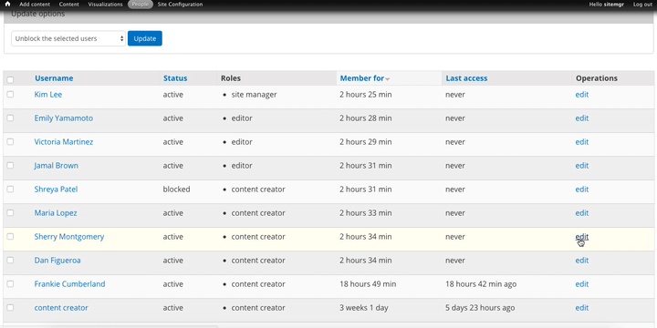
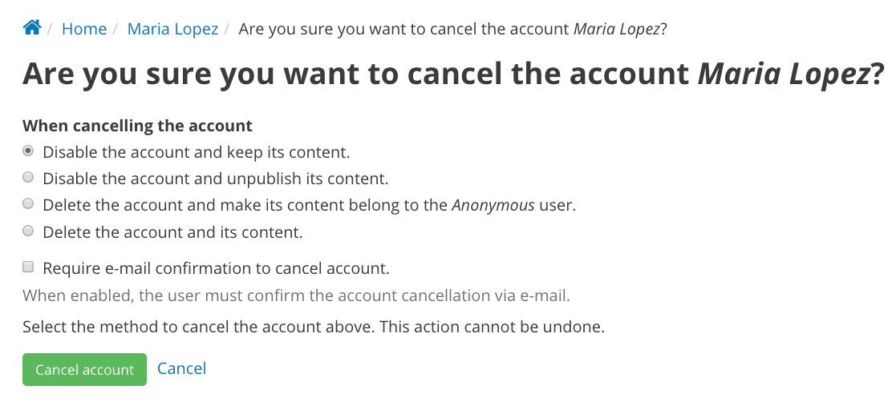

Managing existing users
=======================

Site managers can manage users by clicking 'People' in the Admin Menu. From this screen you can see all existing users, their roles, and details about their account, and by clicking on individual users you can additionally see all the content the user has created. You can also edit their account to change details, add or remove a role, add them to Groups or cancel an account.

.. figure:: ../../images/site_manager_playbook/people/user-administration.png
   :alt: Screen shot of the user administration page.

**To edit an existing user's account:**

* Visit your site’s User Management page by clicking “People” in the admin menu.
* The displayed list of users on the User Management page can be filtered and sorted using the filters at the top of the page. Once you’ve found the user you wish to edit in the user table, click the “edit” link at the end of that user’s row.
* On the resulting “edit user” page, you can edit the user’s username, email, or profile information. You can also set a new password for the user. Click the “Save” button at the bottom of the page to save your changes.
* Use the “Cancel account” at the bottom of the edit user page to delete an account. You will be given the option to preserve or delete any website content added by that user before deletion.

Filtering Users
---------------

On some sites, the list of users can be several pages long. To find a specific user or group of users you can use filters to narrow the results. This makes it easy to manage multiple users at the same time or find an individual user without needing to browse through several pages of users.

- **Username** You can enter text into the username filter to limit the results to usernames that contain matching text.
- **E-mail** Filter users by e-mail
- **Active** This filter will limit the results to either Active users or Blocked users.
- **Role** By selecting a role, the results will only show users that are assigned that specific role.

Bulk Operations
---------------

When you have several users that require the same action, you can use the **Operations** selector to perform bulk actions on a group of users. Rather than spend extra time performing the same action over and over again for individual users, you can select multiple users and make the change for the group with just one click.

From the People page, check the box next to all of the users you would like to update. Select a task from the Operations drop-down list and click the **Execute** button. You can quickly make changes for a group of users like adding or removing a role and blocking or canceling their accounts.

Blocking a user or canceling an account
---------------------------------------

At some point, a user account may need to be deleted or blocked. Typically this is for internal employees who move on from the organization, but there are occasions involving external users. There are a number of options for canceling an account or blocking a user to meet a number of scenarios.

**Block an account.** Blocking an account is the most simple and straightforward way to suspend an account. Blocking a user account keeps a user from logging in, and accounts can easily be unblocked. A blocked account only means that a user cannot login to their account and access your DKAN site. All of their content and profile details will remain, so nothing is lost if you want to unblock an account and restore access.

For users accounts belonging to your organization, blocking an account is typically a temporary action. For user accounts that belong to people who may have registered the account themselves, blocking is likely to be more permanent. By blocking an account, you keep users from creating a new account with the same details and avoid repeating the blocking process.

You can block a single user by editing their profile and changing their status, or you can block several users at once by using the bulk actions function on the People page. In the example below, the Site Manager is blocking a user account by editing an individual user profile. To finalize the changes, the Site Manager must click the Save button at the bottom of the page.

**Cancel an account.** Canceling an account can be a permanent action, and there are several options to choose from. Some of the actions cannot be reversed, so you should be careful when deciding which option to choose. Below are the options for canceling an account and the implications of selecting the option. While Site Managers can cancel the account of any user on the site, users may also cancel their own accounts.

- **Disable the account and keep its contents:** If you disable the account, the details of the profile remain in tact but the user is blocked from accessing the site with their user login. By keeping the contents, any content that the user published will remain on the live site. Because the account is only disabled (blocked) the user remains as the author of the content and the profile details may still be accessed. This option is similar to just blocking an account, and it's a good temporary measure in most cases.
- **Disable the account and unpublish its contents:** This option blocks the user from accessing the site and all the content that the user has published will be unpublished. This means that their content will not appear on the live site, but it will still exist behind the scenes. It can be managed out of public view and in the mean time, the user cannot do anything else on the site. This is a good option if you need to review the content a user has published and need it to be off the site but still need to access it.
- **Delete the account and make its contents belong to the Anonymous User:** This is a permanent action. Once you delete an account, you cannot recover any of the details that were associated with the user profile. With this option you can delete the entire account as well as keep its contents. Because the account associated with the user who was the original author no longer exists, the content must be assigned to a different author. This option quickly changes the author so that the content remains on the live site, and you can change the author at any time. Again, this is a permanent option so be careful before making this selection.
- **Delete the account and its contents:** This is a permanent action and the most severe choice when canceling an account. This options not only deletes the user account and all the profile details, it also deletes all the content the user added. Neither the account nor the content can be recovered with this selection. As a general best practice, we recommend never deleting content if it can be edited or simply unpublished.

**Require email confirmation:** For any option you choose when canceling an account, you can make sure the user is aware by requiring email confirmation. An email will be sent to the email address provided in the user's profile details. When you check the Require email confirmation box, the account won't be canceled until the user confirms through the email.
