.. `user-docs structure`:
=========
Structure
=========

As a Site Manager you handle the structures that other users operate within. This framework reflects the broader organizational priorities and brings greater visibility to the content on your DKAN site. Many of the tools that help organize the content on your DKAN site also make it easier to navigate and find the right content. All of this improves the experience of a site visitor and makes it more likely that citizens can use the data published on your site.

Site Navigation
---------------

Menus
~~~~~

Menus organize content and play a critical role in directing site visitors to the content they need. As Pages are added with new content, adding new menu links are the connectors for site visitors to your content. 

Some content (like Datasets or Data Stories) has a menu link in the main menu by default, but new Pages require a new link to navigate to the content. You can customize the default structure of the main menu as it makes sense for your site content.

Using menus
~~~~~~~~~~~

From the Admin Menu, hover over the menu link **Site Configuration**. From the drop-down list, select the **Menus** link to access the Menus page. 

The main menu is persistent, meaning that it appears on every page. This menu acts as an anchor for site visitors as they make their way through your site. Details like the order of menu links, link titles, and number of menu links can all impact how a site visitor interacts and engages with the content of your site. 

Click the **list links** button to view and manage all the links on the main menu. 

As a Site Manager, you can manage the details from the main menu page in the following ways: Add a new link, Order menu links, Enable and disable links, and Edit or delete a menu link.

Add a new link
~~~~~~~~~~~~~~

By default, DKAN comes with preset menu links. These links point to pages that automatically collect content as it’s published, like Datasets and Data Stories. 

For new Pages with new content, create a link and add it to the main menu by clicking the **Add link** button at the top-left of the page. Complete all the fields in the form and click the Save button at the bottom of the page. 

Menu link title
  The title is what the site visitor sees as they navigate with the main menu.
Path
  The menu link must point to content, so that when a site visitor clicks the link they are appropriately directed. Paste in the URL for the link. 
Description
  The description essentially acts like alt-text. Make sure you include a description, but keep it brief. 
Enabled checkbox
  By default, when you create a new link, it’s also enabled. Only enabled links appear on the main menu. Uncheck this box if the link should not appear on the main menu.
Show as expanded
  This option only applies to menu links with child menu items. When this box is checked all the child items are displayed.
Parent link
  By default, the parent link is the main menu. Links with this parent link will appear on the top-level menu bar. Click the Parent link drop-down menu and select the correct parent. 
Weight
  Weight determines the order of menu links. High numbers (heavier) are lower on the menu, and smaller numbers (lighter) appear near or at the top of the menu.

Order menu links
~~~~~~~~~~~~~~~~

Change the order of how links appear on the main menu with the simple drag-and-drop interface. Click and hold the cross icon to drag a menu link into a new order. 

If an asterisk appears next to the title of a menu link it indicates that the menu link has been altered, but changes will not be made until saved. 

**Note:** You can also use the drag-and-drop interface to nest or un-nest menu links. 

To nest a link (make a link a child of another menu link), click and hold the cross icon and drag the menu link under and to the right of the new parent menu link. 

To un-nest a link (make a child link a top-level link on the main menu), click and hold the cross icon and drag it above the previous parent link. 

Click the **Save Configuration** button at the bottom of the page to finalize your changes.

Enable and disable links
~~~~~~~~~~~~~~~~~~~~~~~~

Instead of deleting a menu link to remove it from the main menu, you can enable and disable menu links. Disabled links remain in the list for you to edit and manage, but site visitors won’t see them on the main menu. 

To disable a menu link, uncheck the box in the **Enabled** column in the row of the menu link you want to disable.

Edit or delete links
~~~~~~~~~~~~~~~~~~~~

Change the details of a menu link by clicking the **Edit** link in the Operations column in the row of the menu link you want to edit. When editing a menu link you can change details like the title, the path (URL), and parent link. 

Click the **Save** button at the bottom of the page to finalize the changes. 

Deleting a menu link is a permanent action and cannot be undone. If you delete a link and want to add it back, you’ll have to create it as a new menu link. Disabling a link is recommended before fully deleting a menu link. 

To delete a link, click the **Delete** link in the Operations column in the row of the menu link you want to delete.

Adding and editing Topics, Tags, and data formats
-------------------------------------------------

Topics
~~~~~~

Enhanced user experience, branding, and information architecting–the Topics feature touches on all of these areas to add ease-of-use for both site visitors and users working behind the scenes.

With so much data in a single place, DKAN sites have a number of tools to organize the information for citizens to easily and intuitively find what they are looking for. Topics catch site visitors’ attention right from the Home page. As with most DKAN features, Topics are built to provide a crisp, engaging user experience that is adaptable for customization. Either font icons or images can be used, and these graphics can be customized in appearance and color to fit the individual look and feel of any agency. The default DKAN icon font set includes over 100 icons, and new icon font sets can be added anytime for a broad range of options.

Topics typically reflect broad categories like transportation or education. These are areas of interest that should remain consistent themselves and collect timely, relevant content. Topics appear on the front page (unless otherwise modified) along with their assigned icons.

.. figure:: ../images/site_manager_playbook/structure/highlighted_topics.png
   :alt: front page with highlighted topics
   
   The default DKAN frontpage with highlighted Topics section.

Where Topics are managed
~~~~~~~~~~~~~~~~~~~~~~~~

Topics are included in the Structure section of this guide because they're considered a taxonomy. Taxonomies are a high-level way of collecting and organizing information. The smaller pieces of information that make up taxonomies are called terms. So for example, you could have a taxonomy of fruit and individual terms might be "apple" or "banana".

You'll find Topics in the **Taxonomy** drop-down menu item under the **Site Configuration** menu link on the Admin Menu.

.. figure:: ../images/site_manager_playbook/structure/topics_admin_menu.png
   :alt: location of topics in the admin menu
   
   Click on the **Topics** link to get to the main page where Topics are managed.

Adding and managing terms
~~~~~~~~~~~~~~~~~~~~~~~~~
 
DKAN comes with six preset Topics: Transportation, Education, Finance and Budgeting, Health Care, Public Safety, and City Planning. You can add to the existing terms or replace them with different terms. The Topics for your DKAN site depend largely on the data on the site and the areas of interest you believe your site visitors are most interested in.  

Add a term
  On the Topics page, click on the Add term button to open the options for adding a new term (a single Topic) to be included in the collection of Topics. The only fields that are important for adding a new Topic are the Title field and icon selection. The title is the name of your Topic that will appear on the front page of your DKAN site under the icon you select.

.. image:: ../images/site_manager_playbook/structure/default_topics_list.png
   :alt: default list of topics

Icon Type: Font
+++++++++++++++

Icon
  Choose an icon from your font icon library. Whichever you choose, you want something the is both eye-catching and expressive. Site visitors should know exactly what kind of content the Topic includes from the graphic without relying on the text.
Icon Color
  For font icons, you can choose a color for the icon of your Topic. Images do not have an option to change the color. It’s best to choose a single color that all your icons have in common. The color should also fit the look and feel of the rest of your site, either as a matching or complementary color.

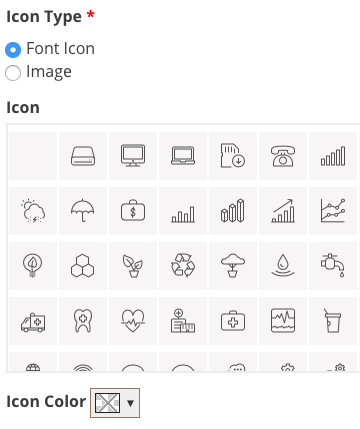

Icon Type: Image
++++++++++++++++

If you have an image that you prefer to use for the Topic icon, select the Image selection instead of font icon. Click the **Choose File** button to find the image on your computer and then click the Upload button to finalize the selection.

**Note:** there are limits on the file size and type. 

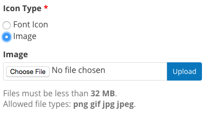

.. figure:: ../images/site_manager_playbook/structure/topic_options_animation.gif
   :alt: configuring topic options
   
   In this example, the Site Manager is adding a new term to the Topics taxonomy called "Environment". The Site Manager chooses an icon from the library and then chooses a color for the icon. Once the Topic is saved it will appear on the front page.

When all your selections are made, click the **Save** button at the bottom of the page to finalize your choices and save the term. Once the new Topic is saved it will appear on the front page with all the other Topics.

It's best to keep your site looking orderly, so you don't want Topics to appear like they do in the image below. For the purposes of this example, a different color was chosen to demonstrate the change, but in practice color schemes should remain consistent across your site.

Additionally, the number of Topics pushes down to a second line and appears uneven. Keep the number of Topics even appearance by maintaining a certain number of Topics at any given time. Since there are six Topics to a line, that means the number of Topics should follow a factor of six.

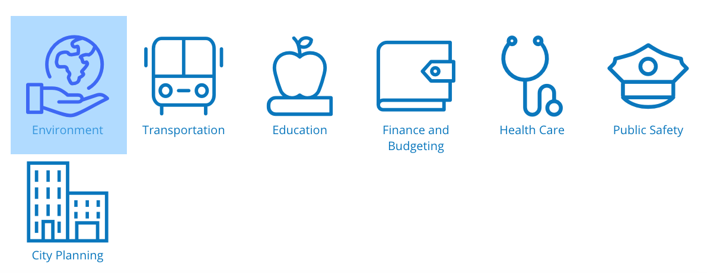

Manage terms
~~~~~~~~~~~~

As the appearance of your DKAN site evolves, you may need to also change the appearance and even titles of your existing Topics. It's best to edit existing Topics rather than create completely new ones. If you delete a Topic then all the content that was before associated with the Topic will no longer have any association because the Topic doesn't exist. But if you update a Topic, then the content will still be associated with the Topic with the updated title and icon. 

You can change the title, icon, and icon color of existing terms by clicking the edit link under the Operations column on the row of the Topic you want to edit. The only fields that are important for adding a new Topic are the Title field and icon selection. The title is the name of your Topic that will appear on the front page of your DKAN site under the icon you select.

Re-order Topics
~~~~~~~~~~~~~~~

While many site visitors will be attracted to a Topic based on its visual element (the icon) many site visitors will read Topics from left to right like with text. You might have some Topics that you want to promote to ensure that site visitors don't miss them. You can re-order Topics to follow the rank of importance to the site visitor. 

Notice the compass arrow to the left of each Topic name. You can change the order of the Topics by clicking and holding the compass arrow, then dragging and dropping each Topic either higher or lower on the list. The order determines how the Topics appear on the front page of your DKAN site. The first Topic on the list appears as the first Topic on the front page. It appears on the far left and the rest follow horizontally across the page.

.. figure:: ../images/site_manager_playbook/structure/ordered_topic_list.png
   :alt: list of topics with a new order
   
   Administrative view of the re-ordered Topics.

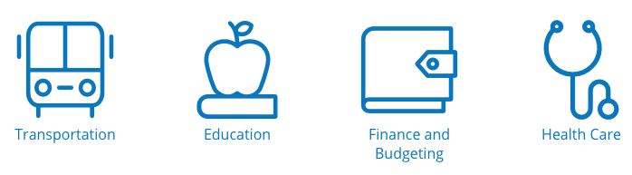
   
   Front page view of the re-ordered Topics.

Customizing icon options
~~~~~~~~~~~~~~~~~~~~~~~~

A consistent appearance on your DKAN site that aligns with the image of your overall organization is important. While your DKAN site is dedicated to data publishing, getting your data into a central location, and increasing transparency to engage with the broader public, it should be clear to site visitors that the effort is part of the larger organizational priorities. If you do use the default font icon library, you can also manage how the library is used.  

Uploading new font icon libraries
~~~~~~~~~~~~~~~~~~~~~~~~~~~~~~~~~

To add greater flexibility in the appearance of Topics to align with your organizational image, you can add your own font icon libraries to choose from for your Topics. By default, DKAN comes with a font icon library called DKAN Topics. It includes over 100 icons to choose from for your Topics. Alternatively, you can also upload your own font icon library if you have one that you prefer.

.. image:: ../images/site_manager_playbook/structure/font_icon_select_options.png
   :alt: font icon select options

You’ll need to name your library with the Title field to manage it among all the uploaded font libraries. Uploading a library also requires four standard files that make a font: EOT, SVG, TTF, and WOFF. If you don’t have these files then you’ll either need to get the files or use the default DKAN Topics font.

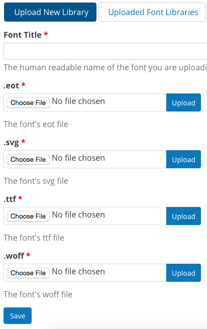

Editing existing font icon libraries
~~~~~~~~~~~~~~~~~~~~~~~~~~~~~~~~~~~~

Once a font icon library is uploaded, you can go back and make edits to an individual library under the Uploaded Font Libraries tab.

Edit Font Options
+++++++++++++++++

Click the edit font link to change the details of the font icon library like the title and the files containing the visual elements of the library.

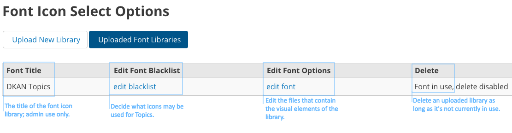

Edit Font Blacklist
+++++++++++++++++++

Your font icon library may contain hundreds of icons, but there might be some icons that you don’t want users to assign to Topics. You can add unwanted icons to a blacklist to block those icons from appearing as an option. Edit the font library blacklist to choose which icons cannot be assigned to Topics. Click on an icon or remove an icon from the blacklist by click a red icon.

.. image:: ../images/site_manager_playbook/structure/global_blacklist_selection.png
   :alt: global blacklist selection view

Delete a library
++++++++++++++++

You can delete an entire library from your site with one click. If a font icon library is in use it can’t be deleted, so you’ll need to change the active library before deleting a library. Once a library is deleted, the action cannot be undone so be careful when removing font icon libraries.

Adding and managing Tags
------------------------

As content is added by users of all types, authors can add Tags to their content. Tags are free-form, so they can be newly added in the field and can contain any words. Think of Tags as keywords either within or related to the content. By including Tags on your content it will appear when the terms are included in a search.

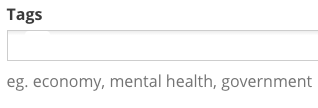
   
   Tags field on content edit pages.

Adding Tags to content
~~~~~~~~~~~~~~~~~~~~~~

Users can add Tags to Datasets and Data Stories, whether they have been added before or not. Simply type the key term you want to tag your content with and hit the space key on your keyboard.

Tags are added in single terms, so if you have multiple or compound words they will either have to be combined for a single term or separated with dashes. If a Tag has been used before, DKAN will autocomplete the term for you. If the Tag has not been added previously, then a new Tag will be created and can be used in the future. As a Site Manager, you can add Tags without adding them to content on the Tags menu. 

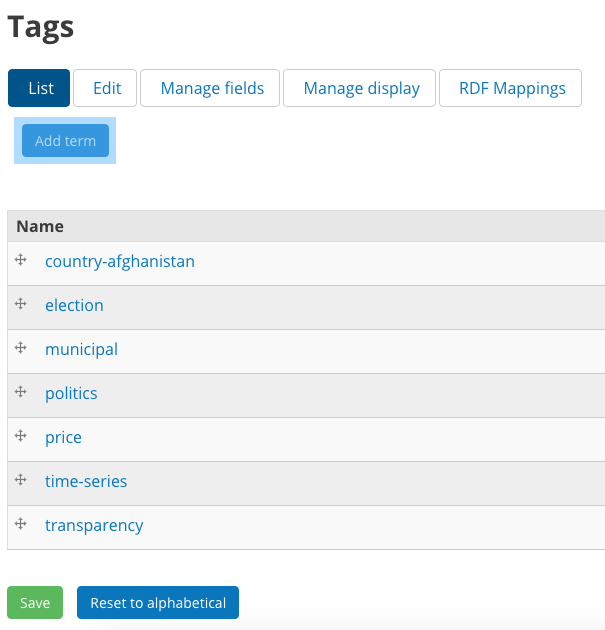
   
   Administrative view of the tags list.

Managing Tags
~~~~~~~~~~~~~

Because Tags are free-form and can be newly added by any user, you may end up with many unnecessary Tags that are counterproductive. Too many Tags can actually make it more difficult to sort through data and confuse site visitors.

As a Site Manager, you have access to all the terms collected as Tags. You’ll want to keep an eye on your Tags to make sure they stay orderly and relevant. You can edit or remove redundant or incorrect terms from the Tags menu under the **Site Configuration** link on the Admin Menu.

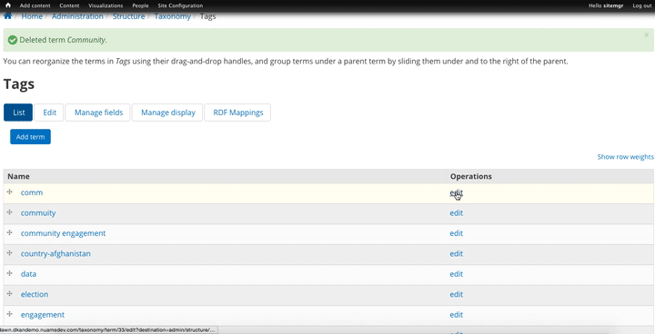
   
   In this example, the Site Manager is deleting a partial (and redundant) Tag as well as editing a Tag that is useful, but spelled incorrectly. This will help users avoid associating their content with the wrong Tags.

Data formats
------------

Data added to your DKAN site may come in a number of file formats. You can think of data, or file formats, as labels to tell site visitors what type of data is contained in the file–adding a data format does **not** change or transform the contents of the files themselves. File formats describe how the data is formatted and indicates how it should be read.

In some cases file formats may be similar like CSV or XLS, which both contain information organized into rows and columns. But in many cases, indicating the file format makes an important difference. Geospatial data formatted in an XML file is read differently than similar data formatted in a JSON file. Data formats allow users to choose the right data format and tell site visitors which type of data they should expect when they download the file. 

Add data formats
~~~~~~~~~~~~~~~~

DKAN comes standard with the most common data formats, but you can add more file formats as needed. File formats fall under the **Taxonomy** menu item on the Admin Menu. Use the Add term button to include an additional file format. Keep in mind that data formats are just labels to tell site visitors what type of data is contained in the file–adding a data format does **not** change or transform the contents of the files themselves.

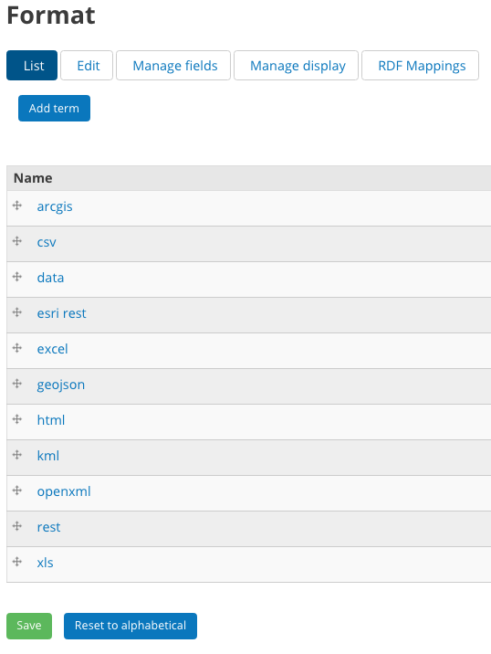

Manage data formats
~~~~~~~~~~~~~~~~~~~

If the language used for the data formats changes, you can edit the name of the format rather than delete the old one and add a new one. This is important because any data content that has the old data format will require a new label to tell site visitors what type of format the data is in. If instead you update the existing data format by editing it, all the data content with the old data format with update automatically.

URL aliases
-----------

Though it may not be obvious, URL aliases are important to the overall experience a site visitor has even before they get to your DKAN site. Because every URL must be unique to work properly by default most URLs are a string of arbitrary numbers, symbols and letters.

This serves the purposes of creating a unique URL, but they can be hard to remember, too long to share, and cause alarm about the credibility of the source. Aliases let you create a URL that is easy to read, understand, and share while still maintaining a unique location on the web.

Managing URL aliases
~~~~~~~~~~~~~~~~~~~~

On DKAN, URL aliases are automatically generated for content, unless you (as a Site Manager) specifically unselect that option on a piece of content. Rather than using the automated URL path that is generated for technical administration (usually an indiscernible cluster of numbers of letters) an alias is created that is easy to read, remember, and type into the search bar. On DKAN, the alias is typically the title of a piece of content.   

While aliases are created at the time content is generated, you can also change the URL alias any time. You might find some terms make more sense or appear more frequently in site visitor searches. You can also delete the alias and leave only the administrative title for a piece of content (not recommended). 

From the Admin Menu, click the the **Site Configuration** menu item and find the Search and metadata section. Select the **URL aliases** link to manage URL aliases. 

Options in the URL aliases page under the Search and metadata section show a list of the existing URL aliases and gives you options for either changing the alias or deleting it. In general, you won’t need to make bulk updates or delete groups of aliases, so we recommend using the List button when making changes.

.. image:: ../images/site_manager_playbook/structure/url_aliases_list.png
   :alt: list of url aliases

Find the URL that you want to change and click the edit link in the column furthest to the right of the URL. Only change the Path alias field; choose a name that is easy to remember, relatively brief so that it's easy to share, and a name that is engaging and tells a site visitor what they'll be reading.

URL aliases are an excellent opportunity to improve how the content on your DKAN site is discovered because you can include key search terms that commonly appear in site visitors' searches. 

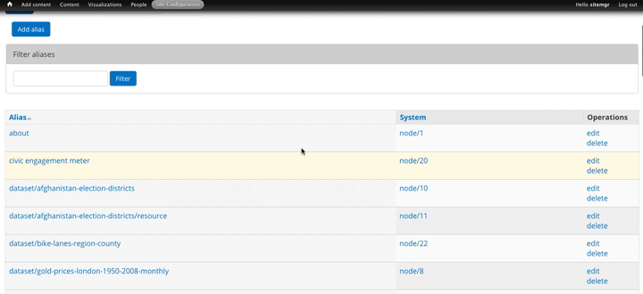
   
   In this example, the Site Manager is editing the URL of a Dataset to make it more specific so that it appears in searches for bike lanes in Miami. 
