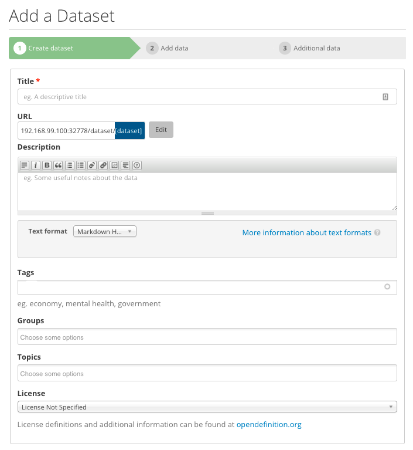
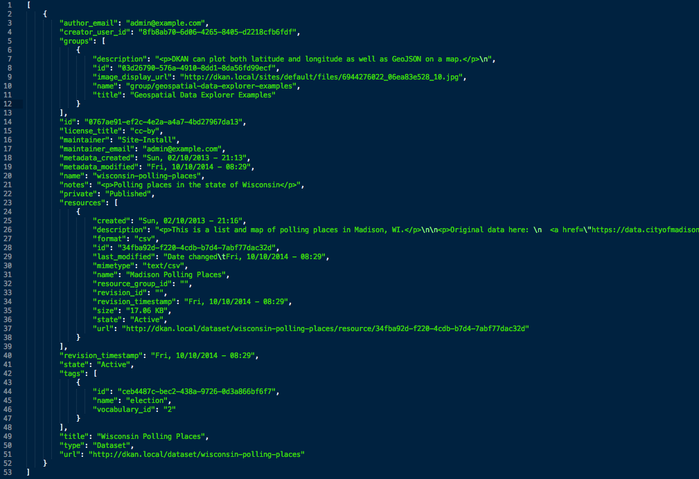
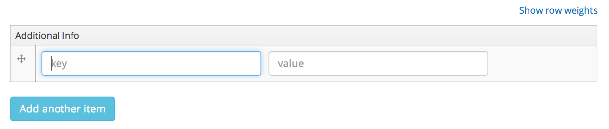
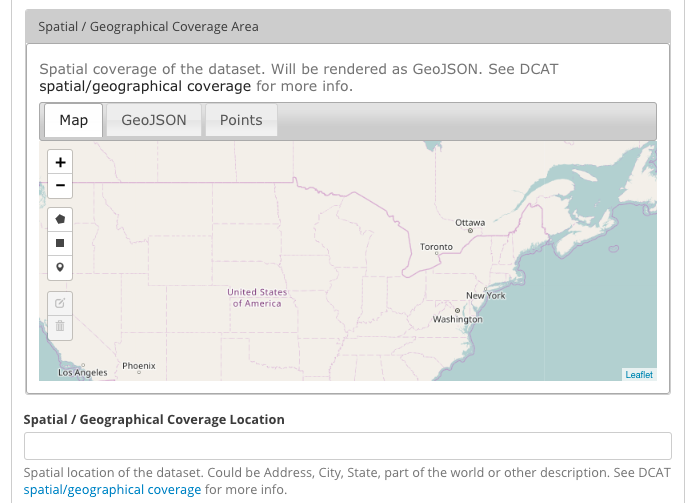
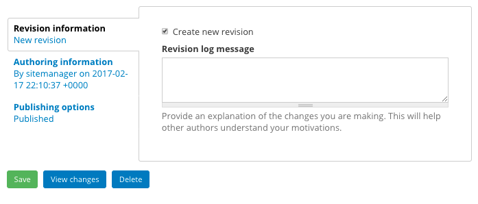

Advanced Metadata Features
==========================

A Dataset is a container for storing files, APIs, or other resources  as well as the `metadata <http://en.wikipedia.org/wiki/Metadata>`_ about those resources.  The metadata in a DKAN Dataset is structured specifically for describing Open Data.

The metadata in a DKAN Dataset is culled from the DCAT standard as well as Project Open Data. For more information on the default Dataset fields view the :ref:`Open Data Field Comparison Tables <field_comparison>`.

The Dataset form allows users to create Datasets and add appropriate metadata:

The DKAN Dataset API exposes Dataset metadata for individual datasets as well an entire catalog.

.. _custom_metadata:

Custom metadata
----------------

It is easy to add new fields to DKAN which will show up on the Dataset form, make available as search facets, and be available to output in one of the Dataset APIs.

If there is information that only pertains to one or more datasets then it is possible to use the "Additional Info" field. This allows content editors to add unique field / value entries that exist only on a single dataset:

Globally-available custom fields can also be added through `Drupal's Fields UI <https://www.drupal.org/documentation/modules/field-ui>`_ and added to public APIs using the :doc:`Open Data Schema Mapper <../open-data-schema>`.

.. _data_extent:

Data Extent
----------------

The "Data Extent" block is a visual representation of the "Spatial / Geographical Coverage Area".

.. figure:: ../../images/data-extent-block.png

The "Spatial / Geographical Coverage Area" field is a geojson representation of the area a Dataset covers. This can be a point, box, or other representation.

DKAN provides a widget so that a spatial area can be drawn if desired:

.. note::

  By default the "Data Extent" block utilizes OpenMap's default tiles. DKAN makes the tiles configurable through the Drupal variable **dkan_map_tile_url**.

  For example, to set the tiles to use Stamen tiles, run ``drush vset dkan_map_tile_url https://stamen-tiles-{s}.a.ssl.fastly.net/terrain/{z}/{x}/{y}.png``

Revision History
----------------

DKAN Datasets and Resources track revisions in order to log and display changes, using Drupal's built-in revision system.

User Interface
***************

Revision log entries can be added through the user interface by clicking "Revision information" in the dataset or resource edit form and can be viewed by clicking "Revisions" on a Dataset or Resource page:

Loading Revision information Programmatically
*********************************************

Revision comments generated in code can be viewed by loading a Dataset or Resource and viewing the log: `$node = node_load('dataset node id'); echo $node->log`

Revision List API
*****************

A list of recent revisions are available through the revision_list API at "/api/3/action/revision_list"

File Revisions
***************

Copies are kept of files from previous revisions that can be compared manually by a user. Diffs of individual files are not available by default, but could be implemented with some `custom code using Apache Solr and the Diff module <https://drupal.org/node/2101377>`_, or a similar strategy.
