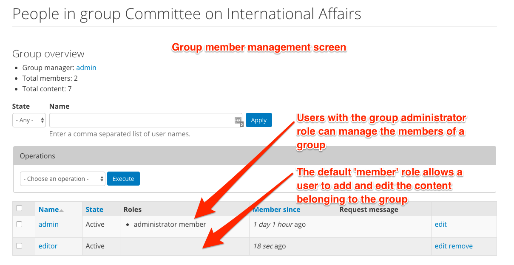

Groups in DKAN
==============

**Groups** allow you to group together datasets under an organization (i.e. Parks and Recreation Department, Department of Education) or category (e.g. Transport Data, Health Data) in order to make it easier for users to browse datasets by theme.

As a best practice, datasets and resources that are added to a Group should share a common publisher.

Essentially, Groups are both a way to collect common Datasets and enable an additional workflow on DKAN. On the outward-facing side, site visitors are able to browse and search Datasets published by a specific Group, which is the common publisher of a number of Datasets.

Behind the scenes, Groups add an additional set of roles and permissions that ensure quality and security when publishing data. Group roles and permissions ensure that Content Creators can add new data but only to their assigned Group. This is especially important for large sites that may have several working groups publishing data to the site. By adding users to the Group’s membership roster, you can create and manage a community based around the data within the group.

How to use Groups
-----------------

Adding a new Group
```````````````````
When adding a new Group, the form has fields for basic information about the Group itself that should tell site visitors what to expect from the Datasets in the Group.

:Title: Name your Group to reflect the agency or whoever the common data publisher is for the datasets that will belong to the Group.

:Image: The image here acts like the logo for your Group. It appears on the overview Groups page as well as the individual page of the Group itself. It's best to choose a square image to fit the dimensions of the thumbnail. Whether you choose an image, a logo, or an icon you can use any image that meets the size and file type requirements. As a Site Manager, you may want to add generic icons to the Groups you add if a current logo is unavailable.

:Description: This text is the full description for your Group similar to an "About" page. The description includes details about the agency, its goals, and information about the data it publishes. While you want to include all the relevant information of the Group, the best descriptions are 1-2 paragraphs long and include a link to the agency's main web page for more details.

:Summary text: You can use the Summary to create unique text for your Group. This text appears as a snippet under the Group image on the Group overview page. If left blank the first portion of the body text will be used (about 100 words). Including a summary can be useful in adding more key search terms or using a different tone to intrigue site visitors to learn more.

.. figure:: ../../images/group.png

Managing Groups and Members
---------------------------

Once you've added a new Group, you can assign Datasets (and their Resources) to that Group. You can also manage the members of a Group, adding new members and giving certain members different roles. Members of a Group are bound by the permissions of their role and restricted to the content in their Group. As a Site Manager you have access to all Groups and are not limited by the permissions of the Group.

Roles and Permissions
`````````````````````

With large sites there is often a need to have special permissions for a group of users to handle a specific set of content. Think of a large agency or department with sub-departments or programs that produce content. On the one hand these users shouldn’t have the ability to manage or edit content for the entire site or other Groups. On the other hand it would be impractical for Editors or Site Managers to handle content for a large number of users. To keep content organized and in the hands of its owners without introducing the risk of inadvertent (and sometimes irreversible) actions, Group-level permissions give users the ability to do things they couldn’t necessarily do on the site outside of the Group.

Within Groups there are different levels of access a user can have, which determines another level of permissions. Any user who belongs to a group falls into one of two types: Member or Administrator. Users not in the group are considered Nonmembers.

:Non-Member: A Non-Member is any user on the site who does not belong to the Group. This role can request membership in the Group and view Group members and content.

:Member: A Member is a basic user within the Group who is mostly adding and editing their own content for the Group. As Datasets are added they can be assigned to a Group. Members of a Group can add Datasets to their Group and edit those Datasets from the Group page. Content within a Group can only be edited by members of that Group, so it’s important to only associate Datasets with Groups that the user belongs to.

:Administrator: An Administrator of a Group plays a similar role to that of an Editor but for their particular Group rather than for the entire site. Conversely, Editors outside of a Group are not able to manage content published within a Group.

  Administrators of Groups are able to add and remove Group members and manage (create/edit/delete) all content within the Group. It’s good practice to have only 1 or 2 users in this role for any given Group.

Adding users
````````````

Adding users to a Group is a straightforward process. Click on the "Group" tab on the group page and click "Add people". Begin typing the username of an existing user into the "User name" field and select from the list of autocomplete options. A user must already have an account to be added to a Group, so if a person needs to be added you should first create an account for them with the appropriate role. By default a user will only have a Member role in the Group. To give the user an Administrator role and permissions, check the administrator member box.

Users may also request membership in a Group. If you or the Group Administrator directly add a user to the Group, then you don’t need to add any text in the Request message box. If the user requested membership, then their request message will appear here as part of the member profile (only visible to the Site Manager and Administrator).

:People: Site Managers and Administrators of Groups can edit the Group details as well as the members and their roles. On the People page under the Group tab, you can access the overview of Group members, edit or delete individual member profiles, and take bulk actions on a group of members.

:Remove a user from the Group: If a user is removed from the Group, they can no longer access Datasets added to that Group to edit them. All non-members can see Datasets that belong to a Group, but non-members can’t edit those Datasets.

  You can remove a single user from the Group with the remove link in the far-right column next to the user’s profile details to access and change the details of their profile. Alternatively, you can remove a group of users from the Group with a bulk action by checking off multiple users and selecting the Remove from group option from the drop-down menu in the Operations box.

:Block a user from the Group: You can keep a user from joining a Group by blocking that user. If a user is blocked they won’t see the option to request subscription for the Group. In order to keep a user blocked, that user must technically be a member of the Group, so it’s different from removing a user entirely.

  You can block a single user from the Group with the edit link in the far-right column next to the user’s profile details to access and change the details of their profile. Alternatively, you can block a group of users from the Group with a bulk action by checking off multiple users and selecting the Modify membership status option from the drop-down menu in the Operations box.

:Change the member’s Group role: In general, you shouldn’t need to change a user’s role often. Most users will be added as members and stay members. For any Group it’s best to limit Administrator roles to just one or two people.

  If you need to change a user’s role you can use the edit link in the far-right column next to the user’s profile details to access and change the details of their profile. Alternatively, you can change a Group member’s role for a group of users in the Group with a bulk action by checking off multiple users and selecting the Modify OG member roles option from the drop-down menu in the Operations box.



More on Group Membership
------------------------

Requesting membership and unsubscribing from a Group
****************************************************

In DKAN, “subscribing” to a Group is synonymous with becoming a member of the Group. Nonmembers can submit a membership request to the Group Administrator to become a Group member. Members have privileges to access and edit Datasets associated to the Group, so membership requires moderation. As a Site Manager, you can join any Group without moderation. Any other role must first submit a request to subscribe and then be approved by the Group Administrator.

Active members, both Members and Administrators, can leave the Group by clicking the *Unsubscribe From Group* link on the Group home page. Once members are removed or leave the Group they no longer have access to the Datasets associated with the Group.

Associating Datasets only to your Group
***************************************

As users author Datasets, it’s important that they associate Datasets only with Groups that they belong to. Once a Dataset is associated with a Group, that Dataset can only be edited by a person in the Group, either the Administrator or a member who authored the Dataset. So if a nonmember authors a Dataset and then associates it to a Group, the author won’t be able to access and edit that Dataset any longer. The Group Administrator can either remove the Dataset from the Group or add the nonmember to the Group as a Member.
