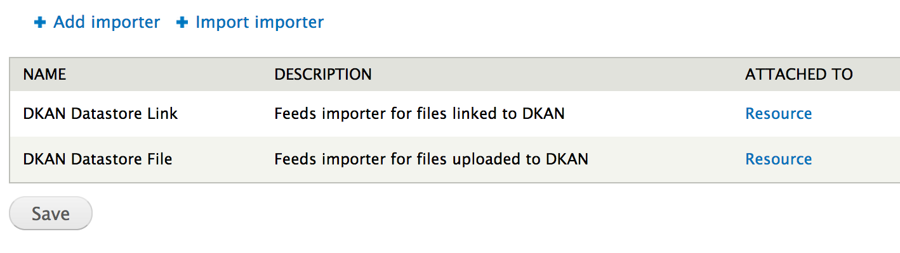
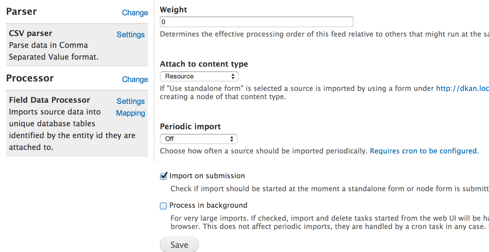
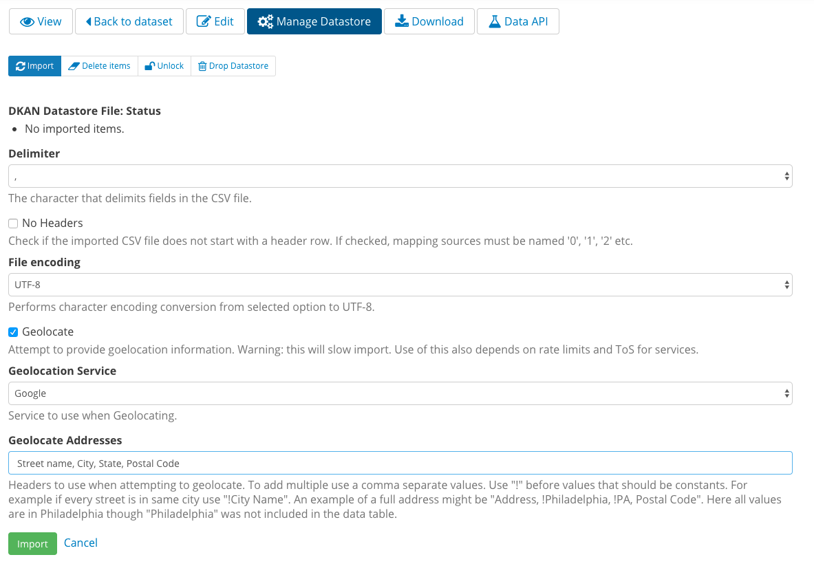

DKAN Datastore
===============

DKAN Datastore bundles a number of modules and configuration to allow users to upload CSV files, parse them and save them into the native database as flat tables, allowing users to query them through a public API.

**Drupal Architecture**

The DKAN Datastore's importer is a wrapper around the `Feeds <https://www.drupal.org/project/feeds>`_ module. The custom `Feeds Flatstore Processor <https://github.com/NuCivic/feeds_flatstore_processor>`_ and `Feeds Field Fetcher <https://www.drupal.org/project/feeds_field_fetcher>`_ plugins were created  the file uploaded to the resource form a feed item.

The `Data <https://www.drupal.org/project/data>`_ module is used to manage datastore tables' schema.

The Datastore API uses the `Services <https://www.drupal.org/project/services>`_ module to provide an endpoint, although nearly all the underlying functionality is overridden and provided directly by the `DKAN Datastore API <https://www.drupal.org/project/services>`_ module.

Getting Started
----------------

When you create a dataset with resources, you have data in DKAN which you can display and store in several ways. However, DKAN is still reading this data directly from the file or API you added as a resource.

To get the fullest functionality possible out of your datasets, you should add your CSV resources to the datastore.

If you are exploring a resource that is not yet in the datastore, you will see a message advising you of this.

.. image:: ../images/datastore-message.png

Click the "Manage Datastore" button at the top of the screen. On the "Manage Datastore" page, confirm that the delimiter and file encoding options are correct, then use the "Import" button at the bottom of the page to import the data from your file or API into DKAN's local datastore.

.. image:: ../images/datastore-resource.png

Your data is now ready to use via the API! Click the "Data API" button at the top of the resource screen for specific instructions.

TAB delimiter support
---------------------

DKAN now supports TAB delimiters for csv files and other file extensions that uses TABs as delimiters. Right now you can add resources with the extensions .tsv, .tab, .txt and .csv separated by TABs. The autodetect format function is available for this file types  (the format detected will be TSV) and the recline previews work fine with them too.

The TAB delimiter support has been introduced to the datastore import functionality, so if your resource contains a csv file separated by TABs and you visit the "Manage Datastore" tab, you'll have an option in the 'Delimiter' dropdown to select TAB. Once you select that option and press the 'Import' button, your resource must be imported correctly and should be shown as expected in the Grid Recline Preview.

Processing Options
-------------------

By default Resource files are added to the DKAN Datastore manually. This can be changed to:

* Import upon form submission
* Import in the background
* Import periodically

Changing Default Datastore Import Behavior
^^^^^^^^^^^^^^^^^^^^^^^^^^^^^^^^^^^^^^^^^^^
Default behavior for linked and uploaded files is controlled through the `Feeds module <http://dgo.to/feeds>`_. To access the Feeds administrative interface, enable the **Feeds Admin UI** module (which is included but not enabled by default in DKAN). Once turned on you can access the Feeds UI at ``/admin/structure/feeds``. You should see two Feeds Importers by default:

Import on submission
^^^^^^^^^^^^^^^^^^^^^^
To import a Resource file upon saving the resource, click **Import on submission** in the settings section for each importer:

This is not recommended for large imports as a batch screen will be triggered that will not stop until the entire file is imported.

Process in background
^^^^^^^^^^^^^^^^^^^^^^^
This setting means that once an import has started, it will be processed in 50 row increments in the background. Processing will occur during cron. The queue of imports is managed by the `Job Schedule <http://dgo.to/job_scheduler>`_ module. Each cron run will `process a maximum of 200 jobs in a maximum of 30 seconds <http://cgit.drupalcode.org/job_scheduler/tree/job_scheduler.module?id=7.x-2.0-alpha3#n54>`_. Note that an import won't be started by saving the Resource form. This will only be triggered by clicking "Import" on the "Manage Datastore" page or if triggered programatically. This setting can be used in addition to "Import on submission" option to start imports that will be imported in the background.

Periodic import
^^^^^^^^^^^^^^^^^^^^^^^
Importing items on a periodic basis makes the most sense if you have a file you are linking to that you want to periodically re-import. This setting requires that cron is running on a regular schedule.

Geocoder
---------

DKAN's native Datastore can use the Drupal Geocoder module to add latitude/longitude coordinates to resources that have plain-text address information. This means that datasets containing plain-text addresses can be viewed on a map using the :doc:`Data Preview <visualizations/datapreviews>` or other map-based data visualizations. It is not included by default with DKAN but can be `downloaded here <https://www.drupal.org/project/geocoder>`_.

Instructions
^^^^^^^^^^^^^
1. Install and enabling the **geocoder** module.
2. Click the **Manage Datastore** tab on any resource with address information.
3. Check the "Geolocate" box.
4. Select the Geolocation Service you will be using.
5. In the Geolocate Addressses field enter the field or fields from the file that make up the address to geolocate.
6. Click the **Import** button

Geolocation Services
^^^^^^^^^^^^^^^^^^^^^
Geolocation services offered are

* `Google <https://developers.google.com/maps/articles/geocodestrat>`_
* `Yahoo <http://developer.yahoo.com/boss/geo/>`_
* `Nominatim <href="https://developer.mapquest.com/documentation/open/geocoding-api/>`_
* `Yandex <http://api.yandex.com/maps/doc/geocoder/desc/concepts/input_params.xml>`_

Note that Nominatim is a driven by `Open Street Map <http://www.openstreetmap.org/>`_ data, which is the most open of the options offered.

Geolocation Limits
^^^^^^^^^^^^^^^^^^^
The number of rows that can be geolocated is determined by the service you select. Google, for example, allows you to geolocate up to 2500 times per day before paying.

Adding Service API Keys
^^^^^^^^^^^^^^^^^^^^^^^^^^
The `Geocoder <https://drupal.org/project/geocoder>`_ module supports adding API keys for the Yahoo and Google services. Users can sign up for those services and, in Google's case, geocode up to 100,000 addressees per day.

Managing datastores with Drush
-------------------------------
**To create a datastore from a local file:**

.. code-block:: php

  drush dsc (path-to-local-file)

**To update a datastore from a local file:**

.. code-block:: php

  drush dsu (datastore-id) (path-to-local-file)

**To delete a datastore file (imported items will be deleted as well):**

.. code-block:: php

  drush dsfd (datastore-id)

**To get the URI of the datastore file:**

.. code-block:: php

  drush dsfuri (datastore-id)

Using the Fast Import Option
-----------------------------

DKAN Datastore's "fast import" allows for importing huge CSV files into the datastore at a fraction of the time it would take using the regular import.

When a CSV is imported using the regular import, this is what it happens under the hood:

1. PHP interpreter reads the file line-by-line from the disk
2. Each time a line is parsed it sends a query to the database
3. The database receives the query and parses it
4. The database creates a query execution plan
5. The database excecutes the plan (i.e., inserts a new row)

.. note::

  Steps 3, 4 and 5 are executed for *each row* in the CSV.

The Datastore Fast Import was designed to remove as many steps as possible from the previous list. It performs the following steps:

1. PHP interpreter sends a LOAD DATA query to the database
2. The database receive the query and parses it
3. The database reads and imports the whole file into a table

Only one query is executed, so the amount of time required to import a big dataset is drastically reduced. On a multi-megabyte file, this could mean the difference between an import time of hours to minutes.

Requirements
^^^^^^^^^^^^^^

- A MySQL / MariaDB database
- MySQL database should support `PDO::MYSQL_ATTR_LOCAL_INFILE` and `PDO::MYSQL_ATTR_USE_BUFFERED_QUERY` flags.
- Cronjob or similar to execute periodic imports.
- Drush

.. note::

  Because of the above requirements, which may not be available on all hosting environments, this module is *disabled* by default in DKAN.

Installation
^^^^^^^^^^^^^^

- Inside your settings.php add a `pdo` element to your database configuration. For example:
  
  .. code-block:: php

    <?php
    $databases['default']['default'] = array (
      'database' => 'drupal',
      'username' => 'drupal',
      'password' => '123',
      'host' => '172.17.0.11',
      'port' => '',
      'driver' => 'mysql',
      'prefix' => '',
      'pdo' => array(
         PDO::MYSQL_ATTR_LOCAL_INFILE => 1,
         PDO::MYSQL_ATTR_USE_BUFFERED_QUERY => 1,
       )
    );

- Go to **/admin/modules**, turn on DKAN Datastore Fast Import and press **Save configuration**. Alternatively you can use drush to enable this module: ``drush en dkan_datastore_fast_import``.

- Make sure you **do not** see this message at the top of the page:

  .. code-block:: bash

    Required PDO flags for dkan_datastore_fast_import were not found. This module requires PDO::MYSQL_ATTR_LOCAL_INFILE and PDO::MYSQL_ATTR_USE_BUFFERED_QUERY

- Set up the following command to run periodically using a cronjob or similar: ``drush queue-run dkan_datastore_fast_import_queue``

Configuration
^^^^^^^^^^^^^^

To configure how Fast Import behaves go to *admin/dkan/datastore*.

There are 3 basic configurations that control the Fast Import functionality:

:Use regular import as default: **Use Fast Import** checkbox is uncheked by default on the resource's datastore import form so files are imported using the normal dkan datastore import. However you can still enable fast import for any resource by clicking that checkbox.

:Use fast import as default: **Use Fast Import** checkbox is cheked by default so files are imported using DKAN Fast Import. Like the previous setting, you can uncheck **Use Fast Import** on the resource-specific datastore import form to use the normal import instead.

:Use fast import for files with a weight over: From this setting you obtain a refined control about when **Use Fast Import** should be checked. This option reveals an additional setting: **"File size threshold."** "Use Fast Import" will be checked on the datastore import form for all the files over this size threshold. A size expressed as a number of bytes with optional SI or IEC binary unit prefix (e.g. 2, 3K, 5MB, 10G, 6GiB, 8 bytes, 9mbytes)

Either of the two "Use fast import" options will also reveal the following additional settings:

:Load Data Statement: Some hostings doesn't support ``LOAD DATA LOCAL INFILE``. If that's your case you can switch to ``LOAD DATA INFILE``.
:Queue Filesize Threshold: If a file is small enough, you can avoid waiting until the drush queue runs by configuring this threshold. Files with a size under this value won't be queued and will rather imported during the request. The time to perform the import should fit into the php request timeout, or your import could be aborted.

Usage
^^^^^^^^^^^^^^

To import a resource using Fast Import:

- Create a resource using a CSV file (**node/add/resource**) or edit an existing one.
- Click on **Manage Datastore**
- Make sure the status says **No imported items** (You can use the **Drop Datastore** link if needed).
- Check **Use Fast Import** checkbox
- Press **import**
- If you get an error like ``SQLSTATE[28000]: invalid authorization specification: 1045 access denied for user 'drupal'@'%' (using password: yes)`` you will need to grant FILE permissions to your MYSQL user. To do so use this command: ``GRANT FILE ON *.* TO 'user-name'``

.. note::

  If you are using the docker-based development environment `described in the DKAN Starter documentation <https://dkan-starter.readthedocs.io/en/latest/docker-dev-env/index.html>`_, you will need to execute the following commands (take note that admin123 is the password of the admin user in that mysql environment):

  .. code-block:: bash

    ahoy docker exec db bash
    mysql -u root -padmin123
    GRANT FILE ON *.* TO 'drupal';

When the option "Use Fast Import" is checked, some other options become visible that affect how MySQL will parse your file:

 - **Quote delimiters**: the character that encloses the fields in your CSV file.
 - **Lines terminated by**: the character that works as line terminator in your CSV file.
 - **Fields escaped by**: the character used to escape other characters in your CSV file.

Also, you can choose if the empty cells will be read as NULL or zeros by checking the box for *"Read empty cells as NULL"*.

Datastore API
--------------

Once processed, Datastore information is available via the Datastore API. For more information, see the :doc:`Datastore API page <../apis/datastore-api>`.
