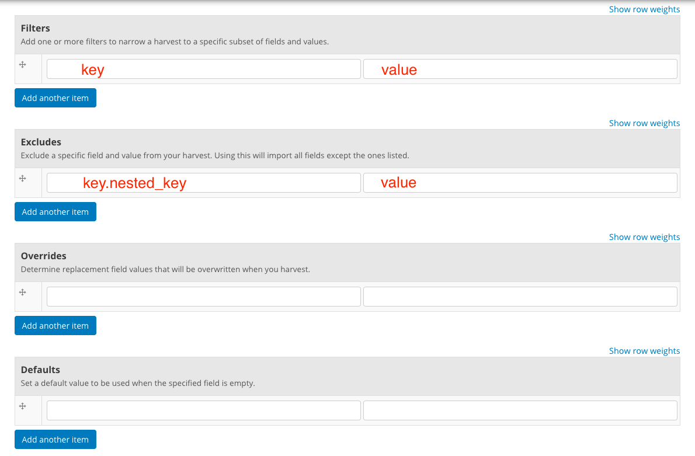
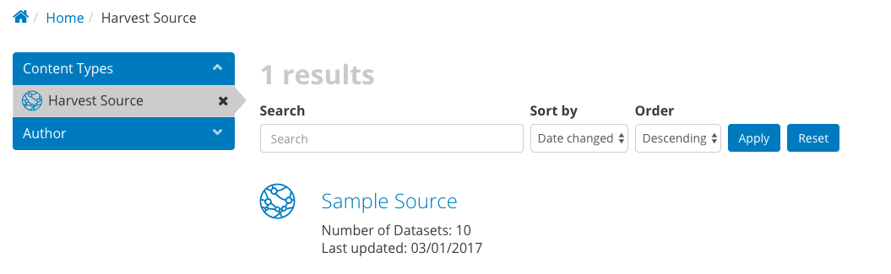
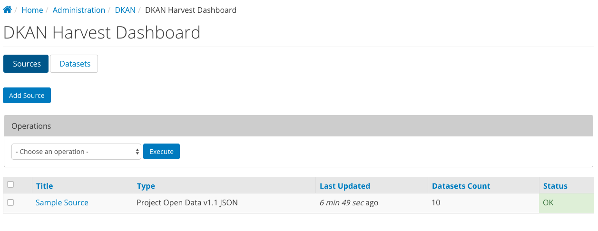
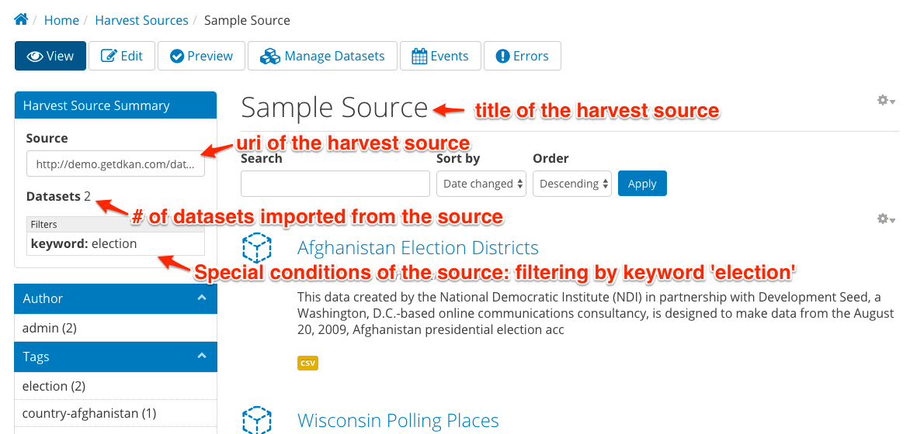

DKAN Harvest
==============

DKAN Harvest is a module that provides a common harvesting framework for DKAN.
It supports custom extensions and adds `drush <http://www.drush.org/en/master/>`_
commands and a web UI to manage harvesting sources and jobs. To "harvest" data is
to use the public feed or API of another data portal to import items from that
portal's catalog into your own. For example,
`Data.gov <https://data.gov>`_ harvests all of its datasets from the
`data.json <https://project-open-data.cio.gov/v1.1/schema/>`_ files of `hundreds
of U.S. federal, state and local data portals <http://catalog.data.gov/harvest>`_.

DKAN Harvest is built on top of the widely-used
`Migrate <https://www.drupal.org/project/migrate>`_ framework for Drupal. It
follows a two-step process to import datasets:

1. Process a source URI and save resulting data locally to disk as JSON
2. Perform migrations into DKAN with the locally cached JSON files, using mappings provided by the `DKAN Migrate Base <https://github.com/NuCivic/dkan_migrate_base>`_ module.

Harvest Sources
----------------

Harvest Sources are nodes that store the source's URI and some additional
configuration. Users with the administrator or site manager role will be able to create and manage harvest sources.

Create a new harvest source
***************************

1. Go to ``node/add/harvest-source`` or Content > Add content > Harvest Source, and fill out the form.

:Title: Administrative title for the source.
:Description: Administrative description or notes about the source.
:Source URI: The full Uniform Resource Identifier, such as `http://demo.getdkan.com/data.json`.
:Type: data.json or data.xml - If the harvest source type you are looking for is not available, please refer to the :ref:`Define a new Harvest Source Type <define_type>` section below.

The form includes four multi-value fields to help you fine tune the results of your harvest.

:Filters: Filters restrict the datasets imported by a particular field. For instance, if you are harvesting a data.json source and want only to harvest health-related datasets, you might add a filter with "keyword" in the first text box, and "heatlh" in the second.
:Excludes: Excludes are the inverse of filters. For example, if you know there is one publisher listed on the source whose datasets you do **not** want to bring into your data portal, you might add "publisher" with value "Governor's Office of Terrible Data"
:Overrides: Overrides will replace values from the source when you harvest. For instance, if you want to take responsibility for the datasets once harvested and add your agency's name as the publisher, you might add "publisher" with your agency's name as the value.
:Defaults: Defaults work the same as overrides, but will only be used if the relevant field is empty in the source

Project Open Data (as well as most metadata APIs) includes many fields that are not simple key-value pairs. If you need to access or modify nested array values you can use this dot syntax to specify the path: `key.nested_key.0.other_nested_key`. For example, the Publisher field in Project Open Data is expressed like this:

.. code-block:: json

    "publisher": {
      "@type": "org:Organization",
      "name": "demo.getdkan.com"
    },

To access the name property for filtering or overriding, you can set `publisher.name` in the first text box and the value you want to use in the second one.

2. Click **Save**, the datasets from the source will be cached, and you will see a preview of what will be imported. This preview page shows a list of dataset titles and identifiers now in the harvest cache, allowing you to perform a basic check on your source configuration. If it does not look right, click the **Edit** tab to make adjustments.

3. Click **Harvest Now**. The datasets that were cached will now be imported into your site.

Harvest Source nodes are viewable by the public and provide some basic metadata to the user.

Managing Harvest Sources
**************************
From the admin menu, navigate to DKAN > DKAN Harvest Dashboard to view harvest sources. The DKAN Harvest Dashboard provides site managers a quick overview of harvest sources, when they were last updated, number of datasets, and status of the source. The dashboard also allows site managers to perform manual harvest operations:

:Harvest (cache and migrate): This will cache the source data locally and migrate that source data into your site content.
:Cache source(s): This will fetch the source data, apply the source configuration (filters, excludes, etc.) and cache the data locally without migrating. You may wish to do this to check for errors, or to refresh the preview.
:Migrate source(s): This will migrate the current cache for the selected sources, no matter how old it is.

Click on the title of a harvest source from the dashboard to see the details of that source. Administrative tasks can be accomplished from the tabs across the top.

:View: View the harvest source node.
:Edit: Click to make changes to the configuration of the harvest source.
:Preview: Click to pull the latest data from the source endpoint into the cache.
:Manage Datasets: An administrative view that lets you sort and filter the datasets from this source. The most powerful function on this page is to filter by **orphan** status. When a dataset that was harvested into your system previously is no longer provided in the source, it is considered "orphaned" on your site and unpublished. From the Manage Datasets screen, you can either permanently delete or re-publish orphan datasets.
:Events: Event Log that provides historical data on all harvests run on this source. The information is managed by the core ``dkan_harvest`` via a per-harvest source ``migrate_log`` table that tracks the number of datasets created, updated, failed, orphaned, and unchanged and status. If the value for the field Status is Error then you can click on the text to see the log error and identify the problem.
:Errors: Error log that shows a list of all errors recorded during harvesting on the source.

Harvested Resources
**************************
When datasets are harvested, the resources are added as remote files, which means they are links to the original files on the remote server. If you modify the resource in your DKAN site, your changes will be overwritten the next time a harvest is performed. If you add a harvested resource to the :doc:`datastore <datastore>` be sure to set up periodic importing so that the resource stays in sync with the source. For these reasons, we do not recommend that you create visualizations based on harvested resources as the visualizations could break when changes are made to the files upstream.

Harvest Drush Commands
-----------------------
DKAN Harvest provides multiple drush commands to manage harvest sources and control harvest jobs. In fact, once your sources are properly configured, running harvests from Drush on a cron job or other scheduling system like `Jenkins <https://jenkins.io/>`_ is highly reccomended.

It is recommanded to pass the ``--user=1`` drush option to
harvest operation (especially harvest migration jobs) to make sure that the
entities created have a proper user as author.

List Harvest sources available
*******************************

.. code-block:: sh

  # List all available Harvest Sources
  $ drush --user=1 dkan-harvest-status
  # Alias
  $ drush --user=1 dkan-hs

Run a full harvest (Cache & Migration)
**************************************

.. code-block:: sh

  # Harvest data and run migration on all the harvest sources available.
  $ drush --user=1 dkan-harvest
  # Alias
  $ drush --user=1 dkan-h

  # Harvest specific  harvest source.
  $ drush --user=1 dkan-harvest test_harvest_source
  # Alias
  $ drush --user=1 dkan-h test_harvest_source

Run a harvest cache
**************************************

.. code-block:: sh

  # Run a harvest cache operation on all the harvest sources available.
  $ drush --user=1 dkan-harvest-cache
  # Alias
  $ drush --user=1 dkan-hc

  # Harvest cache specific harvest source.
  $ drush --user=1 dkan-harvest-cache test_harvest_source
  # Alias
  $ drush --user=1 dkan-hc test_harvest_source

Run a harvest migration job
**************************************

.. code-block:: sh

  # Run a harvest migrate operation on all the harvest sources available.
  $ drush --user=1 dkan-harvest-migrate
  # Alias
  $ drush --user=1 dkan-hm

  # Harvest migrate specific harvest source.
  $ drush --user=1 dkan-harvest-migrate test_harvest_source
  # Alias
  $ drush --user=1 dkan-hm test_harvest_source

Extending DKAN Harvest
----------------------

DKAN developers can use the api provided by DKAN Harvest to add support for
additioanl harvest source types. The ``dkan_harvest_datajson`` module encapsulate
the reference implementation providing support for POD type sources.

If you need to harvest from an end point type other then POD. You can extend
the DKAN Harvest APIs to implement said support by following a simple
checklist:

* Define a new Harvest Source Type via ``hook_harvest_source_types``.
* Implement the Harvest Source Type cache callback.
* Implement the Harvest Source Type Migration Class.
* (Optional) Write tests for your source type implementation.

.. _define_type:

Define a new Harvest Source Type
**************************************

DKAN Harvest leverages Drupal's hook system to provide a way to extend the Source types that DKAN Harvest supports. To add a new harvest source type the we return their definitions as array items via the
``hook_harvest_source_types()`` hook.

.. code-block:: php

  /**
   * Implements hook_harvest_source_types().
   */
  function dkan_harvest_test_harvest_source_types() {
    return array(
      'harvest_test_type' => array(
        'machine_name' => 'harvest_test_type',
        'label' => 'Dkan Harvest Test Type',
        'cache callback' => 'dkan_harvest_cache_default',
        'migration class' => 'HarvestMigration',
      ),

      // Define another harvest source type.
      'harvest_another_test_type' => array(
        'machine_name' => 'harvest_another_test_type',
        'label' => 'Dkan Harvest Another Test Type',
        'cache callback' => 'dkan_harvest_cache_default',
        'migration class' => 'HarvestMigration',
      ),
    );
  }

Each array item defines a single harvest source type. Each harvest source item consists of an array with 4 keyed values:

:machine_name: Unique string identifying the harvest source type.
:label: This label wil be used on the harvest add node form.
:cache callback: Cache function to perform; takes HarvestSource object and timestamp as arguments) and returns a HarvestCache object
:migration class: A registered Migrate class to use for this source type

Cache callbacks
**************************************

.. code:: php

  /**
   * @param HarvestSource $source
   * @param $harvest_updatetime
   *
   * @return HarvestCache
   */
  function dkan_harvest_datajson_cache(HarvestSource $source, $harvest_updatetime)

This callback takes care of downloading/filtering/altering the data from the
source end-point to the local file directory provided by the
HarvestSource::getCacheDir() method. The recommended folder structure for
cached data is to have one dataset per uniqely named file. The actual migration
is then performed on the cached data, not on the remote source itself.

.. code::

  sh
  $ tree
  .
  ├── 5251bc60-02e2-4023-a3fb-03760551ab4a
  ├── 80756f84-894f-4796-bb52-33dd0a54164e
  ├── 846158bd-1821-48d8-80c8-bb23a98294a9
  └── 84cada83-2382-4ba2-b9be-97634b422a07

  0 directories, 4 files

  $ cat 84cada83-2382-4ba2-b9be-97634b422a07
  /* JSON content of the cached dataset data */

The harvest cache function needs to support the modifications to the source
available from the harvest source via the Filter, Excludes, Overrides and Default
fields. Each of these configurations is available
from the HarvestSource object via the ``HarvestSource::filters``,
``HarvestSource::excludes``, ``HarvestSource::overrides``,
``HarvestSource::defaults`` methods.

Migration Classes
**************************************

The common harvest migration logic is encapsulated in the `HarvestMigration
class <https://github.com/NuCivic/dkan/blob/7.x-1.x/modules/dkan/dkan_harvest/dkan_harvest.migrate.inc#L15>`_,
(which extends the `MigrateDKAN <https://github.com/NuCivic/dkan/blob/7.x-1.x/modules/dkan/dkan_migrate_base/dkan_migrate_base.migrate.inc#L241>`_ class provided
via the `DKAN Migrate Base <https://github.com/NuCivic/dkan/tree/7.x-1.x/modules/dkan/dkan_migrate_base>`_
module. DKAN Harvest will support only migration classes extended from
``HarvestMigration``. This class is responsible for consuming the downloaded data
during the harvest cache step to create the DKAN `dataset` and associated
nodes.

Implementing a Harvest Source Type Migration class is the matter of checking
couple of boxes:

* Wire the cached files on the ``HarvestMigration::__construct()`` method.
* Override the fields mapping on the ``HarvestMigration::setFieldMappings()`` method.
* Add alternate logic for existing default DKAN fields or extra logic for
  custom fields on the ``HarvestMigration::prepareRow()`` and the
  ``HarvestMigration::prepare()``.

Working on the Migration Class for Harvest Source Type should be straitforward,
but a good knowladge on how `migrate works <https://www.drupal.org/node/1006982>`_ is a big help.

``HarvestMigration::__construct()``
**************************************
Setting the `HarvestMigrateSourceList` is the only logic required during the
construction of the extended `HarvestMigration`. During the harvest migration
we can't reliably determin and parse the type of cache file (JSON, XML, etc..)
so we still need to provide this information to the Migration class via the
``MigrateItem`` variable. the Migrate module provide different helpful class
for different input file parsing (``MigrateItemFile``, ``MigrateItemJSON``,
``MigrateItemXML``). For the the POD ``dkan_harvest_datajson`` reference
implementation we use the ``MigrateItemJSON`` class to read the JSON files
downloaded from data.json end-points.

.. code:: php

  public function __construct($arguments) {
    parent::__construct($arguments);
    $this->itemUrl = drupal_realpath($this->dkanHarvestSource->getCacheDir()) .
      '/:id';

    $this->source = new HarvestMigrateSourceList(
      new HarvestList($this->dkanHarvestSource->getCacheDir()),
      new MigrateItemJSON($this->itemUrl),
      array(),
      $this->sourceListOptions
    );
  }

``HarvestMigration::setFieldMappings()``
****************************************
The default Mapping for all the default DKAN fields and properties is done on
the ``HarvestMigration::setFieldMapping()`` method. Overriding one or many field
mapping is done by overrrding the ``setFieldMapping()`` in the child class and
add/update the new/changed fields.

For example to override the mapping for the ``og_group_ref`` field.

.. code-block:: php

  public function setFieldMappings() {
    parent::setFieldMappings();
    $this->addFieldMapping('og_group_ref', 'group_id');

Resources import
^^^^^^^^^^^^^^^^
The base ``HarvestMigration`` class will (by default) look for a ``$row->resources`` objects
array that should contain all the data needed for constructing the resource
node(s) associated with the dataset. the helper method
``HarvestMigration::prepareResourceHelper()`` should make creating the
``resources`` array items more streamlined.

Example code snippet:

.. code-block:: php

  /**
   * Implements prepareRow.
   */
  public function prepareRow($row) {
    // Redacted code

    $row->resources = $this->prepareRowResources($row->xml);

    // Redacted code
  }

Harvest and `DKAN Workflow <https://github.com/NuCivic/dkan_workflow>`_ support
^^^^^^^^^^^^^^^^^^^^^^^^^^^^^^^^^^^^^^^^^^^^^^^^^^^^^^^^^^^^^^^^^^^^^^^^^^^^^^^^
By default, DKAN Harvest will make sure that the harvested dataset node will be
set to the ``published`` moderation state if the DKAN Workflow module is enabled
on the DKAN site. This can be changed at the fields mapping level by overriding
the ``workbench_moderation_state_new`` field.
