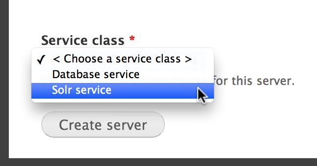
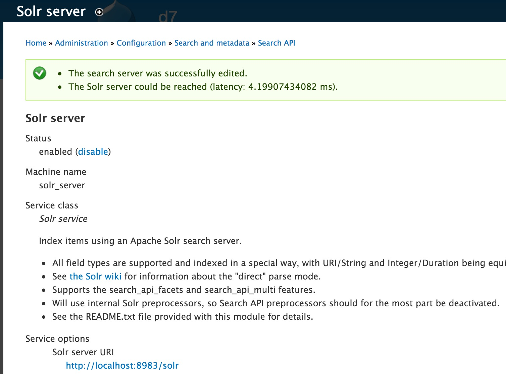
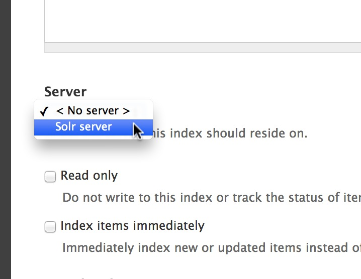

# Search

DKAN offers faceted search similar to CKAN. This functionality comes from the Search API module in Drupal: [Search API](http://drupal.org/project/search_api) Out of the box DKAN uses the native database: [Search API DB](http://drupal.org/project/search_api_db) DKAN can easily be updated to use Solr to power the search using the Search API Solr module: [Search API Solr](http://drupal.org/project/search_api_solr) For a great tutorial on setting up Search API Solr, see: [http://zugec.com/2011/04/how-setup-search-api-apache-solr](http://zugec.com/2011/04/how-setup-search-api-apache-solr)

### Search API

[Search API](http://drupal.org/project/search_api) is a module to extend the search into drupal. This module implement a abstract search layer and allow implement complex searchs with facets, ..... without think if you will use DB or Apache Solr. Is so easy to change between DB or Apache Solr.

### What is Apache Solr?

Apache Solr is a search platform focused on delivering enterprise class, high performance search functionality. The software was originally created as an internal CNET project and then donated to the Apache Foundation in 2006. Apache Solr runs as a separate service from web server and the database. You need some extra  resources to integrate into your website. This can increase the price for hosting (If you have high traffic or want high performance you should use).

### DB vs Solr search

Solr:
 * PRO: Out from database.
 * PRO: Increase performance removing queries over database.
 * PRO: Reduce database size.
 * PRO: Complex queries are executed very fast (Facets,....)
 * CONS: You need a external service to have solr installed.
 * CONS: Sometimes communication with solr can be slow.
 * CONS: Usually increase hosting price.

DB:
 * PRO: All information is over the same database.
 * PRO: High velocity doing queries.
 * CONS: Bad performance for sites with high traffic.
 * CONS: Increase database size if you have a lot data to index.

### Switching to Solr

To switch from the native database to Solr simply:

*   Create or purchase a Solr instance
*   Install search_api_solr
*   Go to Configuration -> "Search API" and go to "Add server"
*   Put a name and as "Service class" select "Solr service" 
*   If you installed solr in your local server you can save in another case you need to put Solr server URI/port/path.
*   When you click on "Create server" you should see a messae as 
*  The next step is change the Dataset index to the Solr server. Go to edit index and select into "Server" the search server created 

### "Did You Mean?" Spellchecking

To add spellcheck, simply install the Search API Spellcheck: [https://www.drupal.org/project/search_api_spellcheck](https://www.drupal.org/project/search_api_spellcheck)

### Searching within Resource files

PDFs, CSVs and other files attached to Resources can be searched by using the Tika library. This functionality is made possible with the Search API Attachments module: [http://drupal.org/project/search_api_attachments](http://drupal.org/project/search_api_attachments)

### Search API Handbook

See the Search API Handbook for more recipes and information: [https://www.drupal.org/node/1250878](https://www.drupal.org/node/1250878)
