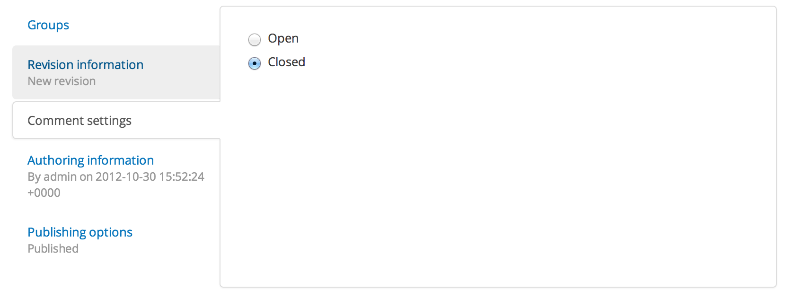

Comment Modules
=====================

Drupal core has a comment module that is included with DKAN.

Enabling comments is as easy as turning on the core Comment module.

Once you have done that new datasets will have a comment box at the bottom.

For previously created datasets you will need to click "Comment settings" and "open" for each datasets:

It is highly recommended to read ​Drupal's `comment documentation <https://www.drupal.org/node/777676>`_ which has some more info on administering and configuring comments. 

**Disqus Comments**

It is easy to add Disqus comments in Drupal. Simply follow `Disqus <https://disqus.com/admin/drupal/>`_ 6 steps. 

More information can be found at `Drupal's Disqus module page <https://www.drupal.org/project/disqus>`_.