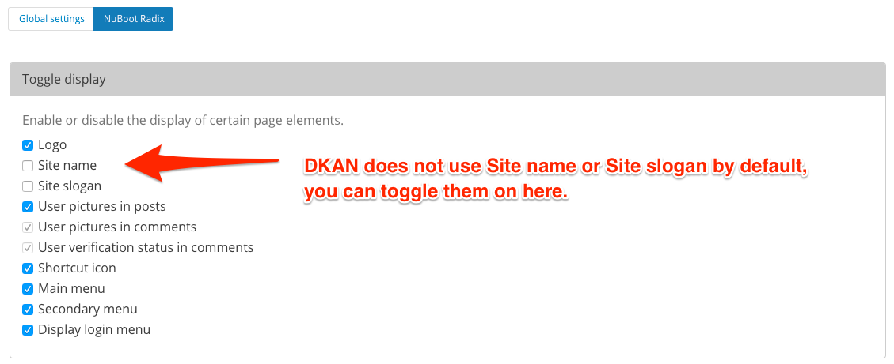
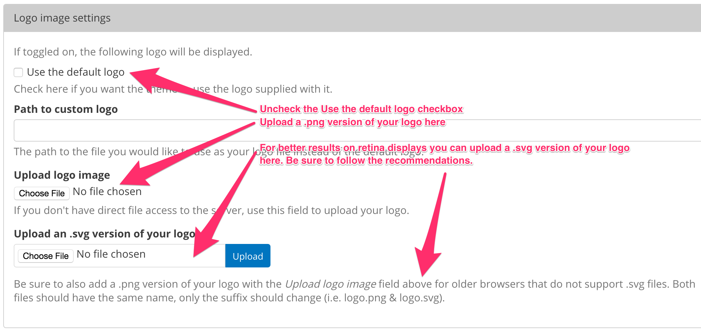
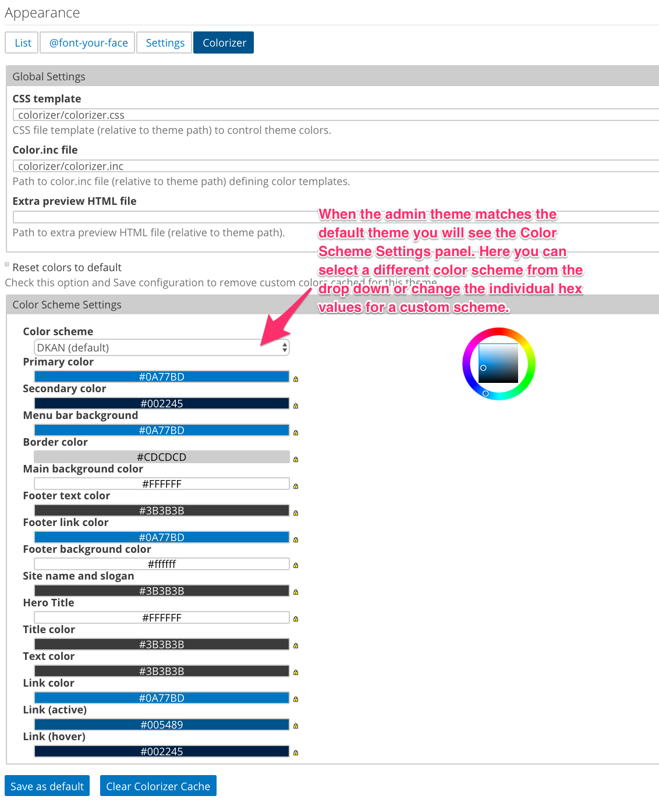
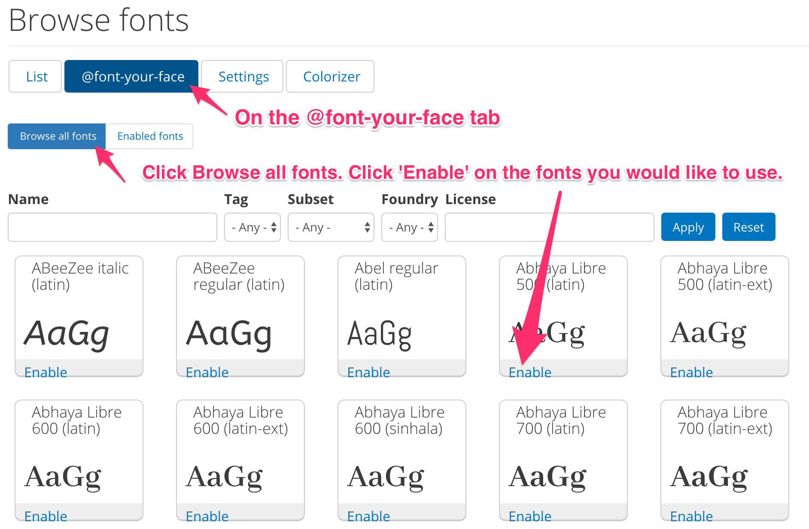

Theme
==========

DKAN takes advantage of Drupal’s well-developed and flexible theming system,
allowing administrators complete graphical control over the entire DKAN site.
Features such as responsive page templates, accessible design elements, and
built-in media management provide the latest in design and presentation
technologies.

Default DKAN Theme
-------------------

In Drupal and DKAN, the collection of page templates, fonts, colors, images,
and other “look and feel” elements are known as a “theme.” NuBoot Radix is the default theme for DKAN and is a subtheme of `Radix <https://www.drupal.org/project/radix>`_ which uses `bootstrap <https://github.com/twbs/bootstrap>`_ styles and is compatible with panelized sites. This theme has some basic customization features built in, for many client sites, these configurations will be all that is necessary to meet the client expectations. The configurable items are:

*   Logo (svg logos will display better on retina displays)
*   Front page Hero image OR you can set a solid color background for the hero region.
*   Favicon.
*   Copyright text.
*   Color options via the Colorizer screen
*   Fonts: use font-your-face to use alternate fonts

DKAN administrators have the choice of customizing the existing DKAN Theme through theme settings, implementing an entirely new theme, or creating a :ref:`subtheme of nuboot_radix <creating_subtheme>`.

By default, the DKAN Theme is located in: `[SITEROOT]/themes/nuboot_radix`

Theme and Appearance Settings
-----------------------------

The DKAN Theme does provide a few simple customizations that administrators can use to change the default appearance of the site from the theme settings screen. If logged in as an administrative user, navigate to Appearance >> Settings

Site name and slogan
*********************

From the settings screen, you can toggle on/off the **site name** and **slogan**, simply check the box next to the elements you want to use.

Logo
*********************

Uncheck the 'Use the default' checkbox, and upload a new logo file in the logo image settings section.

Shortcut icon
*********************

If you would like to use a different favicon image, uncheck the 'Use the default' checkbox, and upload your own.

Copyright info
*********************

To change the **copyright** information that displays at the bottom of every page, edit the text in the copyright field and save.

Hero background image/color
****************************

The **Hero Unit** is the background image that displays on the front page. To use a different photo than the one supplied, click the 'Choose file' button to upload a new image. This image will expand to cover the full width of the browser so be sure to upload a horizontal/landscape image and not a vertical/portrait image.

.. image:: ../images/Appearance_DKAN_3.png

Color scheme
****************************

To use the **colorizer** option, you must use the default theme as the admin theme. Navigate to `[SITEROOT]/admin/appearance` and scroll to the bottom. Confirm that the Admin theme is set to 'Default Theme'.

Now navigate to `[SITEROOT]/admin/appearance/colorizer` by clicking on the 'Colorizer' tab. Here you will see the color scheme options. There are a few default options you can select from the drop down, or you can enter hex values to create a custom color scheme, be sure to click 'Save Configuration' when finished. Your new colors are saved to a css file in your files directory. If you do not see your changes you may need to clear the colorizer cache by clicking the 'Clear Colorizer Cache' button. These colors will override all other styles in the theme.

Fonts
****************************

On the Appearance page, you will see a sub-menu item for **@font-your-face**. Navigate to `[SITEROOT]/admin/appearance/fontyourface`.

By default, the Google fonts api is enabled. If you click on the **Browse all fonts** tab, you will be able to select which google fonts to add to your site. Once you have made your selections, click on the **Enabled fonts** tab to view the font settings screen. Click on the **By CSS selector**, here you can select the css tag and what font should be applied to it using the table. To add fonts to specific css selectors, add them to the open text field at the bottom of the list, select a font from the dropdown next to it and click the **Save applied fonts** button
For more information on how to use @fontyourface visit the `project page <https://www.drupal.org/project/fontyourface>`_.

.. image:: ../images/Appearance_DKAN_5.png
   :alt: Select google fonts

.. _creating_subtheme:

Creating a new subtheme
****************************

To create a Nuboot Radix subtheme, run these commands

.. code-block:: php
  
  drush en radix

  drush vset theme_default radix

  drush radix "MyThemeName" --kit=https://github.com/NuCivic/radix-kit-nuboot/archive/master.zip

  drush vset theme_default MyThemeName

  drush dis radix

OR if using `Ahoy <https://dkan-starter.readthedocs.io>`_:

.. code-block:: php

   ahoy dkan theme new-from-kit [new-theme-name]

   ahoy dkan theme setup

   ahoy dkan theme watch

Your new subtheme will be placed in to the /sites/all/themes/ directory, it will contain only the directory structure, add your overrides where appropriate.

Theming Tools
---------------

Install Node and npm. You will use `gulp <https://www.npmjs.com/package/gulp>`_ for compiling the sass files. To get your local environment set up, follow these steps:

1. Install Node and npm. You can read a guide on how to install node `here <https://docs.npmjs.com/getting-started/installing-node>`_
2. Install bower: ``npm install -g bower``.
3. Go to the root of your theme and run the following commands: ``npm run setup``.
4. Update browserSyncProxy in config.json
5. Edit the files under the scss and js directory, these will be compiled into the assets directory. Run the following command to compile Sass and watch for changes: ``gulp``.

Icon Fonts
---------------

The Nuboot Radix theme ships with two icon fonts:

dkan-flaticon
***************

This font is used for file types (csv, pdf, xls, etc) `designed by Freepik <http://www.flaticon.com/packs/file-formats-icons>`_

The font files and the css are inside the Nuboot Radix theme `dkan/themes/nuboot_radix`. If you would like to use your own file type icons you can override the dkan-flaticon css by creating a custom theme. OR, if you would like to use the dkan-flaticon icons but NOT use Nuboot Radix as your base theme, you will need to copy the dkan-flaticon fonts and the dkan-flaticon.css into the theme you are using.

.. code-block:: php

   dkan/themes/nuboot_radix/assets/fonts/dkan-flaticon.eot
   dkan/themes/nuboot_radix/assets/fonts/dkan-flaticon.svg
   dkan/themes/nuboot_radix/assets/fonts/dkan-flaticon.ttf
   dkan/themes/nuboot_radix/assets/fonts/dkan-flaticon.woff
   dkan/themes/nuboot_radix/assets/css/dkan-flaticon.css

dkan-topics
***************

This font is used for the Content Type and :doc:`Topics <topics>` icons, see `Streamline Icons <http://www.streamlineicons.com/index.html>`_

If you would like to use your own icon font for Topics, use the :doc:`steps outlined here <adding_new_icons>`.
