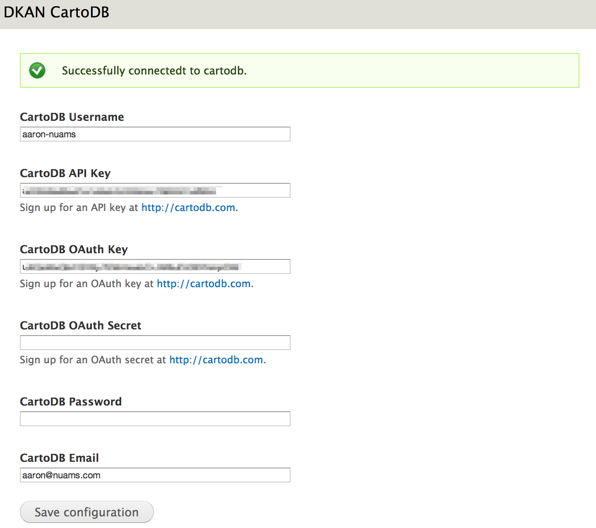
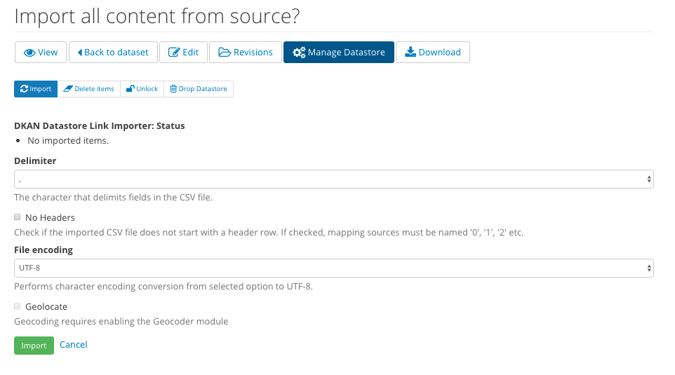
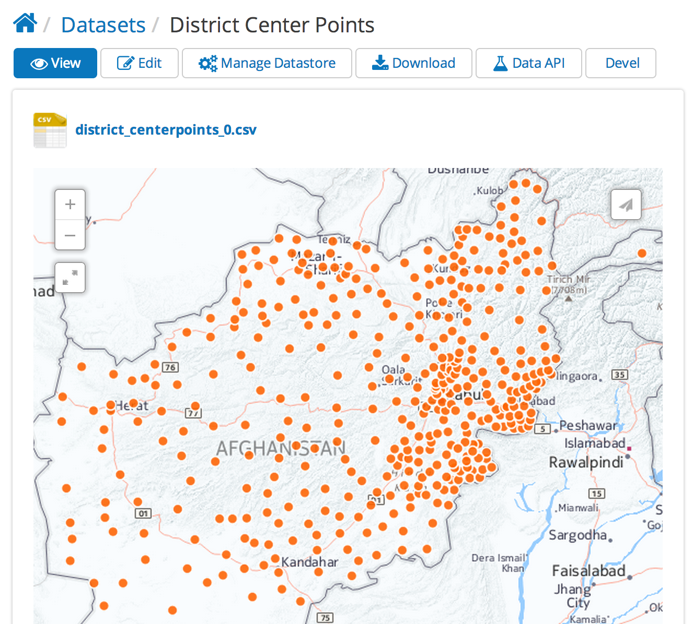

Publishing maps with CartoDB and DKAN
=====================================

`The DKAN Datastore CartoDB module <https://github.com/NuCivic/dkan_datastore_cartodb>`_ takes resources in `DKAN <https://github.com/NuCivic/dkan>`_ and makes them editable in `CartoDB <http://cartodb.com/>`_. The resulting visualizations can be displayed as previews for DKAN resources as well as to tell stories about your data elsewhere on your DKAN site.

CartoDB’s visualizations are built on a powerful `SQL API <http://docs.cartodb.com/cartodb-platform/sql-api.html>`_. Once resources are added to CartoDB, their contents can also be queried. This allows users to make applications from your data.

Install and configure DKAN Datastore CartoDB
--------------------------------------------
Download the `DKAN Datastore CartoDB <https://github.com/NuCivic/dkan_datastore_cartodb>`_ module to your existing DKAN site. For general instructions on Drupal module installation see: `Installing contributed modules <https://www.drupal.org/node/895232>`_.

The module requires the `CartoDB PHP Client <https://github.com/Vizzuality/cartodbclient-php>`_. It should be downloaded and placed in ``sites/all/libraries``. The ``cartodb.class.php`` file should be located at ``sites/all/libraries/cartodbclient-php/cartodb.class.php``

You can also use the dkan\_datastore\_cartodb.make file: ``drush make --no-core dkan_datastore_cartodb.make``

Once the module is enabled, go to ``/admin/dkan/cartodb``. Here you will enter your CartoDB credentials:

Once you've saved your credentials you should see “Successfully connected to CartoDB.”

Add a resource
**************
Next, add a resource with a file attached to it:

.. image:: ../../images/upload-file.png

Once the resource has been uploaded, click “Manage Datastore”:

Click “Import” to start the process:

When the uploading has finished, the “Data API” tab will now indicate that users can query the contents of your file:

.. image:: ../../images/datastore-api.png

Visualizing data from CartoDB
******************************
Now that your resource has been added to CartoDB, it can be queried through CartoDB’s SQL API. It can also still be previewed by DKAN’s native `Recline <http://okfnlabs.org/recline/>`_ data preview.

CartoDB’s tools allow you to take your data and make rich interactive maps. To do so, go to CartoDB and create a visualization using your data. See `CartoDB’s Editor documentation <http://docs.cartodb.com/cartodb-editor.html>`_ for details.

Once a visualization has been created in CartoDB, it is available as the data preview for the resource.

To access it click “Manage Datastore” once more. You should see a list of available visualizations:

.. image:: ../../images/datastore-cartodb.png

Once you have selected a visualization to represent a resource it will be displayed on the resource itself:

