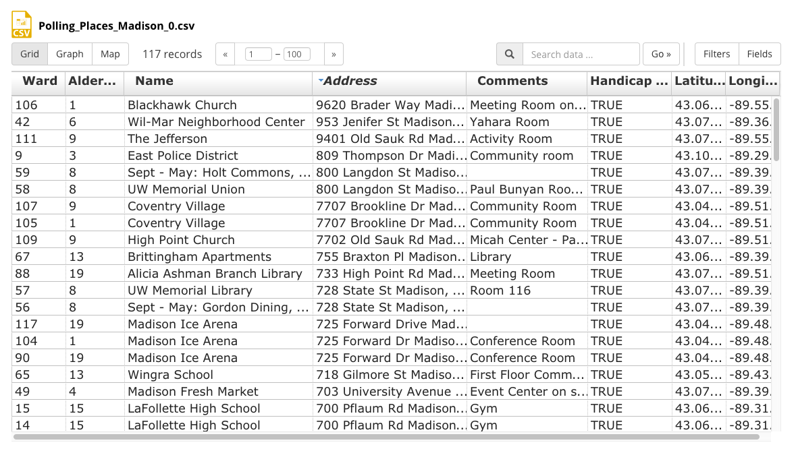
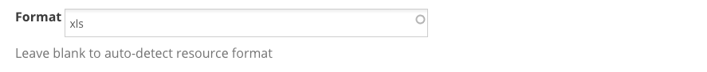
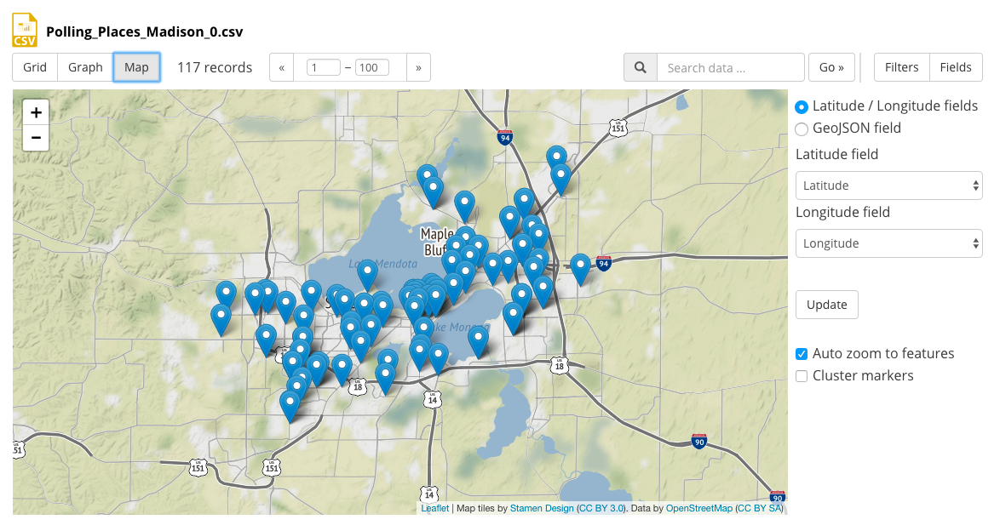
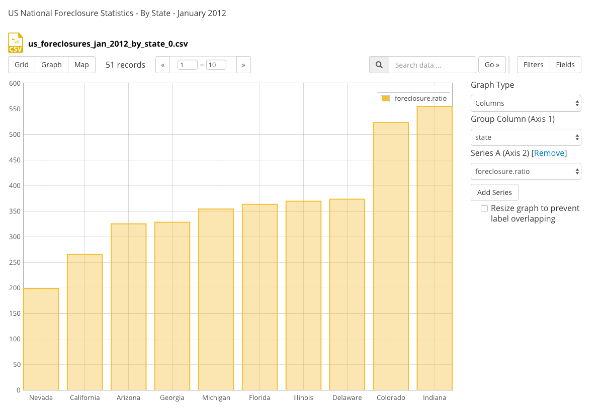
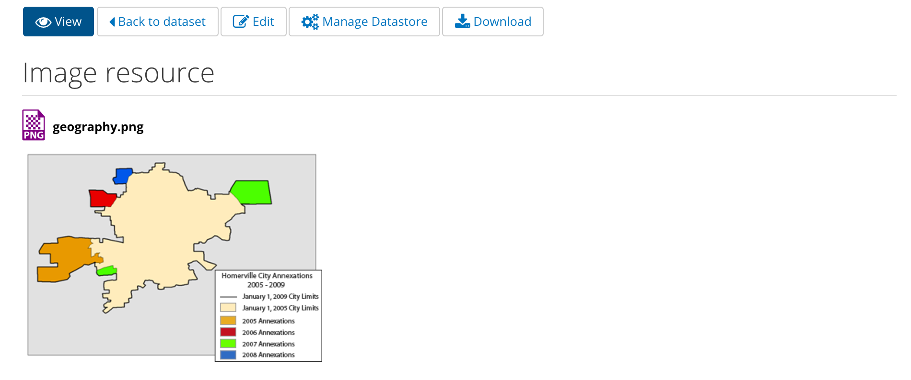
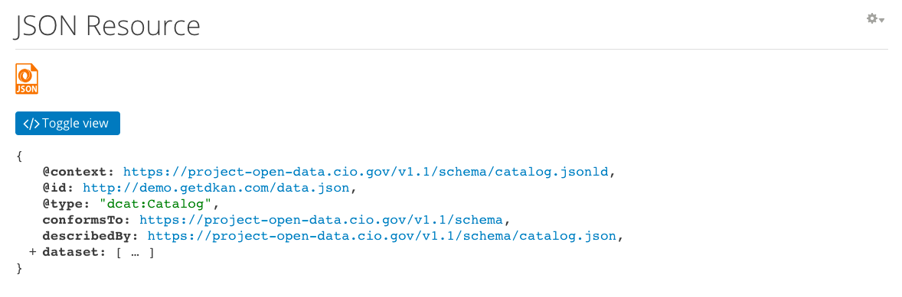
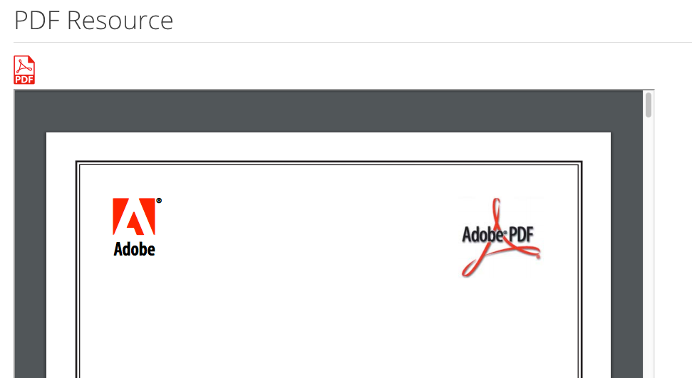
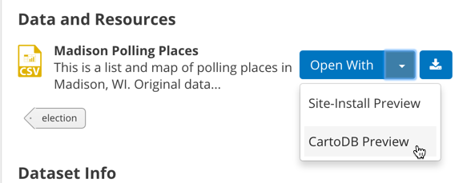

DKAN Data Preview Features
==========================

DKAN allows users to have a preview of their data when uploaded to or linked to a *resource*. Which preview type is displayed for a particular *resource* depends on the data **format** selected. If no data format is provided, DKAN will attempt to auto-detect the format from the file's metadata; re-editing the *resource* and correcting the format field manually may be necessary if the auto-detection is not successful.

This functionality is provided via the `Recline module <https://github.com/NuCivic/recline>`_, which is not part of the core DKAN repository but is a basic dependency of it (and will be included when building the distribution via ``drush make``).

Recline.js
----------

DKAN, like CKAN, offers an integration with the `Recline <http://reclinejs.com>`_ Javascript library. Recline allows site visitors to preview tabular data visually. The preview works for CSV and XLS [*]_ files that are uploaded to the DKAN site or hosted remotely and linked to, as well as for data stored in DKAN's local SQL-based :doc:`datastore <../datastore>`.

Grid View
*********
All tabular data can be rendered as spreadsheet-style rows and columns:

.. [*] For xls files be sure to fill in the format field to see previews of the data

Map View
********
Visitors can preview data that contains either coordinates or GeoJSON on a `Leaflet.js <http://leafletjs.com/>`_ -based map:

Graph View
**********
If enabled, visitors can chose one column of your data as an X-axis, one or more as Y-axis data, and preview your data as a bar, point or line graph.

File size limits
****************
Files can only be previewed if they are well formatted and small enough to render in the browser.

If files are too large to preview within 1 second you will get the following message *"File was too large or unavailable for preview."*

Files that are too large to preview in the browser can be previewed by :doc:`adding them to the datastore <../datastore>`. Once a file is in the datastore the preview is only asking for the first 25 rows of the data. Thus large datasets can be previewed.

Additional Preview Types
------------------------
DKAN provides preview formats for several additional file types beyond what is supported by Recline.js, these include: JSON, geojson, XML, ArcGIS REST, WMS, images, PDF, and ZIP files. These additional preview formatters are defined in a `forked version of Recline <https://github.com/NuCivic/recline>`_

Zip files
*********
DKAN offers the ability to preview the files and folders locked in ZIP files. DKAN will display a list of contents for ZIP files uploaded as resources on datasets.

.. image:: ../../images/zip-preview.png

Image files
***********
Image files (JPG, PNG or GIF) uploaded as resources will be displayed directly on the resource page.

Web Map Service (WMS)
*********************
DKAN can use Leaflet to display a preview of a `WMS server <https://en.wikipedia.org/wiki/Web_Map_Service>`_, provided endpoint.

.. image:: ../../images/wms.png

WMS support in DKAN is still somewhat experimental and your results may vary.

ArcGIS REST
***********
An ESRI/ArcGIS REST endpoint may also be displayed in a Leaflet preview.

.. image:: ../../images/arcgis.png

JSON files
**********

GeoJSON files
****************
.. image:: ../../images/geojson-preview.png

XML files
****************
.. image:: ../../images/xml-preview.png

PDF files
****************

External Previews
******************
Starting with version 7.x-1.10, DKAN supports previewing/opening resources in external services that offer simple URL-based integrations. For instance, the CartoDB mapping service offers an `Open in CartoDB service <https://cartodb.com/open-in-cartodb>`_. Enabling this for CSV files will result in a dataset display like this:

External preview functionality can be enabled and configured in the "DKAN Dataset Previews" administration page (/admin/dkan/dataset_preview).

Configuration
----------------
By default previews are available for resources with files below 3MB of size. However you can customize this limit in the recline configuration page (*/admin/dkan/recline*).

.. image:: ../../images/recline-configuration.png
