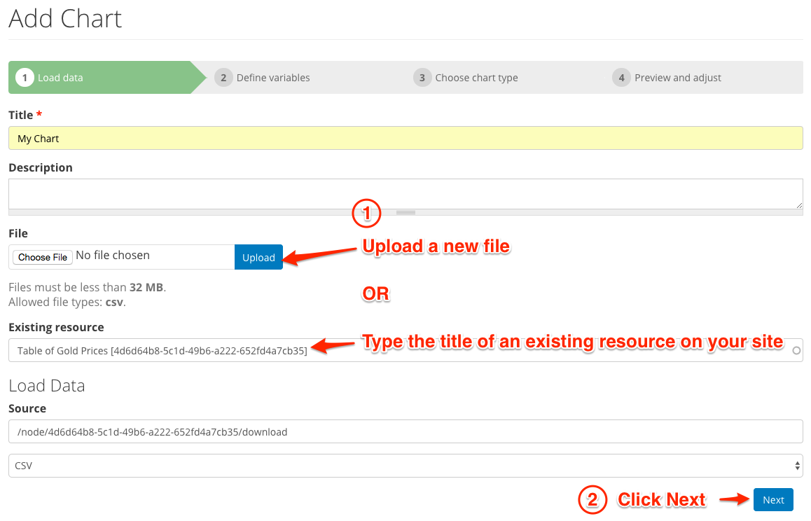
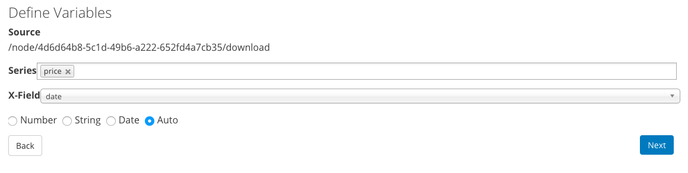
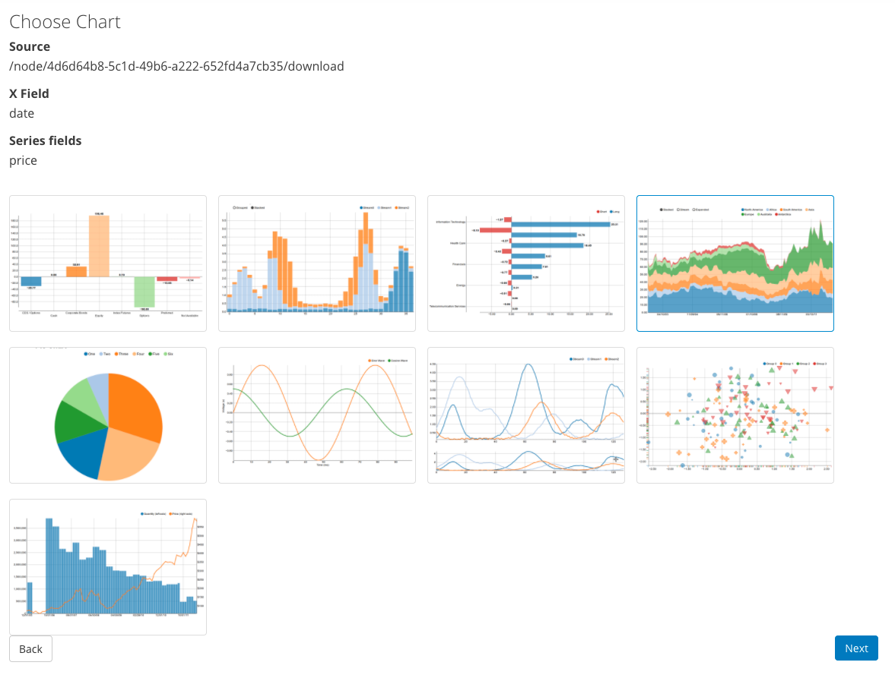
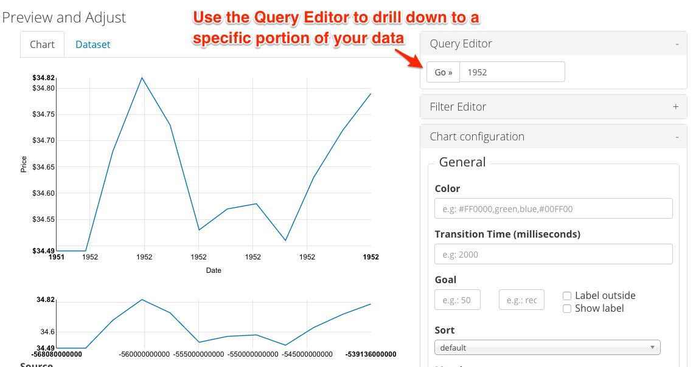

Visualization Chart
====================

Visualization Entity Charts is enabled by default in DKAN. This modules provides the ability to create embeddable NVD3 charts.

Usage
------------
New chart entities can be created by going to ``/admin/structure/entity-type/visualization/ve_chart/add``. A multi-step process will guide you through the creation of a chart based on an uploaded data file.

Step One - Choose a Resource
*****************************
Use the form to upload a data file **OR** link to an existing data resource.
Valid source data include:
* CSV
* Google Spreadsheet
* Data Proxy

Step Two - Define Variables
****************************
Choose a single *x-field* and one or more *y-fields* (series) for the visualization.

Step Three - Choose Chart Type
*******************************
**NOTE**: X and Y Axis Fields are not supported by the *Pie Chart* type.

Step Four - Preview and Adjust
*******************************
You can adjust colors, margins, include a goal, labels, tick values, and more.

.. image:: images/chart-step-4.png

Query Editor
****************************
Click the '+' on the query editor to add a query parameter to specify the data used for the chart.

Filter Editor
****************************
Click the '+' on the filter editor to add one or more filters to limit the data used for the chart.
Multiple filters can be applied to data, the operator is 'OR'.

* Select the field you would like to filter by.
* Select the type of filter (value, range, geo distance)
* Click **Add**
* Fill in the fields to complete the filter.

To delete a filter, click the 'x' next to the filter name.

.. image:: images/chart-filter-editor.png

Chart Configuration
--------------------

X Axis
*****************
* **Format** Select an appropriate format for the X Axis labels.
* **Axis Label**  will provide a custom label for the x axis. 
* **Note:** Axis labels do not display for Pie Charts.
* **Label rotation** will change angle of label values.
* **Tick Values** with **step value** will update the number of ticks for the X axis. **NOTE:** If the range set for tick values is smaller than the range of complete data represented, the chart will be abbreviated.

Y Axis
*****************
* **Axis Label** Provides a custom label for the y axis. 
* **Note:** Axis labels do not display for Pie Charts. 
* Adjust the *distance* field until Label is visible on the chart.
* Adjust **Tick Values** with **step value** to change the number of ticks for the Y axis. **NOTE:** If the range set for tick values is smaller than the range of complete data represented, the chart will be abbreviated.

General
*****************
:Color: Set the color the chart is drawn in. Use either a `HEX color code <http://www.w3schools.com/tags/ref_colorpicker.asp>`_ or a `valid css color name <http://www.w3schools.com/cssref/css_colornames.asp>`_
:Transition Time: Time in ms it takes for graph to animate.
:Goal: Overlay a goal or target line on the chart.
:Margin: Enter value of margin in the order: *top, right, bottom, left*
:Show Title: Display the title you entered on step 1.
:Show Controls: Whether to show extra controls or not. Extra controls include things like making multiBar charts stacked or side by side.
:Show Legend: Display a legend for the chart. 
:Group By X Field: For multiple series values Y will show values grouped by X
:Show Tooltips: Shows data and label on hover.
:Reduce Ticks: Reduces the number of axis values displayed.

Recline
*****************
The bundle also includes an integration with the `Recline module <https://github.com/NuCivic/recline>`_. If you have a content type with a recline file field, you can add a Recline Field Reference field to your chart bundle. This field type is defined in a module that comes bundled with `Visualization Entity <https://github.com/NuCivic/visualization_entity>`_. The included DKAN integration module adds a Recline Field Reference pointing specifically at DKAN's Resource content type. In this case, entering an existing Resource node in the reference field will automatically populate the resource file into the chart entity's file field.
