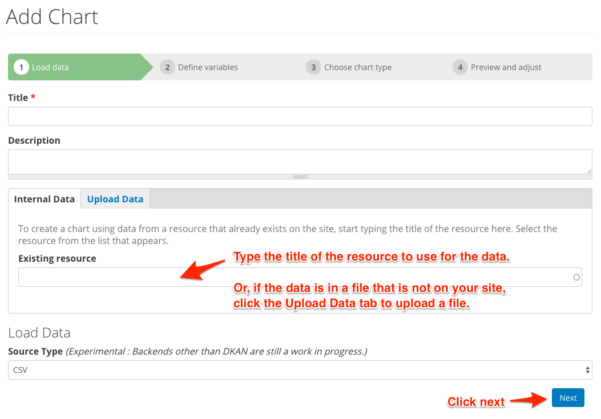
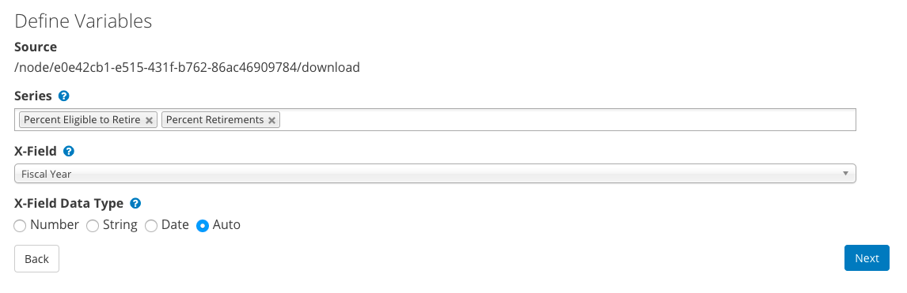
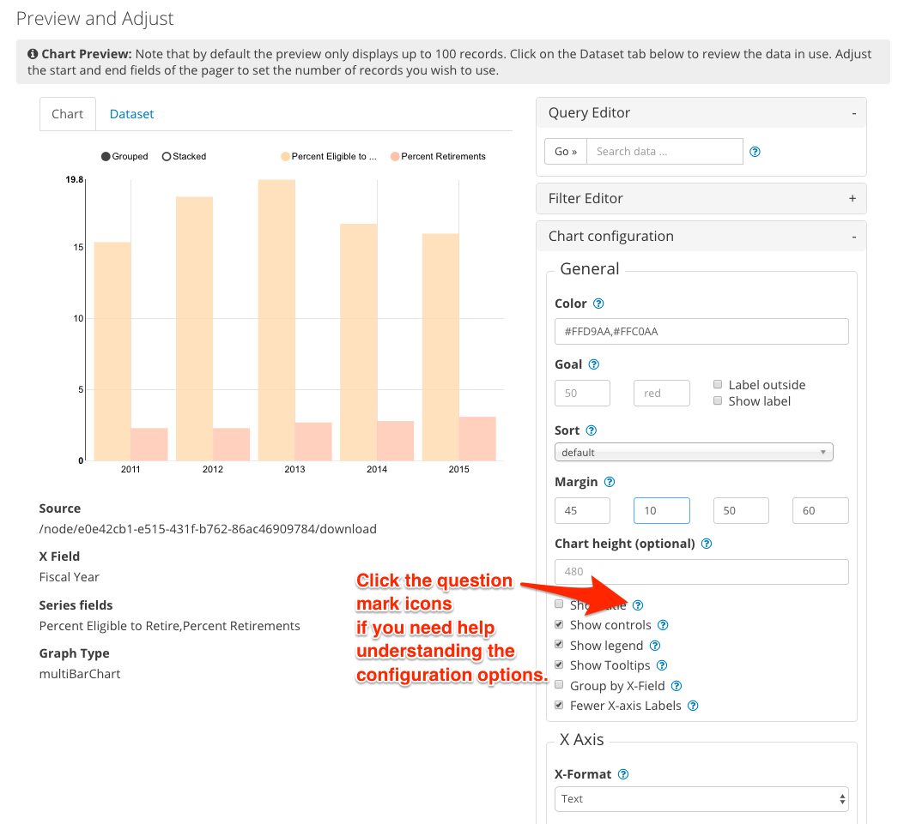

Visualization Chart
====================

Visualization Entity Charts is enabled by default in DKAN. This modules provides the ability to create embeddable NVD3 charts.

Usage
------------
New chart entities can be created by going to ``/admin/structure/entity-type/visualization/ve_chart/add``. A multi-step process will guide you through the creation of a chart based on an uploaded data file.

Step One - Choose a Resource
*****************************
- Enter a title for the chart.
- Enter a description if needed.
- Then start typing the title of a resource that you would like to use as the data source. A list will appear, select the resource from the list. 
- OR, if the data you want to use is not on your site, click the Upload Data tab to upload a CSV data file. 
- Click the Next button.

Step Two - Define Variables
****************************
- **Series:** Add all the columns you would like to plot along the y-axis, the **value** axis. A collection of related values is what makes up a 'series'.
- **Y-Field Data Type:** The data type will be auto-detected but if you see issues you can manually select the data type here.
- **X-Field:** Choose a single column for the x-axis, the **category** axis.
- **X-Field Data Type:** The data type will be auto-detected but if you see issues you can manually select the data type here.

Step Three - Choose Chart Type
*******************************
Select the chart type that will best represent your data.
**NOTE**: X and Y Axis Fields are not supported by the *Pie Chart* type.

.. image:: images/chart-step-3.png

Step Four - Preview and Adjust
*******************************
You can adjust colors, margins, include a goal, labels, tick values, and more.
Click the question mark icons if you need help understanding the configuration options.

By default the chart will use the first 100 records of your data source. To use all records, click the Dataset tab to reveal the data pager, edit the max range value from 100 to the total number of records present. 

.. image:: images/chart-pager.png

Query Editor
^^^^^^^^^^^^^^^^^^^^^^^^^^^^
Click the '+' on the query editor to see the query input field. Enter text to query the data. Returned rows will contain data matching your text (including partial text matches). Click on the Dataset tab to better see how the data is modified by your query.

.. image:: images/chart-query-editor.png

Filter Editor
^^^^^^^^^^^^^^^^^^^^^^^^^^^^
Click the '+' on the filter editor to add one or more filters to limit the data used for the chart.
Multiple filters will be applied with the AND operator (all criteria must be met for the data to be included in the chart).

1. Create a filter
  * Select the field you would like to filter by.
  * Select filter type: Select Value to filter by strings (labels), select Range to filter by numerical values, and select Geo distance to filter by geographical data.
  * Click **Add**
  * Value filters check for exact matches (no partial text matches; use the Query Editor instead if you need to search for partial text matches)
2. Configure the filter
  * Fill in the fields to complete the filter.
  * Click **Update** to reload the chart.

To remove a filter, click the trash can icon next to the filter name.

.. image:: images/chart-filter-editor.png

Chart Configuration
^^^^^^^^^^^^^^^^^^^^^^^^^^^^

X Axis
~~~~~~~~~~~~~~~~~~~~~~
* **Format** Select an appropriate format for the X Axis labels.
* **Axis Label**  will provide a custom label for the x axis. 
* **Note:** Axis labels do not display for Pie Charts.
* **Label rotation** will change angle of label values.
* **Tick Values** Enter a numerical range to set the start and end values to display. 
* **Step**: Use the Step field to define the value between each tick within the range. **NOTE:** If the range set for tick values is smaller than the range of complete data represented, the chart will be abbreviated.

Y Axis
~~~~~~~~~~~~~~~~~~~~~~
* **Axis Label** Provides a custom label for the y axis. 
* **Note:** Axis labels do not display for Pie Charts. 
* Adjust the *distance* field if your axis label overlaps the y-axis data labels. You can move the label left with positive values, and right with negative values. You may need to adjust the left margin of the chart as well.
* **Tick Values** Enter a numerical range to set the start and end values to display. 
* **Step**: Use the Step field to define the value between each tick within the range. **NOTE:** If the range set for tick values is smaller than the range of complete data represented, the chart will be abbreviated.

General
~~~~~~~~~~~~~~~~~~~~~~
:Color: Set the color the chart is drawn in. Use either a `HEX color code <http://www.w3schools.com/tags/ref_colorpicker.asp>`_ or a `valid css color name <http://www.w3schools.com/cssref/css_colornames.asp>`_ Separate multiple colors with commas.
:Goal: Overlay a goal or target line on the chart.
:Margin: Enter value of margin in the order: *top, right, bottom, left*
:Show Title: Display the title you entered on step 1.
:Show Controls: Whether to show extra controls or not. Extra controls include things like making multiBar charts stacked or side by side.
:Show Legend: Display a legend for the chart.
:Show Tooltips: Shows data and label on hover.
:Group By X Field: If there are two or more rows that have the same value in the column assigned to the x-axis field, those rows will be combined and display as a single data point. This is only relevant for combining numerical data.
:Fewer X-axis Labels: Reduces the number of labels displayed along the x-axis.

Save the chart
****************
Remember to click **Finish** to save your configuration changes.

Recline
*****************
The bundle also includes an integration with the `Recline module <https://github.com/NuCivic/recline>`_. If you have a content type with a recline file field, you can add a Recline Field Reference field to your chart bundle. This field type is defined in a module that comes bundled with `Visualization Entity <https://github.com/NuCivic/visualization_entity>`_. The included DKAN integration module adds a Recline Field Reference pointing specifically at DKAN's Resource content type. In this case, entering an existing Resource node in the reference field will automatically populate the resource file into the chart entity's file field.
