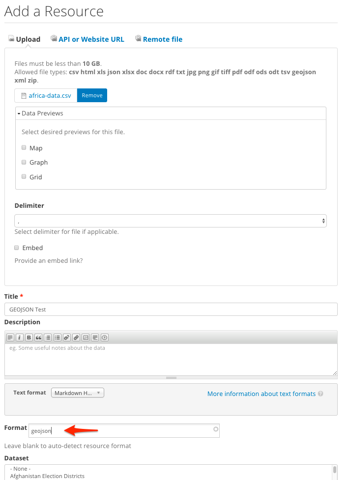
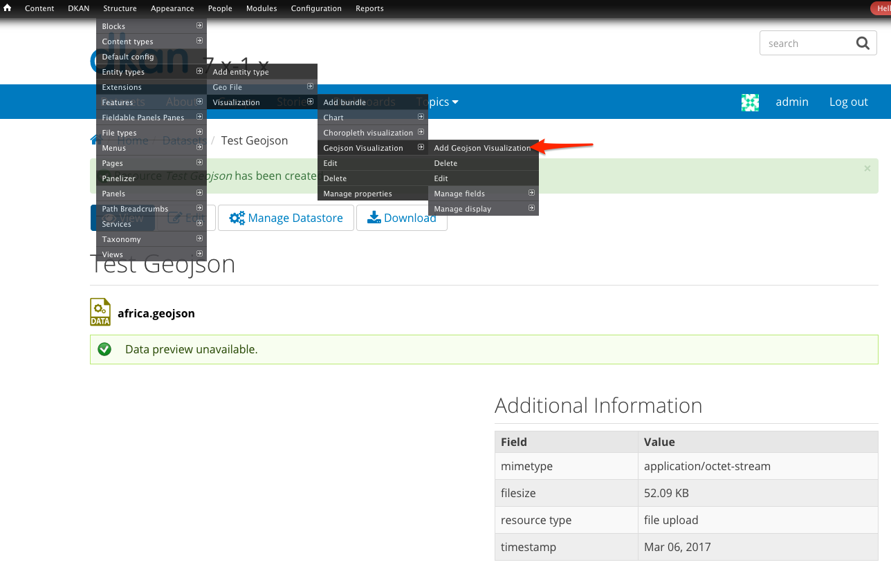
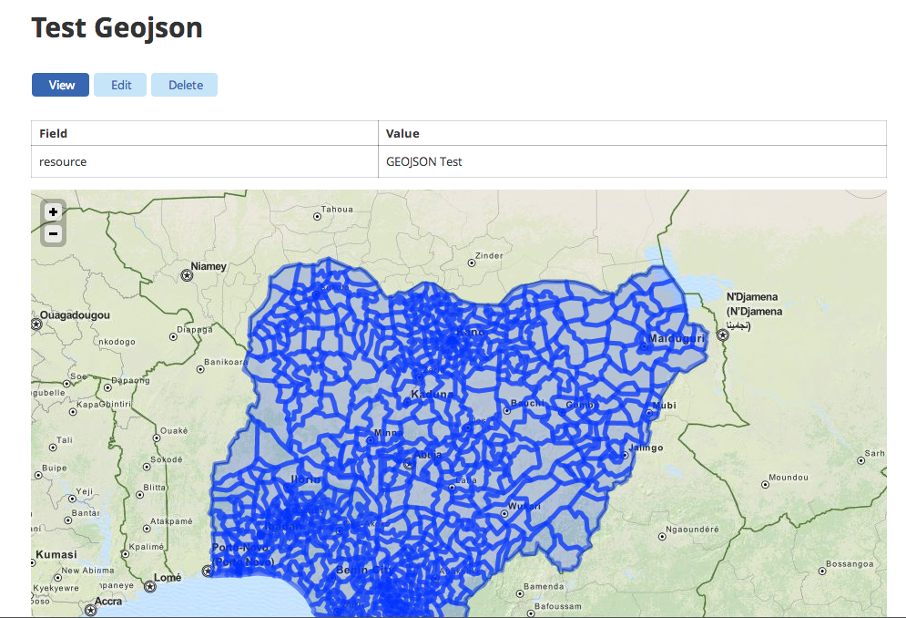

GeoJSON
=======
.. warning::

	Under Development. Do not use on production.

Enable the geojson bundle:

.. code-block:: php

	$ drush -y visualization_entity_geojson_bundle
	$ drush cc all

Create Visualization
--------------------
+ Look for **Content -> Add Content -> Resource** in the admin menu and click on it.

+ Upload a geojson data file for the resource

+ Fill the required fields, enter 'geojson' in the format field, and **save** the resource

+ Look for **Structure -> Entity Types -> Visualization -> Geojson Visualization -> Add Geojson Visualization** in the admin menu and click on it.

+ Set a **title**
+ Select the **resource** containing the **geojson** data file you uploaded

.. image:: images/geojson-step-04.png

+ Click **Save** & Enjoy!

