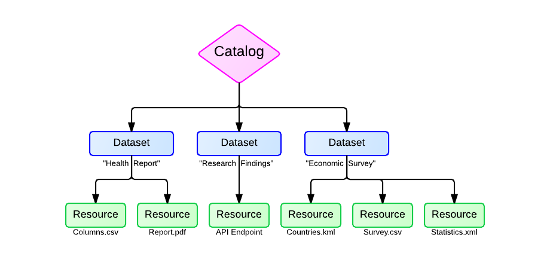

Catalog Basics
====================

Open data catalogs - or portals - are simple in purpose but may appear complicated at first glance. A homepage will often feature a slideshow, list of blog posts, or a visualization using data from the underlying catalog; these homepage assets can easily obscure the underlying structure of the data.

Understanding the structure of an open data catalog can help users, developers, and stakeholders make the best use of open data tools.

Catalog
--------------------

The catalog is a wrapper containing information, sorted into datasets. A catalog should provide the answers to basic questions such as: "Who is providing this data?" and "Under what conditions?"

`DCAT <http://www.w3.org/TR/vocab-dcat/>`_ - an RDF vocabulary designed to facilitate interoperability between data catalogs published on the Web -  recommends providing the following fields: catalog record, dataset, description, homepage, language, license, publisher, release date, rights, spatial, themes, title and update date.

.. _datasets:
Dataset
--------------------

A dataset contains individual resources as well as metadata. Metadata is the "Who, What, When, Where, Why" of each dataset. There are a number of specifications for dataset metadata and DKAN currently complies with the DCAT and `Project Open Data <https://project-open-data.cio.gov/>`_ schemas.

It is possible to add new fields to DKAN to conform to additional specifications or custom requirements.

.. _resources:

Resource
--------------------

Resources are the actual files, APIs or links that are being shared. Resource types include csv, html, xls, json, xlsx, doc, docx, rdf, txt, jpg, png, gif, tiff, pdf, odf, ods, odt, tsv, geojson and xml files. If the resource is an API, it can be used as a live source of information for building a site or application.

Datasets and Resources within DKAN and CKAN
-------------------------------------------

The following images display how datasets and resources are structured within DKAN and CKAN. Screenshots are from `Data.gov <http://data.gov>`_ which is powered by CKAN. DKAN follows CKAN conventions where possible.

.. figure:: ../images/datasets-resources.png

.. figure:: ../images/metadata.png
   :alt: Metadata

