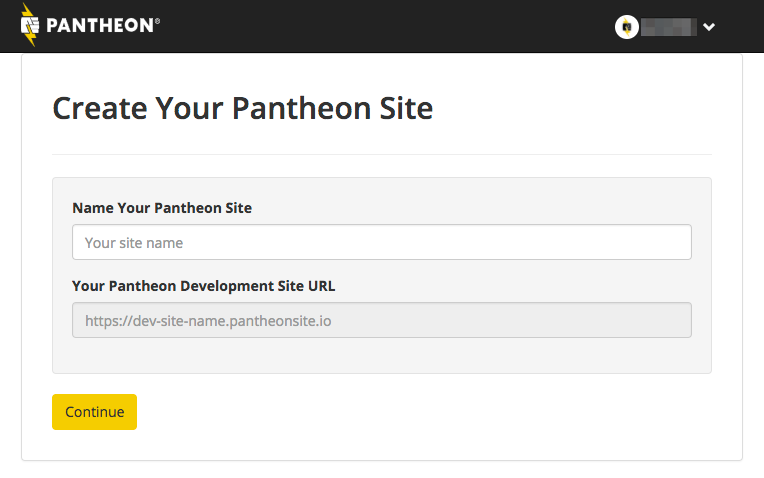
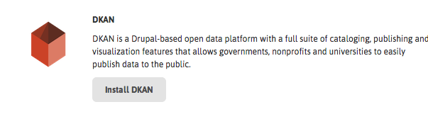
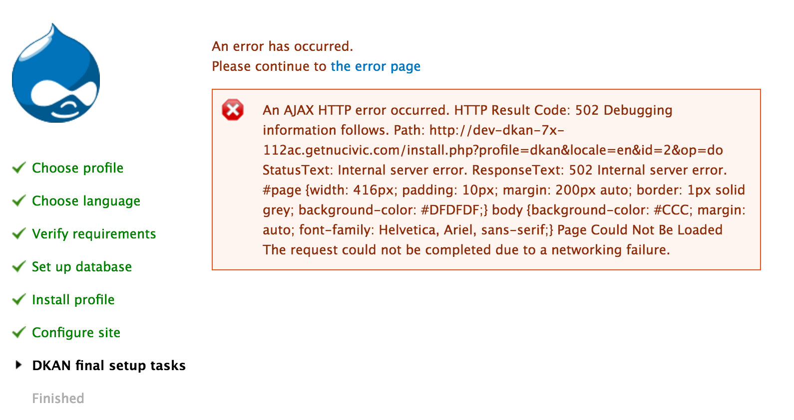

# Get DKAN

DKAN is open source and flexible: You can download it for free and run it on your own server or choose from one of our hosting partners below.

## Download and run DKAN on your server

DKAN is based on the open source </a><a href="http://drupal.org">Drupal</a> content and application framework and runs almost anywhere Drupal is supported.  Users unfamiliar with Drupal may be more comfortable trying one of the hosted options listed below, or contacting us to obtain a private demonstration instance. There is extensive information on how to install DKAN on your own in the [the developers/installation](/dkan-documentation/dkan-developers/installation) section of this site.

## Hosting Partners

DKAN is open source and flexible: you can download it for free and run it on your own server (see [installation instructions](installation.md)) or choose from one of our hosting partners below.

### Acquia

**[Click here](https://insight.acquia.com/free?distro=dkantestdrive)**  to install DKAN on Acquia for free.

[Acquia](http://acquia.com) offers a number of [hosting tools](http://www.acquia.com/products-services/acquia-cloud#Overview) built specifically for best maintaining Drupal sites. These include integrations with 3rd party systems like New Relic and Blaze Meter as well as reports on module updates, performance, and security reviews. Most importantly, Acquia offers a dashboard that makes it easy to move code (hosted by git), media files, and the database between development, testing, and production environments:

These tools allow a single site builder or team of developers to follow best practices, scale up if needed, and follow a rigorous QA process all without ever touching a server.

#### Single-click Installation

Acquia offers a "single-click" installation of DKAN. While this is labelled as a "Test drive," the environment offers the same dashboard tools as a full, paid account. [Visit Acquia's website for complete instructions](https://docs.acquia.com/cloud/free/aws-testdrive/dkan).

#### Maintaining a DKAN Site on Acquia

Updates to DKAN are released frequently. Acquia will not push these updates to your instance automatically, but you can keep your codebase up-to-date using your own workflow, or following our general [Upgrade Instructions](../development/maintaining.md).

### Pantheon

**[Click here](https://dashboard.getpantheon.com/products/dkan/spinup)**  to install DKAN on Pantheon for free.

Pantheon provides reliable Drupal cloud hosting with a powerful development tools and web-based user interface designed to facilitate and encourage best development practices. With essentially a single click, you can spin up a new DKAN instance on Pantheon and log in to your new site in just a few minutes.

You can register for a free account [here](https://www.getpantheon.com/). Once you have access, create a new site:

Choose to make a new site from scratch, and to use the DKAN distribution:

Pantheon will then build your new based site on the latest DKAN release. You will go through a normal Drupal install process, explained in detail in the [installation instructions](../installation.md).

#### Managing updates

Pantheon uses a modified version of Drupal Pressflow, which is [publicly available on GitHub](https://github.com/pantheon-systems/drops-7). Whenever a new version of the DKAN distribution is released, the changes are merged into a version of DKAN special-built for Pantheon, [also available on GitHub](https://github.com/NuCivic/dkan-drops-7).

However, Pantheon provides an easy way to update your instance of DKAN (or any Drupal distribution hosted with them). Each time the DKAN's Pantheon build is updated, an alert will appear in your Pantheon dashboard:

Usually, you will be able to use the "Apply Updates" button to merge those "upstream" changes directly into your copy of the codebase, alongside any changes you have already made to it. If you are developing locally using git, the next time you pull from your Pantheon repository, you'll receive the DKAN updates locally as well.

If you have modified any of the files included with DKAN, merging in upstream changes may produce conflicts. Pantheon's dashboard provides instructions for how to do the merge locally, to give you more control over resolving potential conflicts.

#### Troubleshooting

An error like the following is often seen at the end of the install process on Pantheon:

This will hopefully be fixed on future releases. However, the resulting site should still be fully installed and functional.

## Granicus Data Subscription

[Granicus](http://granicus.com), the company leading DKAN's development, now offers a turn-key software as a service (SaaS) product called [Granicus Data Enterprise](https://insights.govdelivery.com/Digital_Services/GovDelivery_Open_Data). Hosted on Acquia Cloud, Granicus Data Enterprise meets US government [security standards](https://docs.acquia.com/cloud/arch/compliance-standards-and-regulations), comes pre-configured for out-of-the-box open data standards compliance and advanced data visualization techniques, and includes 24-hour, enterprise-level support. [Contact Granicus](http://granicus.com/contact) for more information.

## GovDelivery Open Data

More information coming soon...
