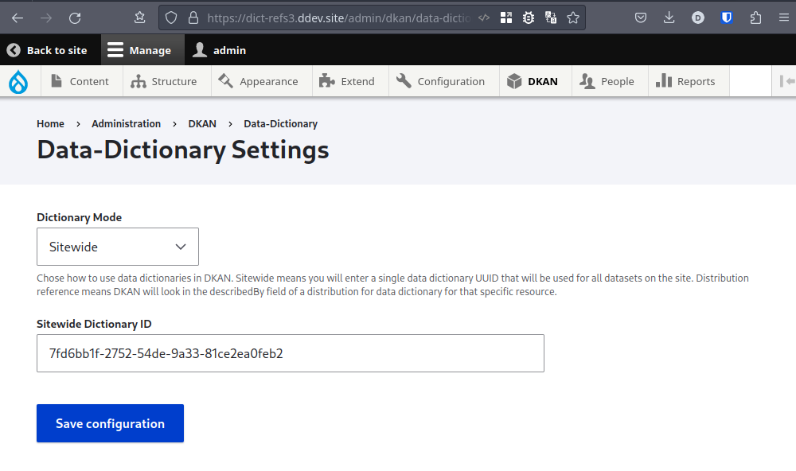

Data Dictionaries
=================

.. _guide_data_dictionaries:

What is the purpose of data dictionaries?
-----------------------------------------

A data dictionary describes the structure and content of data elements, provides guidance on interpretation, reduces data inconsistencies, and makes data easier to analyze.

How Data Dictionaries are Used
^^^^^^^^^^^^^^^^^^^^^^^^^^^^^^

* **Documentation** - provide data structure details for users, developers, and other stakeholders
* **Communication** - equip users with a common vocabulary and definitions for shared data, data standards, data flow and exchange, and help developers gage impacts of schema changes
* **Application Design** - help application developers create forms and reports with proper data types and controls
* **Systems Analysis** - enable analysts to understand overall system design and data flow, and to find where data interact with various processes or components
* **Data Integration** - clear definitions of data elements provide the contextual understanding needed when deciding how to map one data system to another, or whether to subset, merge, stack, or transform data for a specific use
* **Decision Making** - assist in planning data collection, project development, and other collaborative efforts

In DKAN, data dictionaries are used as instructions for how to store the data in the database. When you add datasets to your catalog, any distribution with a csv file will be queued for import into the database as a datastore table. At this stage, everything is imported as strings. Once the import of the file has completed, a post import job is generated to apply the data dictionary to the datastore table. Without these instructions, date and numeric data will not sort as expected.

You can check how many jobs are in each queue by running `drush queue-list`. Be sure that cron is running often enough to process the jobs to completion.

Table Schema
------------

The structure of your data dictionary should follow `Frictionless Standards table schema <https://specs.frictionlessdata.io/table-schema/>`_.

.. code-block:: json

    {
      "title": "A human readable label",
      "data": {
       "fields": [
        {
          "name": "(REQUIRED) machine name of field (e.g. column name)",
          "title": "(optional) A nicer human readable label or title for the field",
          "type": "(REQUIRED) A string specifying the type",
          "format": "(only required if NOT using default) A string specifying a format",
          "description": "(optional) A description for the field"
        }
       ]
      }
    }

name
^^^^
The "name" should match name of the column header. Spaces will be converted to underscores, uppercase will convert to lowercase, special characters will be dropped, and there is a 64 char limit, anything longer will be truncated and given a unique 4 digit hash at the end. It is the machine name that users will use when running queries on the datastore API so it is helpful to not use overly long name values.

type
^^^^
The following are acceptable values:

.. list-table::
   :widths: 25 75
   :header-rows: 1

   * - value
     - description
   * - string
     - Value MUST be a string
   * - number
     - Value MUST be a number, floating point numbers are allowed. Cannot contain non-numeric content other than "."
   * - integer
     - Value MUST be an integer, no floating point numbers are allowed. This is a subset of the number type. Cannot contain non-numeric content.
   * - boolean
     - Value MUST be a boolean.
   * - object
     - Value MUST be an object.
   * - array
     - Value MUST be an array.
   * - any
     - Value MAY be of any type including null.
   * - date
     - A date without a time, in ISO8601 format YYYY-MM-DD.
   * - time
     - A time without a date.
   * - datetime
     - A date with a time, in ISO8601 format YYYY-MM-DDThh:mm:ssZ in UTC time.
   * - year
     - A calendar year.
   * - yearmonth
     - A specific month in a specific year.
   * - duration
     - A duration of time.

format
^^^^^^
This property is important for fields where you need to specify the format of the values. See `Types & Formats <https://specs.frictionlessdata.io/table-schema/#types-and-formats>`_ for details.

If your date values are not in ISO8601 format, use this property to define the format being used so that the data will import into the datastore correctly. Month and day values must be zero-padded. Follow the date formatting syntax of C / Python `strftime <http://strftime.org/>`_ to determine the pattern to use in your format property. For example, if your dates are in mm/dd/YYYY format, use "format": "%m/%d/%Y".

How to create a data dictionary
-------------------------------

Creating a data dictionary via the API
^^^^^^^^^^^^^^^^^^^^^^^^^^^^^^^^^^^^^^

We will define a list of fields based on the example header row below.

.. list-table::
   :widths: 16 16 16 16 16 16
   :header-rows: 1

   * - project_id
     - project_name
     - start_date
     - end_date
     - cost
     - contact
   * - 94
     - Example
     - 01/16/2019
     - 05/28/2021
     - 124748.34
     - info@example.com

----

.. http:post:: /api/1/metastore/schemas/data-dictionary/items

  **Example request**:

  .. sourcecode:: http

      POST /api/1/metastore/schemas/data-dictionary/items HTTP/1.1
      Host: mydomain.com
      Accept: application/json
      Authorization: Basic username:password

      {
          "data": {
              "title": "Demo Dictionary",
              "fields": [
                  {
                      "name": "project_id",
                      "title": "Project ID",
                      "type": "integer"
                  },
                  {
                      "name": "project_name",
                      "title": "Project",
                      "type": "string"
                  },
                  {
                      "name": "start_date",
                      "title": "Start Date",
                      "type": "date",
                      "format": "%m/%d/%Y"
                  },
                  {
                      "name": "end_date",
                      "title": "End Date",
                      "type": "date",
                      "format": "%m/%d/%Y"
                  },
                  {
                      "name": "cost",
                      "title": "Cost",
                      "type": "number"
                  },
                  {
                      "name": "contact",
                      "title": "Contact",
                      "type": "string",
                      "format": "email"
                  }
              ]
          }
      }

  **Example response**:

  .. sourcecode:: http

      HTTP/1.1 201 Created

      {
        "endpoint": "\/api\/1\/metastore\/schemas\/data-dictionary\/items\/7fd6bb1f-2752-54de-9a33-81ce2ea0feb2",
        "identifier": "7fd6bb1f-2752-54de-9a33-81ce2ea0feb2"
      }

We get a response that tells us the identifier for the new dictionary is `7fd6bb1f-2752-54de-9a33-81ce2ea0feb2`.

Creating a data dictionary via the UI
^^^^^^^^^^^^^^^^^^^^^^^^^^^^^^^^^^^^^
1. Log in as a user with the *Data: Create new content* permission.
2. From the DKAN menu, select Data Dictionary -> Create.
3. Enter a UUID for your data dictionary that will serve as its identifier.
4. Enter a human readable title for your data dictionary.
5. In the **Dictionary Fields** section, click the "Add one" button.
6. Fill the form to define your field. Reference the Table Schema section above if needed.
7. Repeat steps 5 and 6 for each field you want in your data dictionary.
8. Click the "Save" button.
9. See a list of your data dictionaries at `/api/1/metastore/schemas/data-dictionary/items/`
10. Edit your data dictionary by going to `/admin/dkan/datasets`, then select "data-dictionary" from the data type filter, and click "Filter".
11. Click the "Edit" link in the right-hand column.

Adding indexes
^^^^^^^^^^^^^^
Data dictionaries can be used to describe indexes that should be applied when importing to a database.
Learn more about this on :doc:`guide_indexes`

How to set the data dictionary mode
-----------------------------------

In the section above we created a data dictionary
with ID `7fd6bb1f-2752-54de-9a33-81ce2ea0feb2`.
We will use this ID when setting either of the data dictionary modes.

Sitewide
^^^^^^^^
The simplest way to use data dictionaries on your site is to create one for the entire catalog.
In this mode, any datastore table that contains any of the defined fields in it's header row will
be altered according to the sitewide data dictionary.

To set the data dictionary mode to **sitewide**:

1. Go to admin/dkan/data-dictionary/settings
2. Set "Dictionary Mode" to "Sitewide".
3. Set "Sitewide Dictionary ID" to `7fd6bb1f-2752-54de-9a33-81ce2ea0feb2`.
4. Click "Save configuration".

        input for Sitewide Dictionary ID containing the identifier 7fd6bb1f-2752-54de-9a33-81ce2ea0feb2.

Distribution reference
^^^^^^^^^^^^^^^^^^^^^^
Datasets can reference specific data dictionaries in this mode. Distribution reference mode means that DKAN will look for links to data dictionaries in the
`describedBy` field of the distribution that a data file is described in. It will look for a URL to a data dictionary
in the metastore. The `describedByType` must also be `application/vnd.tableschema+json` to signal correct data
dictionary format.

To set the data dictionary mode to **distribution reference**:

1. Go to admin/dkan/data-dictionary/settings
2. Set "Dictionary Mode" to "Distribution reference".

.. note:: Note
   Assigning data dictionaries to datasets through the UI is still a work in progress!

Now let's use the API to link a new dataset to the data dictionay we created above.
Look closely at the distribution property in the example below.

.. http:post:: /api/1/metastore/schemas/dataset/items

   **Example**:

   .. sourcecode:: http

      POST https://mydomain.com/api/1/metastore/schemas/data-dictionary/items HTTP/1.1
      Accept: application/json
      Authorization: Basic username:password

      {
        "@type": "dcat:Dataset",
        "accessLevel": "public",
        "contactPoint": {
          "fn": "Jane Doe",
          "hasEmail": "mailto:data.admin@example.com"
        },
        "title": "Project list",
        "description": "Example dataset.",
        "distribution": [
          {
            "@type": "dcat:Distribution",
            "downloadURL": "https://example.com/projects.csv",
            "mediaType": "text\/csv",
            "format": "csv",
            "title": "Projects",
            "describedBy": "dkan://metastore/schemas/data-dictionary/items/7fd6bb1f-2752-54de-9a33-81ce2ea0feb2",
            "describedByType": "application/vnd.tableschema+json"
          }
        ],
        "issued": "2016-06-22",
        "license": "http://opendatacommons.org/licenses/by/1.0/",
        "modified": "2016-06-22",
        "publisher": {
          "@type": "org:Organization",
          "name": "Data publisher"
        },
        "keyword":["tag1"]
      }

Note the special URL used to point to the data dictionary. The full URL, e.g.
http://mydomain.com/api/1/metastore/schemas/data-dictionary/items/7fd6bb1f-2752-54de-9a33-81ce2ea0feb2,
could also be used, and would be converted to an internal `dkan://` URL on save.

This data dictionary will now be used to modify the datastore table after import. If we were to
request the dataset back from the API, it would show us the absolute URL as well.
