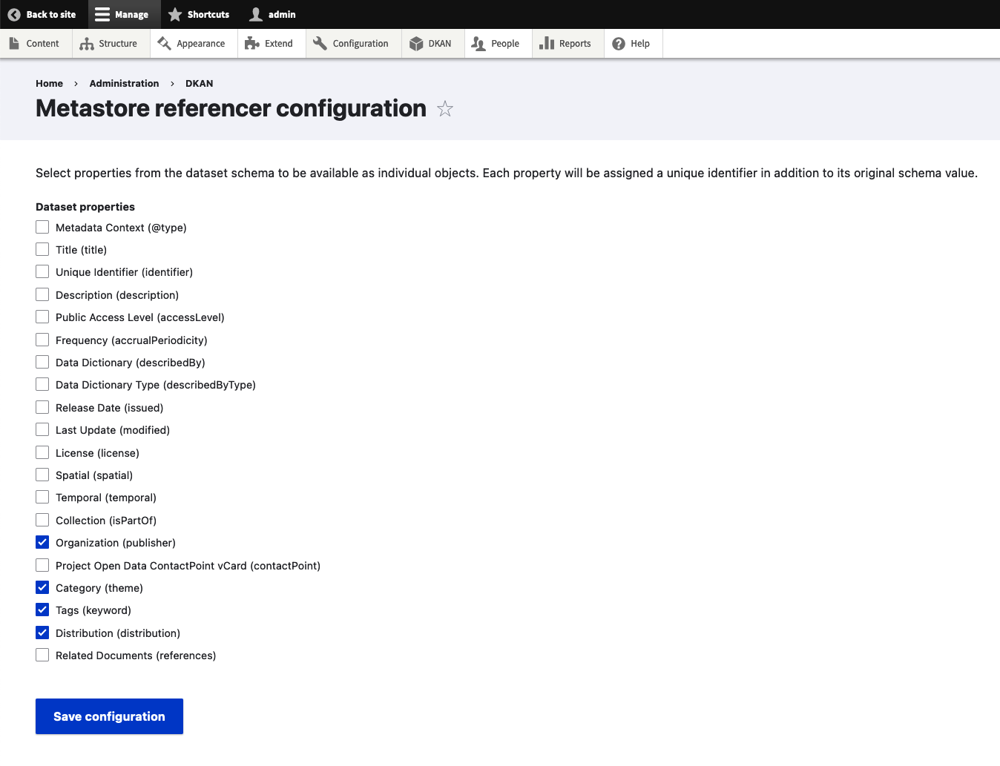

How to add or remove entity generation for schema sub properties
================================================================

When you create a dataset, additional data nodes will be created for specific sub-elements
of the dataset as well, the default properties are: publisher, theme, keywords, and
distribution. These data nodes will provide unique reference ids for the sub-elements and
can be accesssed via an API endpoint. Learn about the `API <https://demo.getdkan.org/api>`_.

You can customize which sub-elements generate additional data nodes here ``admin/dkan/properties``.

When the value of these elements change or become outdated, the corresponding data node will be unpublished by the **orphan_reference_processor** queue task.

If you prefer to run it manually, you may do so with:

.. prompt:: bash $

   drush queue-run orphan_reference_processor
