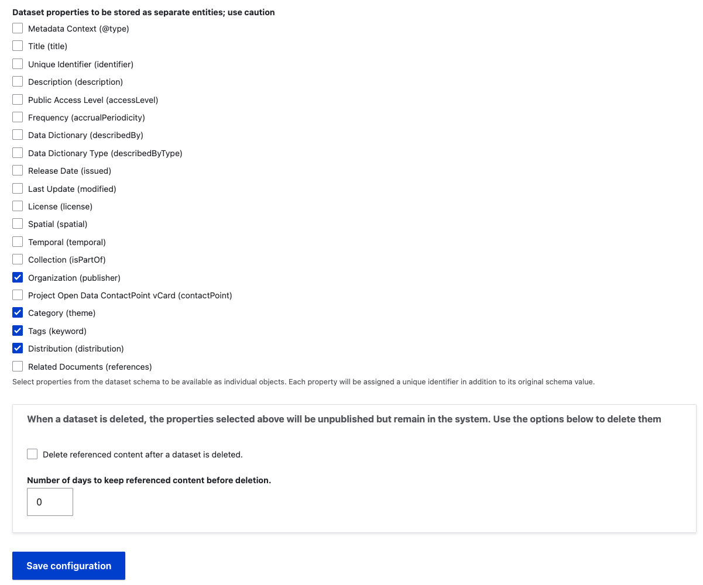

How to add or remove entity generation for schema sub properties
================================================================

When you create a dataset, additional data nodes will be created for specific sub-elements
of the dataset as well, the default properties are: publisher, theme, keywords, and
distribution. These data nodes will provide unique reference ids for the sub-elements and
can be accessed via an API endpoint. Learn about the `API <https://demo.getdkan.org/api>`_.

You can customize which sub-elements generate additional data nodes here ``admin/dkan/properties``.

When the value of these elements change or become outdated, the corresponding data node will be unpublished by the **orphan_reference_processor** queue task.

If you prefer to run it manually, you may do so with:

.. prompt:: bash $

   drush queue-run orphan_reference_processor

The unpublished data nodes will not appear on the site, but they will remain in the
 system until they are deleted. If you would like them to be deleted automatically
 as part of the daily cron run, check "Delete referenced content after a dataset is
 deleted". If you prefer to retain these data nodes temporarily, but still automate
 their deletion, enter the number of days you want to keep them in "Number of days
 to keep referenced content before deletion"
