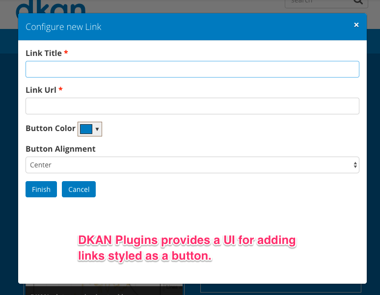

# DKAN Plugins

DKAN Plugins is a module that invokes the CTools Plugin API to provide custom panels content. Currently this module contains a single plugin that allows content creator level roles and above to add styled button links without having to write out the html.

