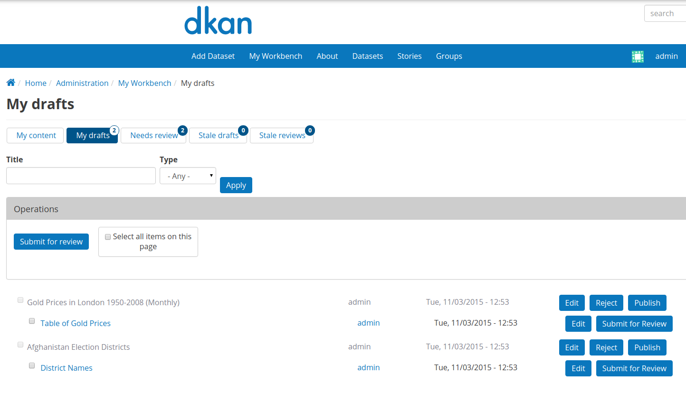

[](https://circleci.com/gh/NuCivic/dkan_workflow)

## What is DKAN?

[DKAN](http://nucivic.com/dkan) is a Drupal-based open data tool with a full
suite of cataloging, publishing and visualization features that allows
governments, nonprofits and universities to easily publish data to the public.
DKAN is maintained by [NuCivic](http://nucivic.com).

## What is DKAN Workflow?


Workflow implementation for [DKAN](https://github.com/NuCivic/dkan) based on
[Workbench](https://www.drupal.org/project/workbench) and related modules.

## Requirements

* Dkan install. We do use undeclared dependencies used in core Dkan, for example
  the dataset and resource content types, features_role_export...
* All external dependencies other then core Dkan are incapsulated in the
`dkan_workflow.make` file. This includes
[Workbench](https://www.drupal.org/project/workbench) and related modules
([Workbench Moderation](https://www.drupal.org/project/workbench_moderation) for
the content moderation features, [Workbench
Email](https://www.drupal.org/project/workbench_email) for email notifications.)
* Better UX is made possible by using the [Link
  Badges](https://www.drupal.org/project/link_badges) and [Menu
  Badges](https://www.drupal.org/project/menu_badges)

## Installation

This module needs to be [built using drush
make](https://github.com/NuCivic/nucivic-process/wiki/Using-drush-make-in-individual-modules)
before being enabled. If you download only the module you will miss key
dependencies for required modules and libraries.

After either enabling or disabling DKAN Workflow and its dependencies, you will need to [rebuild content permissions](https://docs.acquia.com/articles/rebuilding-node-access-permissions). If logged in as an admin you should see a message telling you this with a link to the form to do so.

To install:
```
cd <path to modules directory>
git clone https://github.com/NuCivic/dkan_workflow
drush make --no-core <path to modules directory>/dkan_workflow/dkan_workflow.make
drush en dkan_workflow
```

## Known issues:

* Transitions config and Emails templates for "Original Author" could not be
 exported due to a bug in workbench_email.
* Behat tests uses [hhs_implementation](https://github.com/NuCivic/dkanextension/tree/hhs_implementation)
 dkanextension instead of the master branch.
* Support for OG while sending emails is supported but not clearly documented.

## Documentation

We are working on improving this documentation. Please let us know if you have
any questions in the mean time.

## Contributing

We are accepting issues in the dkan issue thread only ->
https://github.com/NuCivic/dkan/issues -> Please label your issue as
**"component: dkan_workflow"** after submitting so we can identify problems and
feature requests faster.

If you can, please cross reference commits in this repo to the corresponding
issue in the dkan issue thread. You can do that easily adding this text:

```
NuCivic/dkan#[issue_id]
```

to any commit message or comment replacing **issue_id** with the corresponding
issue id.
