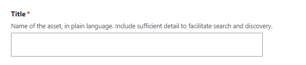

# JSON Form Widget

This module provides a versatile way to create Drupal form elements, and by extension, a functional and submittable Drupal webform from a JSON file. For the purpose of DKAN, this allows for schema adherent data to be submitted and saved to the database without the need to create a seperate, new Drupal webform any time new schema is introduced.  

Using a combination of "router", "helper", and "handler" classes, as well as some extensions on Drupal core elements, it first determines the schema to build the form from the URL paramater in the route (EX: ?schema=dataset or ?schema=data-dictionary) and then builds the form according to the retrieved schema and any schema user interface options if supplied (see SchemaUiHandler.php and it's contained methods for more information about UI options).

The examples section of this readme can be used to understand how different field types translate directly to Drupal form elements and subsequently, how they would look within the Drupal user interface.


## Table of contents

- Features
- Requirements
- Installation
- Configuration
- Field type UI examples
- Maintainers

## Features

- Create submittable Drupal webforms from JSON files.
- Modify webform element options created from JSON files with specialized schema.ui JSON files.

## Requirements

This module is currently required and supplied by DKAN.

It requires:
DKAN:
- DKAN:Metastore (metastore)
- DKAN:Common (common)

Contrib:
- Select (or other) (select_or_other)
- Select2 (select2)

Drupal Core:
- User (user)
- HTTP Basic Authentication (basic_auth)
- System (system)
- Content Moderation (content_moderation)
- Workflows (workflows)


## Installation

The forms the JSON Form Widget creates utilize the metastore for schema discovery and subsequently create nodes as individual entities on the "data" content type. It therefore is currently packaged with DKAN and as of now cannot be installed independantly. 

## Configuration

No configuration is currently provided for this module.

## Field Type UI Examples

If we use the DKAN dataset form/schema we can see some examples of how different field types are converted into form elements utilizing both the dataset.json (schema file) as well as the dataset.ui.jsonm (schema UI file).
Please see the Schema UI Handler class as well as the Element folder and it's included class files for how different UI options are managed.

The following are some examples of Field types and associated options and how they appear as a form element respectively.

### String
With Description Schema UI option.

#### Schema File Example:

```
"title": {
  "title": "Title",
  "description": "Human-readable name of the asset. Should be in plain English and include sufficient detail to facilitate search and discovery.",
  "type": "string",
  "minLength": 1
},
```

#### Schema UI File Example:

```
"title": {
    "ui:options": {
      "description": "Name of the asset, in plain language. Include sufficient detail to facilitate search and discovery."
    }
  },
```

#### Form Element:



### String
With

## Maintainers

