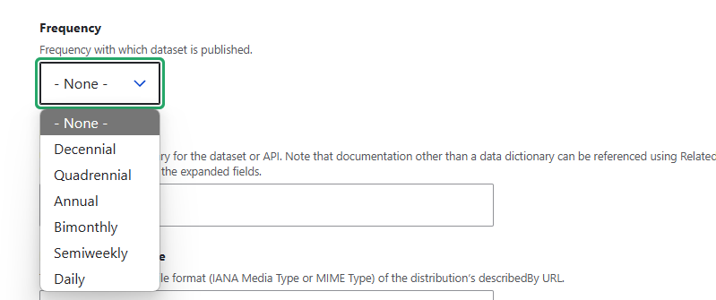
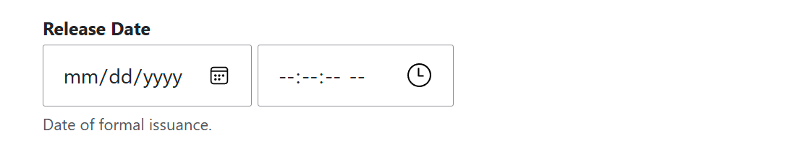
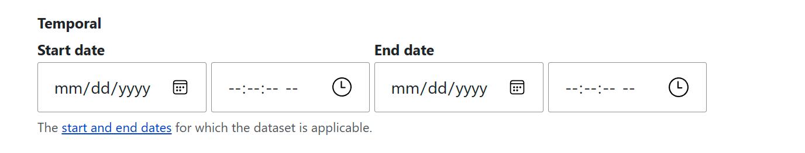
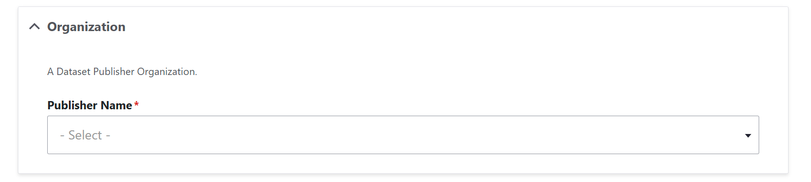

# JSON Form Widget

This module provides a versatile way to create Drupal form elements, and by extension, a functional and submittable Drupal form from a JSON file. For the purpose of DKAN, this allows for schema adherent data to be submitted and saved to the database without the need to create a seperate, new Drupal form any time new schema is introduced.  

Using a combination of "router", "helper", and "handler" classes, as well as some extensions on Drupal core elements, it first determines the schema to build the form from the URL paramater in the route (EX: ?schema=dataset or ?schema=data-dictionary) and then builds the form according to the retrieved schema and any schema user interface options if supplied (see SchemaUiHandler.php and it's contained methods for more information about UI options).

The examples section of this readme can be used to understand how different field types translate directly to Drupal form elements and subsequently, how they would look within the Drupal user interface.


## Table of contents

- Features
- Requirements
- Installation
- Configuration
- Field type UI examples
- Maintainers

## Features

- Create submittable Drupal forms from JSON files.
- Modify form element options created from JSON files with specialized schema.ui JSON files.

## Requirements

This module is currently required and supplied by DKAN.

It requires:
DKAN:
- DKAN:Metastore (metastore)
- DKAN:Common (common)

Contrib:
- Select (or other) (select_or_other)
- Select2 (select2)

Drupal Core:
- User (user)
- HTTP Basic Authentication (basic_auth)
- System (system)
- Content Moderation (content_moderation)
- Workflows (workflows)


## Installation

The forms that the JSON Form Widget creates utilize the DKAN metastore for schema discovery and subsequently create nodes as individual entities on the "data" content type. This module therefore is currently packaged with DKAN and as of now cannot be installed independantly. 

## Configuration

No configuration is currently provided for this module.

## Field Type UI Examples

If we look closely at the provided DKAN dataset form, schema and schema UI we can see some examples of how different field types are converted into form elements utilizing both the dataset.json (schema file) as well as the dataset.ui.json (schema UI file) which in turn create the form @ /node/add/data?schema=dataset.

> **_TIP:_** Please additionally see the Schema UI Handler class as well as the Element folder and it's included class files for how different UI options are managed in code.

The following are some examples of Field types and associated options and how they appear as a form element respectively. Newly introduced schema UI options will be described only the first time they appear. The length of some JSON objects may be trimmed as compared to the provided dataset.json/ui.json files in order to keep this page's length to a minimum, but the functionality they are showcasing will remain unchanged.

> **_TIP:_** You can make fields required on the form using a JSON property array in your schema file similarly to how it is done in the example from the dataset.json file below:

```
"required": [
  "title",
  "description",
  "identifier",
  "accessLevel",
  "modified",
  "keyword"
],
```

In the above example the listed fields (which would follow in the rest of the JSON file) would be required fields in the Drupal form that is created.

### Text Box (String)

#### Schema File Example:

```
"title": {
  "title": "Title",
  "description": "Human-readable name of the asset. Should be in plain English and include sufficient detail to facilitate search and discovery.",
  "type": "string",
  "minLength": 1
},
```

#### Schema UI File Example:

```
"title": {
    "ui:options": {
      "description": "Name of the asset, in plain language. Include sufficient detail to facilitate search and discovery."
    }
  },
```

UI Options:
- description
  - Overrides the description for the field in the schema file and displays the value of the JSON property in the schema ui file instead.

#### Form Element:


### Text Area (String)

#### Schema File Example:

```
"description": {
  "title": "Description",
  "description": "Human-readable description (e.g., an abstract) with sufficient detail to enable a user to quickly understand whether the asset is of interest.",
  "type": "string",
  "minLength": 1
},
```

#### Schema UI File Example:

```
"description": {
  "ui:options": {
    "widget": "textarea",
    "rows": 5,
    "description": "Description (e.g., an abstract) with sufficient detail to enable a user to quickly understand whether the asset is of interest."
  }
},
```

UI options:
- widget: textarea
  - Creates a larger text area box
- rows: 5
  - The text area has a height of 5 rows
- description

#### Form Element:


### Select (String)

#### Schema File Example:

```
"accrualPeriodicity": {
  "title": "Frequency",
  "description": "Frequency with which dataset is published.",
  "type": "string",
  "enum": [
    "R/P10Y",
    "R/P4Y",
    "R/P1Y",
    "R/P2M",
    "R/P3.5D",
    "R/P1D"
  ],
  "enumNames": [
    "Decennial",
    "Quadrennial",
    "Annual",
    "Bimonthly",
    "Semiweekly",
    "Daily"
  ]
},
```

> **_NOTE:_** The enum (values) and enumNames (labels) property arrays.

#### Schema UI File Example:

> **_TIP:_** A corresponding object within a schema UI file is not required for each object within the schema file if UI options for that object are not needed/wanted.


#### Form Element:




### Date and Time (String)

#### Schema File Example:

```
"issued": {
  "title": "Release Date",
  "description": "Date of formal issuance.",
  "type": "string"
},
```

#### Schema UI File Example:

```
"issued": {
    "ui:options": {
      "widget": "flexible_datetime"
    }
  },
```

UI options:
- widget: flexible_datetime
  - Creates a date and time field (see FlexibleDateTime.php)

#### Form Element:



### Date Range (String)

#### Schema File Example:

```
"temporal": {
  "title": "Temporal",
  "description": "The <a href=\"https://project-open-data.cio.gov/v1.1/schema/#temporal\">start and end dates</a> for which the dataset is applicable, separated by a \"/\" (i.e., 2000-01-15T00:45:00Z/2010-01-15T00:06:00Z).",
  "type": "string"
},
```

#### Schema UI File Example:

```
"temporal": {
    "ui:options": {
      "description": "The <a href=\"https://project-open-data.cio.gov/v1.1/schema/#temporal\">start and end dates</a> for which the dataset is applicable.",
      "widget": "date_range"
    }
  },
```

UI options:
- widget: date_range
  - Creates a date and time range field with a Start Date and End Date input (see DateRange.php)

#### Form Element:



### Expandable dropdown "details" box with autocomplete

#### Schema File Example:

```
 "publisher": {
  "$schema": "http://json-schema.org/draft-04/schema#",
  "id": "https://project-open-data.cio.gov/v1.1/schema/organization.json#",
  "title": "Organization",
  "description": "A Dataset Publisher Organization.",
  "type": "object",
  "required": [
    "name"
  ],
  "properties": {
    "@type": {
      "title": "Metadata Context",
      "description": "IRI for the JSON-LD data type. This should be org:Organization for each publisher",
      "type": "string",
      "default": "org:Organization"
    },
    "name": {
      "title": "Publisher Name",
      "description": "",
      "type": "string",
      "minLength": 1
    },
    "subOrganizationOf": {
      "title": "Parent Organization",
      "type": "string"
    }
  }
},
```

> **_NOTE:_** The nested nature of this scheme object "Publisher".

#### Schema UI File Example:

```
"publisher": {
  "ui:options": {
    "widget": "list",
    "type": "autocomplete",
    "allowCreate": "true",
    "titleProperty": "name",
    "source": {
      "metastoreSchema": "publisher"
    }
  },
  "properties": {
    "@type": {
      "ui:options": {
        "widget": "hidden"
      }
    },
    "subOrganizationOf": {
      "ui:options": {
        "widget": "hidden"
      }
    }
  }
},
```

> **_NOTE:_** The 'widget: hidden' properties in this schema UI object and how they hide their respective fields from appearing on the final form.

UI options:
- widget: list
- type: autocomplete
- allowCreate: true
- source
  - metestoreSchema: publisher
  - Creates a date and time range field with a Start Date and End Date input (see DateRange.php)

#### Form Element:



## Maintainers

In the fall of 2017, CivicActions took over sponsorship and maintenance of DKAN and it's associated custom submodules.

