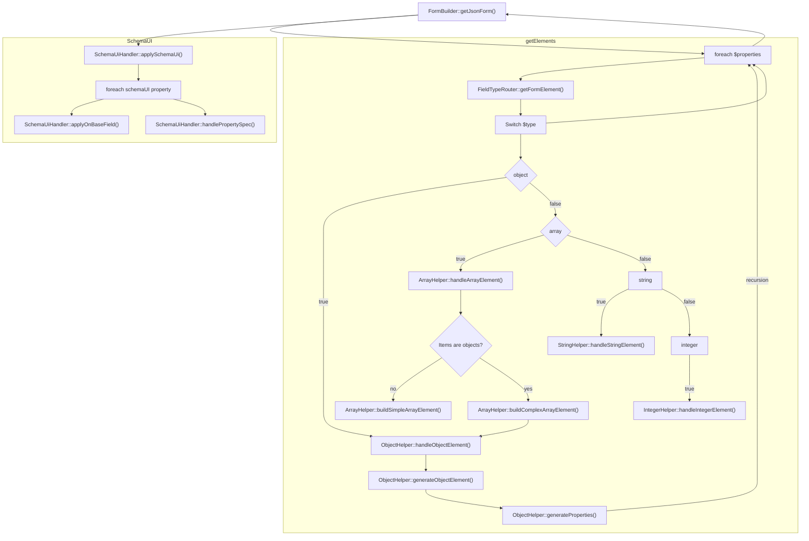

```mermaid
graph TD
  getForm["FormBuilder::getJsonForm()"] --> eachProp["foreach $properties"]
  subgraph getElements
    eachProp --> getElement["FieldTypeRouter::getFormElement()"]
    getElement --> switch[Switch $type]
    switch --> object{object}
    
    object -- true --> handleObject["ObjectHelper::handleObjectElement()"]
    handleObject --> generateObject["ObjectHelper::generateObjectElement()"]
    generateObject --> generateProperties["ObjectHelper::generateProperties()"]
    generateProperties -- recursion --> eachProp


    object -- false --> array{array}
    array -- true --> handleArray["ArrayHelper::handleArrayElement()"]
    handleArray --> complex{Items are objects?}
    complex -- no --> buildSimple["ArrayHelper::buildSimpleArrayElement()"]
    complex -- yes --> buildComplex["ArrayHelper::buildComplexArrayElement()"]
    buildComplex --> handleObject

    array -- false --> string["string"]
    string -- true --> handleString["StringHelper::handleStringElement()"]
    string -- false --> integer["integer"]
    integer -- true --> handleInteger["IntegerHelper::handleIntegerElement()"]
    switch --> eachProp
  end
  eachProp -->getForm
  getForm --> applySchemaUi["SchemaUiHandler::applySchemaUi()"]

  subgraph SchemaUI
    applySchemaUi --> eachProp2["foreach schemaUI property"]
    eachProp2 --> applyOnBaseField["SchemaUiHandler::applyOnBaseField()"]
    eachProp2 --> handlePropertySpec["SchemaUiHandler::handlePropertySpec()"]

  end
```
